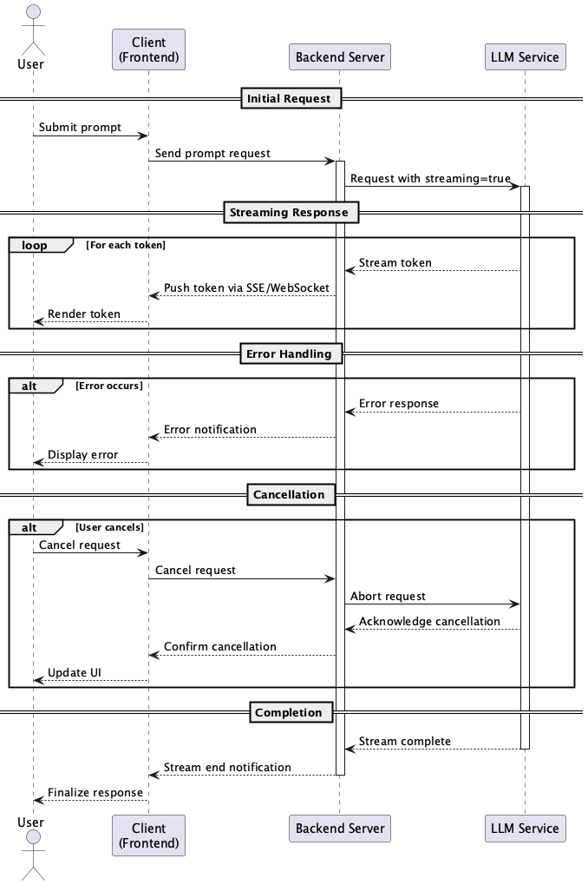

# Streaming Output Pattern

## 概要
Streaming Output Patternは、LLMからの応答をバッファリングせず逐次的に処理・表示する設計手法です。このパターンにより、ユーザーに対して即時性のあるフィードバックを提供し、応答待機時間の体感を大きく短縮することができます。リアルタイム性が求められるインターフェースにおいて、UXを大幅に改善することが可能です。

## 解決したい課題
従来のLLM活用においては、LLMの応答が完了するまで待機しなければならず、以下のような問題が発生します。

1. **応答までの待機時間が長く、ユーザー体験が悪化する**
   - 例：応答生成に10秒かかる場合、ユーザーは無反応な画面を見続けることになります。

2. **中断やキャンセルができず、誤ったリクエストでも最後まで処理されてしまう**
   - 例：ユーザーが入力ミスに気づいても、応答完了まで操作を止められません。

3. **UX上のインタラクション性が低下する**
   - 例：Chat UIにおいては、応答の文字列が一気に表示されるよりも、打ち込まれるように流れる方が自然な会話体験を演出できます。

## 解決策
Streaming Output Patternでは、LLMからの出力をストリーミングモードで受信し、到着したトークンや文単位で逐次的に処理・表示します。以下のような構成が一般的です。

1. **ストリーミングAPIの活用**
   - LLM API（例：OpenAIの`stream=true`オプション）を用いて逐次的にトークンを受信します。

2. **リアルタイム通信の実装**
   - バックエンドではトークンの受信単位でクライアントにプッシュします（SSEやWebSocketを使用）。

3. **即時レンダリングの実装**
   - フロントエンドでは受信した内容を即時レンダリングし、ユーザーに応答の進捗を示します。

4. **制御機能の追加**
   - 必要に応じて途中キャンセル機能や表示の一時停止機能も実装します。

## 適応するシーン
このパターンは以下のような場面で特に有効です。

- チャットボットや仮想アシスタントなどのインタラクティブなUI
- 長文の要約、記事生成、翻訳結果など出力量が多いユースケース
- 応答時間が長いことが予想される高精度のプロンプトや複雑なシステム指示を用いる場面
- ユーザーがリアルタイムなレスポンスを期待するアプリケーション

## 利用するメリット
このパターンを採用することで、以下のメリットが得られます。

- 応答の待機時間を体感的に短縮できます。
- リッチで自然なユーザー体験を提供できます。
- 応答の進行が見えるため、途中での中断や再入力判断が可能になります。
- モデルの遅延をUX面で吸収でき、全体的なシステム印象を向上させます。

## 注意点とトレードオフ
このパターンを採用する際は、以下の点に注意が必要です。

- ストリーミング処理には非同期処理やリアルタイム通信（WebSocket, SSEなど）の実装が必要です。
- ストリーミングに対応していないLLMプロバイダやモードでは適用できません。
- バックエンドとフロントエンド間の通信負荷が増加し、エラーハンドリングも複雑になります。
- トークン単位での表示は、文脈が確定していない段階での誤解を招く可能性もあります。

## 導入のヒント
このパターンを効果的に導入するためのポイントは以下の通りです。

1. 最初はチャットUIのみに限定してストリーミング表示を導入することで、影響範囲を限定できます。
2. バックエンドは非同期対応のフレームワーク（例：FastAPI, Node.js）で設計すると効果的です。
3. ユーザーが「入力完了前でもキャンセル可能」である設計を併用すると、使いやすさが向上します。
4. ストリーム終端を検知した後に整形処理を加えることで、表示の質を保つことができます。

## まとめ
Streaming Output Patternは、LLMの応答をリアルタイムに表示することでUXを劇的に改善する設計手法です。応答生成に時間を要するLLMの特性に対し、ユーザーに"即時反応"の印象を与えることができるため、対話型UIや生成系アプリケーションにおいて非常に有効です。技術的な複雑さはありますが、それを上回る価値が得られるパターンです。
