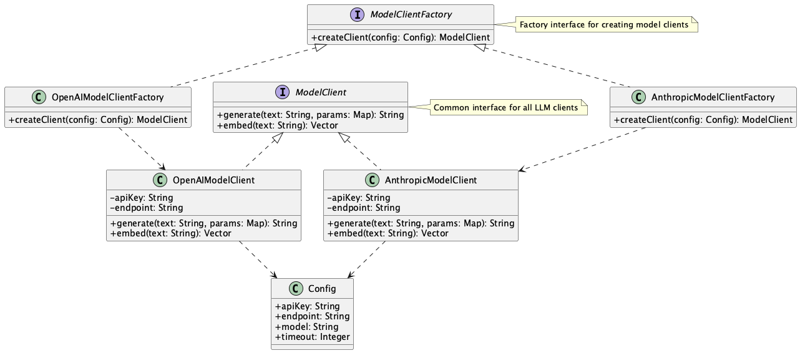

# Abstract Factory for Model Clients

## 概要
Abstract Factory for Model Clientsパターンは、複数のLLMプロバイダ（OpenAI、Anthropic、Google Gemini、またはDeepSeek等オンプレミスのオープンソースモデルなど）に対して共通のインターフェースを提供する設計手法です。このパターンにより、ビジネスロジック層は具体的なプロバイダの実装の詳細を意識することなく、統一された方法でLLMの機能を利用することができます。

## 解決したい課題
多くの場合、LLMを活用したシステム開発では当初は一つのLLMプロバイダー（例：OpenAI API）を活用してプロジェクトを進めます。プログラムもOpenAI APIを呼び出すクライアントだけを用意し、各所で利用するでしょう。しかしLLMは完璧ではないため、当初利用していたLLMでは不都合な事態が発生し、他のLLMを活用して打開するケースがあります。
最初のLLMクライアント（例：OpenAI APIクライアント）と並列して他のLLMクライアント（例：Anthropic APIクライアント）を作ることも可能ですが、その場合は以下のような課題が発生します。

1. **ベンダーロックインの問題**
   - 例：OpenAIのAPIを直接呼び出す実装をしていた場合、コスト削減のためにAnthropicに切り替えたい場合に、コード全体の修正が必要になります。

2. **重複コードの増加**
   - 例：各プロバイダごとに同様のリクエスト組立やエラーハンドリングのコードが重複して実装され、メンテナンス性が低下します。

3. **テストの困難さ**
   - 例：各プロバイダのAPIを個別にモック化する必要があり、テストコードが複雑化します。

## 解決策
Abstract Factory for Model Clientsパターンを適用し、各LLMプロバイダー共通のインタフェースとFactoryクラスを用意します。LLMクライアントは共通のLLMモデルクライアントファクトリから生成し、利用時も共通のインタフェースを利用可能にします。LLMを利用するビジネスロジック層はLLMのインタフェースの違いを意識することなく、同じ方法で使うことができるようになります。

1. **共通インターフェースの定義**
   - すべてのLLMクライアントが実装する共通のインターフェース（`generate`、`embed`など）を定義します。

2. **Factoryクラスの実装**
   - 各プロバイダに対応するFactoryクラスを作成し、適切な設定でクライアントを生成します。

3. **設定の一元管理**
   - APIキーやエンドポイントなどの設定を一箇所で管理し、実行時に動的に切り替え可能にします。

## 適応するシーン
このパターンは以下のような場面で特に有効です。

- 複数のLLMプロバイダを併用するシステム
- コストや性能に応じて動的にプロバイダを切り替えたい場合
- フェイルオーバーやバックアップの仕組みが必要な場合
- 異なるモデル間でのA/Bテストを実施する場合

## 利用するメリット
このパターンを採用することで、以下のメリットが得られます。

- ビジネスロジックとプロバイダ実装を疎結合化できます。
- 新しいプロバイダの追加が容易です。
- インタフェースからモックLLMクライアントを作ることで、テストが容易になります。
- 設定の集中管理による運用性の向上が可能です。

## 注意点とトレードオフ
このパターンを採用する際は、以下の点に注意が必要です。

- 小規模なシステムでは、抽象化によるオーバーヘッドが大きくなる可能性があります。
- 各プロバイダの固有機能を全て共通インターフェースに含めようとすると、インターフェースが肥大化します。
- プロバイダのSDKバージョンアップに伴う保守コストが発生します。

## 導入のヒント
このパターンを効果的に導入するためのポイントは以下の通りです。

1. まずは最小限の共通メソッドから始め、必要に応じて拡張します。
2. DIコンテナと組み合わせて、起動時に利用するプロバイダを設定可能にします。
3. 設定ファイル（YAML/JSON/Env）でモデルタイプやAPIキーを管理します。

## まとめ
Abstract Factory for Model Clientsパターンは、複数のLLMプロバイダを統一的に扱うための強力な設計手法です。適切に実装することで、システムの柔軟性と保守性を大幅に向上させることができます。ただし、システムの規模や要件に応じて、抽象化のレベルを適切に調整することが重要です。
