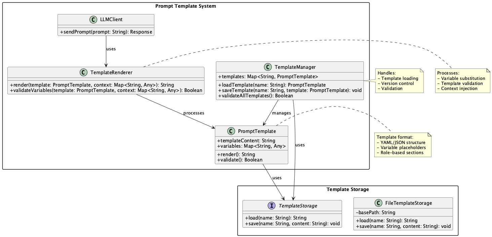

# Structured Prompt Template Pattern

## 概要

Structured Prompt Template Patternは、LLM（大規模言語モデル）に渡すプロンプトを構造化テンプレートとして定義・管理する設計手法です。プロンプトの形式や項目をテンプレートで明示的に分離することで、再利用性、保守性、可読性を向上させることができます。このパターンにより、プロンプトの管理と運用が効率化され、チーム全体でのプロンプト改善が容易になります。

## 解決したい課題

LLMを活用するアプリケーションでは、プロンプトがコード内に埋め込まれた状態でハードコーディングされることが多く、以下のような課題が発生します。

1. **プロンプトの再利用性が低い**
   - 例：同じ構造のプロンプトを複数の箇所で微妙に異なる形で記述してしまい、修正や調整が一貫して行えません。

2. **メンテナンス性が悪い**
   - 例：プロンプトの構成が複雑になるにつれ、どの要素がどの効果をもたらしているかが不明瞭になり、デバッグや改善が困難になります。

3. **実験やABテストが困難**
   - 例：テンプレートを切り替えたり、部分的に修正するにはコードの直接編集が必要で、運用上のリスクが高まります。

## 解決策

プロンプトをYAMLやJSON、Jinja2テンプレートなどの構造化フォーマットで定義し、外部ファイルとして管理します。システムはこれらのテンプレートに動的な変数を埋め込み、最終的なプロンプト文字列を組み立ててLLMに渡します。

1. **テンプレートの構造化**
   - 例：YAMLでsystem、user、assistantなどの役割ごとのセクションを持つテンプレートを定義します。

2. **変数の動的注入**
   - 例：変数部分には`{{ user_input }}`や`{{ document_summary }}`などを使い、ビジネスロジックから動的に値を注入します。

3. **外部ファイル管理**
   - 例：テンプレートはファイルとして分離することで、非エンジニアでも編集可能になります。

## 適応するシーン

このパターンは以下のような場面で特に有効です。

- 会話システムやチャットボットで複数のプロンプトパターンを切り替える場合
- ドキュメント要約や抽出などのタスクで、一貫したプロンプト構造が必要な場合
- ABテストや評価実験において、複数テンプレートを比較する必要がある場合
- プロンプトを運用チームが自由に更新・改善したい場合

## 利用するメリット

このパターンを採用することで、以下のメリットが得られます。

- プロンプトの構造が明示的になり、可読性と保守性が向上します。
- テンプレートの再利用により、開発スピードと品質が向上します。
- 非エンジニアでもテンプレートを調整可能となり、運用の柔軟性が高まります。
- テンプレートの切り替えやバージョン管理が容易になります。

## 注意点とトレードオフ

このパターンを採用する際は、以下の点に注意が必要です。

- 過度なテンプレート分割は複雑性を増加させるため、粒度のバランスに注意が必要です。
- テンプレートとロジックの変数マッピングに齟齬があると、プロンプト生成に失敗するリスクがあります。
- テンプレートエンジンの導入により、システムの構成が複雑になる可能性があります。

## 導入のヒント

このパターンを効果的に導入するためのポイントは以下の通りです。

1. 最初は単一のテンプレートから始め、共通化できる部分を抽出してテンプレート化していきます。
2. テンプレートのバリデーションチェックを導入し、不正な構造を検出できるようにします。
3. テンプレートをコードとは別のディレクトリで管理し、バージョン管理システムで追跡します。
4. 非エンジニアでも扱いやすい形式（YAML、Markdown with placeholdersなど）を選びます。

## まとめ

Structured Prompt Template Patternは、LLMのプロンプトを構造化テンプレートとして管理することで、品質・保守性・柔軟性を高める強力な設計手法です。チームによるプロンプト設計や改善を支える基盤として、プロダクション品質のLLMアプリケーションにおいて導入が強く推奨されます。
