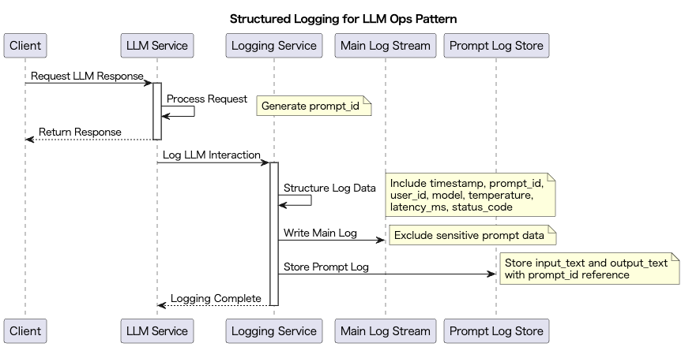

# Structured Logging for LLM Ops Pattern

## 概要

Structured Logging for LLM Ops Patternは、LLMを活用するアプリケーションにおいて、プロンプト、レスポンス、メタ情報などのやり取りを構造化された形式（JSON形式など）で記録する設計手法です。このパターンにより、LLMの運用監視、品質分析、テスト自動化、トラブルシューティングを効率的に行うことができます。構造化されたログは、Datadog、CloudWatch、Elasticsearch、BigQuery等のログ集約基盤と連携することで、可視化・集計・異常検知も実現可能です。

さらにはプロンプトをログではなく専用のデータストアに出力することで、ログの可読性を維持する方法を紹介します。

## 解決したい課題

LLMの推論は多様な要素で構成されています。

- 入力プロンプト
- 出力プロンプト
- 利用したモデル
- リクエストパラメータ（Temperature等）
- リクエスト日時
- 利用ユーザ
- その他

他のアプリケーションシステム同様に、障害が発生したときにどの情報がエラーの原因になっているかは、エラー発生時にしかわかりません。記録していないログは消えていくものであるため、必要十分な情報をログ出力することが求められることに疑問はありません。また、エラーではなくても品質改善のボトルネックがどの情報に関係するか知るためには、ログを見て分析する必要があります。

他方で、LLMのログを管理する厄介な点は、入出力のプロンプトが巨大になることが多く、さらには秘匿情報が含まれる可能性があることです。出力されたログが巨大な自然言語で埋め尽くされると、他のログを読み込むことが困難になることが言うまでもありません。そこに秘匿情報まで含まれる可能性があると、適切にログを処理することがさらに困難になります。

- **障害原因の追跡困難**
   ユーザーから「回答が的外れだった」と報告を受けたが、どのプロンプト・どの設定で送信されたか不明のため、再現や調査が困難です。

- **品質改善のための分析が非効率**
   どのプロンプトテンプレートやパラメータ設定が高い精度を生んだかを比較したいが、ログが不統一・非構造化のため抽出できません。

- **自動テストやアラートの導入が困難**
   LLM出力に異常が含まれるかを監視したいが、ログが人間可読のプレーンテキストで記録されており、分析処理ができません。

- **ログの可読性低下と秘匿情報**
   プロンプトをログシステムにそのまま出力していると、ログの可読性と安全性が損なわれます。

## 解決策

プロンプト、レスポンス、API呼び出し時のパラメータ、応答時間、モデル名、ユーザーIDなどの情報を、JSON形式などで一貫して構造化ログとして記録します。以下のフィールドを含む構造化ログを定義することで、ログ解析や品質モニタリングを容易にします。

- `timestamp`：ログの記録時刻
- `prompt_id`：プロンプトの一意識別子
- `user_id`：ユーザー識別子
- `model`：使用したLLMモデル名
- `temperature`：生成時の温度パラメータ
- `input_text`：入力プロンプト
- `output_text`：LLMの出力
- `latency_ms`：応答時間
- `status_code`：API呼び出しのステータス

加えて、プロンプトログは直接ログストリームに出力せず、専用のプロンプト用ログデータストアに保存することで、ログの可読性と秘匿性を維持します。ログストリームとデータストアのログは、一意となるログIDで管理し、必要に応じて双方を見る運用とします。

## 適応するシーン

このパターンは以下のような場面で特に有効です。

- 商用LLMサービスにおける運用監視やSLA準拠のための可視化が必要な場合
- RAGやチャットボットなど、高頻度にプロンプトを生成・送信するアプリケーション
- テスト用のプロンプト検証、LLM出力の品質評価を行う工程
- セキュリティや監査対応として、ユーザー操作やシステム出力を追跡可能にする必要がある場面

## 利用するメリット

このパターンを採用することで、以下のメリットが得られます。

- プロンプトやレスポンスのトレーサビリティが確保でき、障害対応やユーザー対応が容易になります。
- 構造化されたログを分析・集計することで、LLMの精度評価や改善に活用できます。
- 自動アラートやエラー検知ロジックを構築しやすくなります。
- 将来的なモデル比較やA/Bテストのデータ基盤としても活用可能です。

## 注意点とトレードオフ

このパターンを採用する際は、以下の点に注意が必要です。

- 構造化ログにはプロンプトや出力が含まれるため、個人情報や機密情報の漏洩リスクに注意が必要です。
- ログ量が膨大になる場合、ストレージコストやログ基盤のスケーラビリティを事前に設計する必要があります。
- ログの整合性や一貫性を保つためには、ロガーの標準化とテストが重要です。
- 過剰なログ出力はパフォーマンス劣化を招く可能性があるため、ログレベルやサンプリングの制御も検討が必要です。

## 導入のヒント

このパターンを効果的に導入するためのポイントは以下の通りです。

1. ログスキーマを明確に定義し、全てのLLM呼び出しで同じ形式で記録するよう共通ライブラリを整備します。
2. JSONや構造化されたログ形式を使い、ログ基盤と連携できるようにします。
3. 開発段階からログレベル（info/debug/error）を意識し、段階的に本番環境に展開します。
4. プロンプトや出力に含まれる個人情報をマスク・フィルタするロジックを組み込みます。

## まとめ

Structured Logging for LLM Ops Patternは、LLMを業務で活用する上での信頼性、トレーサビリティ、品質管理を強化するための基本的かつ重要な設計パターンです。構造化されたログを標準化し、分析・可視化基盤と連携することで、開発・運用・改善の全フェーズにおいて大きな効果を発揮します。ただし、ログのセキュリティとコスト管理には十分な配慮が必要です。
