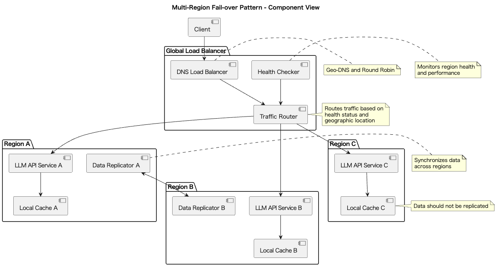
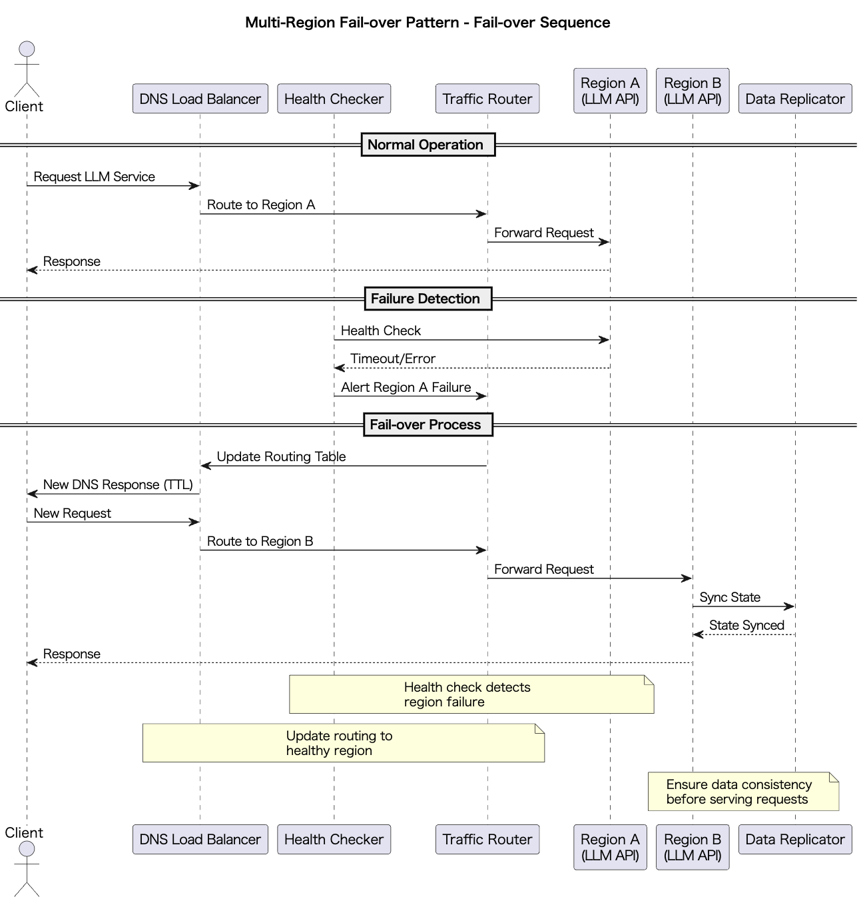

# Multi-Region Fail-over Pattern

## 概要

Multi-Region Fail-over Patternは、LLM APIサービスを複数の地理的リージョンに分散配置し、あるリージョンで障害や過負荷が発生した際に自動または手動で他のリージョンへトラフィックを切り替える設計手法です。このパターンにより、システムの高可用性を確保し、ユーザ体験を維持しながら、各地域の法規制に対応することができます。

## 解決したい課題

LLM APIはクラウドサービスにデプロイされているものを利用するケースが一般的でしょう。LLMプロバイダーによっては、ユーザが自らクラウドのリージョンを指定してLLMモデルをデプロイして利用する方式もあります（例：Azure OpenAI API）。

もちろんLLMの機能を提供するだけであれば単一リージョンのLLM APIを利用すれば良いかもしれませんが、その場合には以下のような課題が発生します。

1. **単一リージョン障害**
   - 地域的なインフラ障害や自然災害により、そのリージョンの全サービスが停止するリスクがあります。

2. **リージョン間のレイテンシ**
   - ユーザが遠隔地のサーバに接続する場合、レスポンスが遅くなりUXが低下します。日本在住のユーザーが米国リージョンのサーバーに接続する場合、200-300ms程度のレイテンシが発生します。

3. **法規制・データ主権**
   - 地域ごとに異なる法規制（EUのGDPRなど）により、データを特定地域に保存しなければならない場合があります。たとえばEUのユーザーデータはEUリージョン内で処理する必要があります。

4. **負荷集中の偏り**
   - 一部のリージョンにアクセスが集中すると、スケーリング限界により処理性能が低下します。特定の地域でプロモーションイベントが開催された場合、その地域のリージョンに負荷が集中します。

## 解決策

Multi-Region Fail-over Patternでは、以下のような方法で課題を解決します。

1. **DNSベースのルーティング**
   - DNSラウンドロビンやGeo-DNSを用いて、ユーザを最寄りのリージョンにルーティングします。

2. **グローバルロードバランシング**
   - グローバルロードバランサにより、各リージョンのヘルスチェックを行い、障害時に自動で他の正常なリージョンへ切り替えます。

3. **データレプリケーション**
   - 入力プロンプト、会話履歴、キャッシュ情報などを複数のリージョンに同期します。

4. **DNS TTLの最適化**
   - TTLを短く設定したDNSポリシーにより、迅速なフェイルオーバーを実現します。

## 適応するシーン

このパターンは以下のような場面で有効です。

- グローバル展開しているLLMチャットサービスやSaaSプラットフォーム
- 各国の規制に対応しながら高可用性を実現したい企業向けソリューション
- 災害対策や業務継続計画（BCP）が求められる金融・ヘルスケア領域
- 世界中からアクセスが集中するプロモーションイベント時のシステム

## 利用するメリット

このパターンを導入することで、以下の利点が得られます。

- **高可用性の確保**：リージョン障害発生時にも、システムを停止させることなくトラフィックを切り替えることができます。
- **最適なユーザ体験**：常にユーザの地理的に近いリージョンへ接続することで、低レイテンシな応答が実現できます。
- **コンプライアンス対応**：各地域のデータ主権に対応しつつ、グローバルな冗長性を確保できます。
- **水平スケーリング**：リージョン単位でスケーリングが可能となり、全体のリソース分散を促進します。

## 注意点とトレードオフ

このパターンを活用する際には、以下の点に注意が必要です。

- **データ同期コストと遅延**：リージョン間のレプリケーションにはネットワーク転送量や遅延が発生します。
- **実装・運用の複雑性**：DNS設定、ロードバランサ構成、監視・アラートルールなど複数の構成要素の管理が必要です。
- **整合性の問題**：即時の整合性が求められる場合は、リージョン間で状態の不整合が発生する可能性があります。
- **インフラコストの増加**：各リージョンに常時リソースを配置するため、運用コストが高くなります。

## 導入のヒント

導入にあたっては、以下のアプローチが効果的です。

1. **小規模リージョンでの検証**：まずはステージング環境でカナリアリージョンを構築し、切り替え動作やデータ同期の精度を検証します。
2. **ヘルスチェックの多層化**：単純な死活監視ではなく、応答速度やエラー率を加味した複合的なヘルスチェック設計を行います。
3. **キャッシュ戦略の分離**：リージョンローカルのキャッシュとグローバル同期のキャッシュを併用し、レスポンス性能と整合性のバランスを取ります。
4. **DNS TTLの最適化**：TTLを短くして即時切り替え可能にしつつ、頻繁なDNS問い合わせによる負荷を監視して調整します。
5. **Infrastructure as Codeの活用**：TerraformやCloudFormationなどを用いて、自動化されたフェイルオーバースクリプトと監視の整備を行います。

## まとめ

Multi-Region Fail-over Patternは、LLM APIを用いたシステムにおいて高可用性・レイテンシ最適化・規制対応を同時に実現するための重要な設計手法です。導入には一定の設計・運用コストが伴いますが、安定かつ持続的なグローバルサービスを構築する上で非常に有効なアプローチです。
