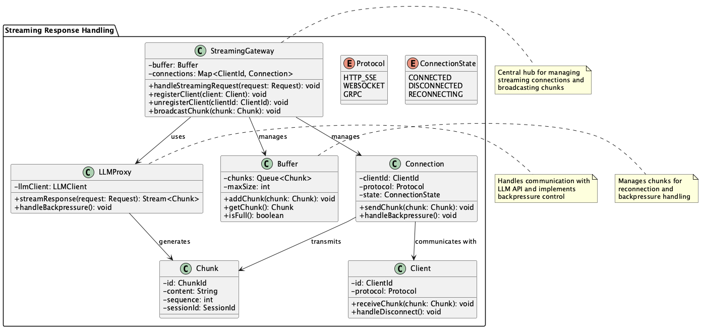
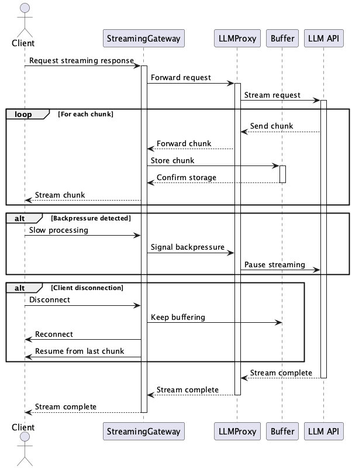

# Streaming Response Handling Pattern

## 概要

Streaming Response Handlingパターンは、LLMが出力するストリーミングレスポンスを効率的かつ信頼性高く受信・中継し、複数のクライアントに配信するための設計手法です。プロキシやハブを介して部分生成トークン（チャンク）を中継し、バックプレッシャー制御や多様なプロトコル対応を行います。クライアントとの接続管理をサーバー側で集中化することで、システムの安定性と拡張性を両立できます。

## 解決したい課題

**Streaming Output Pattern**で書いた通り、LLM APIのレスポンスをストリーミングで出力することが求められるユースケースは多々あります。ストリーミング処理を要するサービスで、そのためにクライアントとLLM APIを直接接続することは良いプラクティスではありません。LLMのストリーミング応答を直接各クライアントに配信する構成では、以下のような課題が発生します。

1. **接続数や認証の煩雑化**
   - 各クライアントが直接LLMと接続することで、認証管理や接続制御が複雑になります。

2. **ストリームの中断と再接続の困難さ**
   - ネットワーク切断時に、前回の続きを再開する仕組みを個別に実装する必要があります。

3. **多様なプロトコルの取り扱いの難しさ**
   - HTTP/1.1 SSE、HTTP/2 gRPC、WebSocketなどのストリーミング方式への対応が必要です。

4. **バックプレッシャーへの対応不足**
   - クライアント側の処理が遅い場合にサーバー全体が巻き込まれ、処理遅延や切断が発生します。

## 解決策

サーバー側にプロキシまたは中継ハブを構築し、LLMからのストリーミング出力を一元的に受信・再配信する構成とします。以下のような仕組みを組み込みます。

1. **マルチプロトコル対応の配信ゲートウェイ**
   - クライアントごとに適切なチャネルでデータを配信します。

2. **中継サーバーでのバッファリングとキャッシュ**
   - 再接続時の状態復元や配信安定性を担保します。

3. **バックプレッシャー制御機構**
   - クライアントの処理能力に応じた配信を実現します。

4. **マルチキャスト機能**
   - 同じストリームを複数のクライアントに同時配信します。

## 適応するシーン

このパターンは、以下のようなシステムやプロジェクトに適しています。

- リアルタイムチャットシステム：部分生成された応答を即座にユーザーへ提示する必要がある場合
- 共同編集アプリケーション：複数ユーザーが同じ出力ストリームを受信するシチュエーション
- APIゲートウェイ型SaaS：外部クライアントに同一ストリームをセキュアに中継する必要がある場合
- 社内外のハイブリッド構成：社内処理結果を外部にストリーミング配信する構成

## 利用するメリット

このパターンの導入によって、以下のメリットが得られます。

- 接続と認証の一元管理により、運用とセキュリティが簡素化されます
- 信頼性の向上：サーバー側で中継・リトライ処理を集中管理でき、クライアント再接続時にも状態を維持できます
- 柔軟な配信対応：同一ストリームをWebSocket、SSE、gRPCなど異なる形式で同時に配信可能です
- 運用可視化が容易：中継レイヤでのメトリクス取得により、レイテンシや接続状況の監視が可能になります

## 注意点とトレードオフ

このパターンを採用する際には、以下の注意点とトレードオフが存在します。

- 追加の実装・運用コスト：プロキシや中継層の開発、接続管理、バッファ制御などの実装が必要になります
- レイテンシの増加：中継処理によって、若干の通信遅延が発生する可能性があります
- スケーラビリティ要件の増大：同時接続数が多い場合には、ゲートウェイの水平スケーリングと負荷分散設計が必須となります
- 状態管理の複雑化：チャンクの再送やセッション継続を考慮した設計が求められます

## 導入のヒント

本パターンを導入する際には、以下のステップを参考にしてください。

1. 既存のストリーミング対応ミドルウェアを活用します。例：Envoy、NGINX、gRPCプロキシ
2. 段階的に機能追加します。例：まずは単一クライアント対応 → 複数クライアントへの配信 → バックプレッシャー処理
3. チャンクに識別情報を付与します。例：シーケンス番号やセッションIDを使って再接続時の位置復元を可能にする
4. モニタリングを実装します。例：切断率、再接続数、スループットなどの可視化とアラート設定
5. クライアント向けSDKを提供します。例：自動再接続やエラーハンドリング機能を備えたクライアントライブラリの配布

## まとめ

Streaming Response Handlingパターンは、LLMのストリーミング出力を安定的かつ効率的に多数のクライアントに配信するための有効な設計手法です。ゲートウェイや中継サーバーを活用することで、接続管理の一元化とストリームの信頼性向上を実現できます。実装と運用のコストは増加しますが、それに見合うスケーラビリティとユーザ体験の向上が期待できます。
