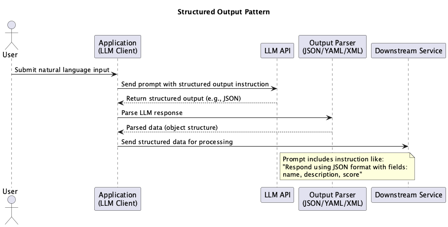

# Structured Output Pattern

## Overview

The Structured Output Pattern is a design approach for receiving LLM outputs in predefined structures (JSON, dataclass, pydantic.BaseModel, etc.). This pattern enables systems to safely and mechanically process generated results. By utilizing OpenAI's function calling / tool calling or JSON schema, it becomes possible to automatically validate and structure model outputs.

## Problems to Solve

Most programming languages are better at handling structured objects than natural language strings. On the other hand, LLMs are based on natural language processing, with natural language as their basic input/output. When a program requests and receives responses from an LLM, the difficulty of operating with just natural language (string type) is that the program needs to parse and search for necessary information within the string. Since natural language can be freely written, there's no denying the possibility of gaps in parsing or search rules. In such situations, the following problems arise:

1. **Frequent Parsing Errors**
   - Expected JSON format output may contain grammatically incorrect strings, causing errors.

2. **Low Safety**
   - Outputs may contain unexpected content, risking the execution of incorrect business logic.

3. **Difficulty in Debugging and Validation**
   - With free-form natural text, it's difficult to understand how each field is interpreted, making testing complex.

## Solution

Many recent LLM APIs support Structured Output. With OpenAI API, you can instruct the program to respond in a structure specified by the program using function calling / tool calling or JSON schema. In the Structured Output Pattern, we explicitly instruct the LLM to output according to a predefined structure and receive responses in a format that matches that structure.

1. **Output Schema Definition**
   - Design prompts to explicitly state JSON schema, encouraging output in the format `{ "title": ..., "summary": ... }`.

2. **Type-Safe Conversion**
   - Map LLM responses to structures and convert them to type-safe forms (objects, dictionaries, structs, etc.).

3. **Hallucination Detection for Non-Compliant Structures**
   - Validate LLM responses to detect hallucinations when they don't follow the instructed structure.

## Applicable Scenarios

This pattern is particularly effective in the following situations:

- Data extraction tasks (entity extraction, numerical information retrieval, etc.)
- When data needs to be passed to downstream systems via API responses
- Use cases requiring standardized output like JSON or CSV
- When user input needs to be structured for internal processing

## Benefits

Adopting this pattern provides the following benefits:

- Output format becomes standardized, making parsing and type conversion easier.
- Detection of anomalies and missing values becomes easier, improving reliability.
- System integration (API calls, etc.) becomes easier.
- Input/output schema validation makes unit testing and automation easier.

## Considerations and Trade-offs

When adopting this pattern, the following points require attention:

- LLMs may not completely follow structured output, requiring exception handling.
- Too many constraints on the schema may reduce flexibility.
- Token count increases, requiring attention to prompt size and cost.
- Output formatting accuracy may vary depending on the model version.

## Implementation Tips

Key points for effectively implementing this pattern are as follows:

1. Explicitly define output schemas using dataclass or pydantic.BaseModel.
2. Prioritize using JSON schema or Function Calling / Tool Calling compatible models.
3. Implement type validation using libraries like Pydantic.

## Summary

The Structured Output Pattern is a practical approach for handling LLM generated outputs in a structured manner. This enables reliable system integration and automated processing, greatly expanding the scope of business applications. However, since it depends on output accuracy, robust schema design and exception handling are crucial.
