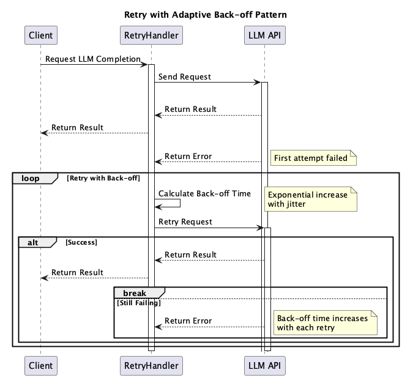

# Retry with Adaptive Back-off Pattern

## Overview

The Retry with Adaptive Back-off Pattern is a design approach for handling temporary failures in LLM API calls by implementing intelligent retry mechanisms with dynamic back-off intervals. This pattern improves system reliability by automatically retrying failed requests while avoiding overwhelming the API service.

## Problems to Solve

When utilizing LLM APIs, various temporary failures can occur:

1. **Rate Limiting**
   - API providers may enforce rate limits, causing requests to fail temporarily.
   - Without proper retry handling, these failures may appear as permanent errors to users.

2. **Network Issues**
   - Temporary network glitches or connectivity problems may cause request failures.
   - Simple retries without back-off may not be effective in resolving these issues.

3. **Service Overload**
   - During high traffic periods, the API service may be temporarily overloaded.
   - Immediate retries may exacerbate the overload situation.

## Solution

Implement an intelligent retry mechanism with adaptive back-off:

1. **Retry Logic**
   - Define conditions for when to retry (e.g., specific error codes, timeout errors).
   - Implement a maximum number of retry attempts.

2. **Adaptive Back-off**
   - Use exponential back-off with jitter to determine retry intervals.
   - Adjust back-off intervals based on error types and response headers.

3. **Error Classification**
   - Categorize errors into retryable and non-retryable types.
   - Implement different strategies for different error categories.

## Applicable Scenarios

This pattern is particularly effective in the following situations:

- When dealing with APIs that have rate limits or quotas
- When building applications that need to handle temporary network issues gracefully
- When implementing systems that require high reliability in API interactions
- When working with APIs that may experience temporary overload

## Benefits

Adopting this pattern provides the following benefits:

- Improves success rate of API calls by handling temporary failures
- Reduces impact on API service during high load periods
- Enhances system reliability and user experience
- Provides better control over API usage and costs

## Considerations and Trade-offs

When adopting this pattern, the following points require attention:

- Setting appropriate retry limits and back-off intervals requires careful consideration
- Excessive retries may increase API costs and response times
- Complex retry logic may make debugging more difficult
- Need to balance between immediate retries and longer back-off periods

## Implementation Tips

Key points for effectively implementing this pattern are as follows:

1. Start with conservative retry limits and adjust based on monitoring data
2. Implement comprehensive logging for retry attempts and failures
3. Consider using existing retry libraries that support adaptive back-off
4. Monitor retry patterns to identify potential API issues

## Summary

The Retry with Adaptive Back-off Pattern is a crucial design approach for building resilient applications that utilize LLM APIs. By implementing intelligent retry mechanisms with adaptive back-off, applications can handle temporary failures gracefully while maintaining good API service citizenship.
