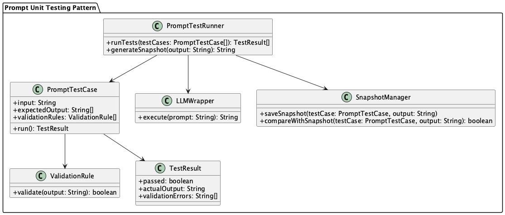

# Prompt Unit Testing Pattern

## Overview

The Prompt Unit Testing Pattern is a design pattern that verifies the behavior of prompts for LLMs at the unit test level. It enhances the reliability of LLM-powered systems by ensuring prompt quality and stability while making it easier to detect side effects from changes. This pattern enables automatic verification of how prompt changes affect outputs and prevents quality degradation.

## Problems to Solve

In LLM applications, even minor changes to prompts can significantly impact output results. While prompt change management is important, it's equally crucial to ensure the quality of results from modified prompts. Like general programming, prompt changes should also be tested.

Additionally, in scenarios where prompts are manipulated programmatically, such as with the **Structured Prompt Template Pattern** or **Role-Based Prompt Control Pattern**, it's necessary to test whether prompts are generated as expected and are only accessible to appropriate users.

The following challenges make prompt quality management difficult:

- **Prompt quality becomes person-dependent**
   - Prompt adjustment know-how accumulates as tacit knowledge and isn't shared across the team.

- **Difficulty in visualizing the impact of changes on behavior**
   - Changes in output are hard to verify in reviews, risking unexpected content being released to production. The correlation between prompt change history and output changes cannot be tracked.

- **No regression testing exists**
   - Cases that previously worked well might break after prompt modifications without notice. Output quality for important use cases may gradually deteriorate.

- **Misconception that testing is impossible due to output ambiguity**
   - LLM outputs are always probabilistic and variable, leading to the misconception that they can't be tested. Testing is often abandoned due to the belief that exact matching tests can't be written.

## Solution

The Prompt Unit Testing Pattern automates unit testing of prompts and verifies expected output structures and important elements for representative inputs. By designing with the following approach, testing becomes possible while considering LLM ambiguity:

- **Implementation of flexible output verification**
   - Verification is done by keywords, structure, or schema rather than exact text matching.
   - Using the **Structured Output Pattern** to organize information structurally makes testing easier.

- **Preparation of test utilities**
   - Test utilities that wrap LLMs are prepared, introducing mechanisms to absorb environmental differences and variations.
   - Output differences are recorded based on snapshots, making them reviewable.

- **Systematization of test cases**
   - Representative input cases are organized by category and managed as test cases. A comprehensive test suite is built including edge cases and error scenarios.

## Applicable Scenarios

This pattern is particularly effective in the following situations:

- LLM applications requiring standardized outputs (e.g., FAQ, summarization, classification)
- Teams where multiple people maintain and improve prompts
- When CI/CD pipelines include LLM processing
- When LLMs are introduced as part of business processes requiring high reliability
- When prompt change history needs to be tracked and quality maintained

## Benefits

Adopting this pattern provides the following benefits:

- Quick detection of impact areas from prompt changes prevents quality degradation.
- Improved reliability of LLM outputs reduces concerns from users and business stakeholders.
- Developers can confidently improve and experiment with prompts.
- Continuous quality verification becomes possible through CI/CD integration.
- Prompt quality management becomes team-shared rather than person-dependent.

## Considerations and Trade-offs

When adopting this pattern, the following points require attention:

- Test design requires careful consideration, as assuming complete output matching can make tests fragile.
- Maintaining test coverage can be challenging for prompts with large output variations.
- Over-reliance on snapshot testing can make maintenance cumbersome by being overly sensitive to minor output differences.
- Test execution time may increase, potentially affecting CI/CD pipeline efficiency.

## Implementation Tips

Key points for effectively implementing this pattern are:

1. Manage test prompts in structured files like YAML or JSON for easy version control.
2. Start smoothly by selecting 1-3 representative input cases and defining test and expected output comparison criteria.
3. Structure LLM output format using the **Structured Output Pattern** to enable schema validation and structured information retrieval.
4. Establish mechanisms to visualize and share test execution results within the team.

## Summary

The Prompt Unit Testing Pattern is an essential design approach for safely and continuously utilizing and improving LLMs. By detecting the impact of prompt changes through testing, it prevents quality degradation and reliability issues, enabling better LLM utilization cycles. By incorporating thoughtful test design and scalable mechanisms, it becomes possible to bring software development best practices into LLM development.
