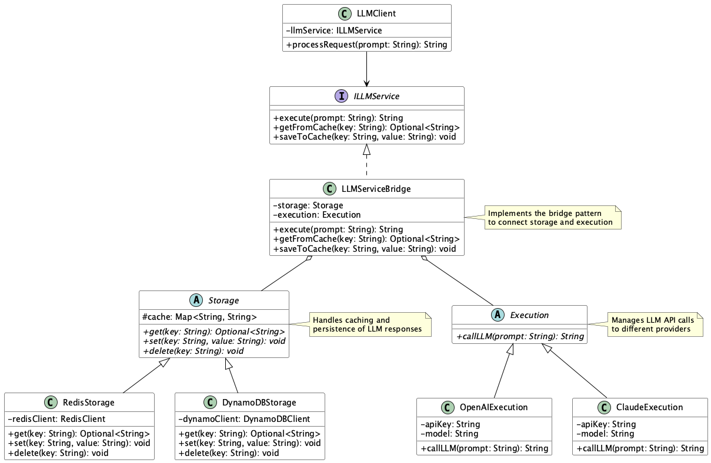

# Bridge for Storage & Execution Pattern

## Overview

The Bridge for Storage & Execution Pattern is a design approach that clearly separates "Storage" and "Execution" in systems utilizing LLMs, introducing an interface that acts as a bridge between the two. This pattern enables loose coupling between cache processing, persistence processing, and LLM API call processing, allowing for flexible and testable systems.

## Problems to Solve

When using LLMs, past communication history and user metadata are often used as supplementary data for prompts. Therefore, in many systems using LLM APIs, cache processing and database integration processing tend to be tightly coupled with LLM call logic. This leads to the following issues:

- **Decreased readability and maintainability due to mixed logic**
  - Cache retrieval, DB writing, and LLM API calls are mixed within a single class, expanding the scope of impact when changes are made.

- **Difficulty in swapping storage infrastructure or LLM providers**
  - When switching from Redis to DynamoDB, modifications are required up to the LLM call portion.

- **Testing becomes difficult**
  - Classes containing both Storage and Execution require large-grained mocks in unit testing, making reproducible tests challenging.

- **Limited room for performance optimization**
  - Cache hit/miss logic cannot be finely divided, reducing the freedom for performance improvements.

## Solution

The Bridge for Storage & Execution Pattern separates Storage (cache and persistence) and Execution (LLM calls) into independent implementations and coordinates them through a common interface (Bridge).

- **Implementation of Abstraction (Bridge)**
  - Define interfaces like ILLMService and use them in a common form from the calling side.

- **Separation of Storage Implementation**
  - Implement cache read/write using Redis, DynamoDB, PostgreSQL, etc.

- **Separation of Execution Implementation**
  - Handle calls to LLM providers like OpenAI API or Claude.

- **Implementation of Coordination Flow**
  - First query Storage, return cache if hit, execute LLM if miss, save result to Storage, then return.

## Applicable Scenarios

This pattern is effective for the following systems:

- RAG (Retrieval-Augmented Generation) services: When you want to cache search results and generated results to optimize costs and latency
- Chatbot platforms: When you need to persist conversation history and memory while generating output based on the latest context
- Embedding pipelines: When you want to calculate vector embeddings only on the first occasion and retrieve from cache thereafter
- Real-time analysis systems: When you want to cache generated results and reflect them in dashboards

## Benefits

Adopting this pattern provides the following advantages:

- Loose coupling enables independent development and testing of Storage and Execution.
- High extensibility makes it easy to swap storage or LLM providers.
- Performance optimization becomes easier, with expected cost reduction and latency improvement through increased cache hit rates.
- Improved testability makes unit testing with Mocks and Stubs easier.

## Considerations and Trade-offs

When introducing this pattern, consider the following points:

- Increased design and implementation complexity: Need to manage a three-layer structure of Bridge, Storage, and Execution, which may be difficult for beginners to understand.
- Increased overhead: Cache checking and saving processes slightly increase call latency.
- Cache consistency design is necessary: Without TTL settings or manual invalidation mechanisms, there's a risk of returning stale data.
- Operational costs: Storage layer may require dedicated monitoring and scaling strategies.

## Implementation Tips

Key points for effective implementation are as follows:

1. Start with minimal configuration: Begin with in-memory cache (e.g., dict) and simple LLM calls.
2. Utilize DI or Factory: Make Storage/Execution implementations swappable per environment (development, production).
3. Introduce metrics collection: Monitor cache hit rates and LLM call counts as decision-making materials for optimization.
4. Policy design: Clarify cache strategies including TTL, LFU/LRU, and manual deletion APIs.
5. Expand gradually: Start with either one initially and extend to the Bridge pattern as needed for smooth introduction.

## Summary

The Bridge for Storage & Execution Pattern is a practical design approach that enables loose coupling management of LLM output generation and its caching/persistence. By clearly separating responsibilities, it improves extensibility, readability, and testability while enabling execution efficiency optimization. Although initial implementation difficulty is somewhat high, it significantly contributes to building maintainable systems in the medium to long term.
