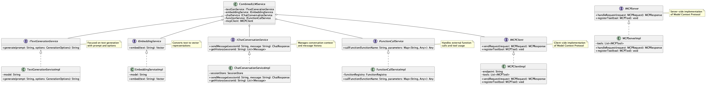

# LLM Service Interface Segregation Pattern

## Overview

The LLM Service Interface Segregation Pattern is a design pattern that separates the service layer interfaces that provide LLM-related functionality by feature. Based on the Interface Segregation Principle (ISP), it defines fine-grained interfaces so that users can depend only on the minimum methods they need. This enables minimization of dependencies, simplification of testing, and flexibility in permission management.

## Problems to Solve

LLMs provide diverse natural language processing capabilities. Even just for text generation, they can perform chat, text classification, tagging, program generation, and more. Additionally, they enable similar search using text vectors and external service calls through MCP (Model Context Protocol).

While LLMs provide these diverse functionalities, adopting a single large service interface for LLMs presents the following challenges:

- **Interface Bloat**
   - Packing all LLM functionalities like text generation, embeddings, chat, tool calling, etc., into one interface forces dependencies on unused features, complicating class design.

- **Test Complexity**
   - Using a single mock across all unit tests requires implementing and managing unnecessary methods.

- **Widespread Impact of Changes**
   - Adding or modifying new LLM features affects the existing interface, impacting a wide range of builds and tests.

- **Lack of Flexibility in Permission Management and Rate Limiting**
   - Controlling fine-grained authorization and rate limiting per API becomes difficult with a single interface.

## Solution

Based on the Interface Segregation Principle (ISP), we define independent interfaces for each functionality and structure services according to their responsibilities. For example, the following separation is effective:

- **Text Generation Interface**
   - `ITextGenerationService.generate(prompt, options)`
   - An interface specialized for text generation based on prompts.

- **Embedding Interface**
   - `IEmbeddingService.embed(text)`
   - An interface specialized for text vectorization.

- **Chat Interface**
   - `IChatConversationService.sendMessage(sessionId, message)`
   - An interface specialized for chat functionality that maintains conversation context.

- **Function Calling Interface**
   - Function calling / tool calling, or relying on MCP client and MCP server.
   - An interface specialized for calling tools and functions.
   - See **External Service Pattern**.

## Applicable Scenarios

This pattern is effective in the following scenarios:

- Multi-functional enterprise chat systems (generation, summarization, RAG, tool calling, etc.)
- AI platforms or microservice architectures with modular separation
- Multi-tenant SaaS that provides different LLM feature sets per tenant
- Large-scale development projects with established test automation and CI/CD

## Benefits

Adopting this pattern provides the following benefits:

- Achieves clear separation of responsibilities and loose coupling, improving reusability and maintainability.
- Facilitates unit testing and mocking, enhancing development productivity.
- Enables fine-grained authorization and rate control, making security policy implementation easier.
- Allows for highly extensible configurations and safe addition of new features.

## Considerations and Trade-offs

When adopting this pattern, the following points require attention:

- Increased number of interfaces raises design and management costs.
- Dependency injection (DI) configuration becomes more complex, potentially requiring more setup time depending on project scale.
- Poor granularity design of features may require later integration or re-separation.
- Documentation maintenance burden increases, potentially raising learning costs for developers.

## Implementation Tips

Key points for effectively implementing this pattern are as follows:

1. Start with feature classification, categorize LLM functionalities by use case, and design by separating into interface units.
2. Gradually split existing monolithic interfaces, ensuring tests don't break during migration.
3. Use DI mechanisms like Spring, Guice, or NestJS to set up interface-level dependency injection.
4. Design common middleware to consistently apply authorization and rate limiting for each feature interface.
5. Document and share usage examples for each interface to help new developers understand the system.

## Summary

The LLM Service Interface Segregation Pattern is an effective approach for implementing LLM services in a scalable and maintainable structure. By separating interfaces by functionality, it improves the efficiency of testing, extension, and permission control. While careful consideration of granularity is needed in initial design, proper implementation can yield significant benefits in large-scale systems.
