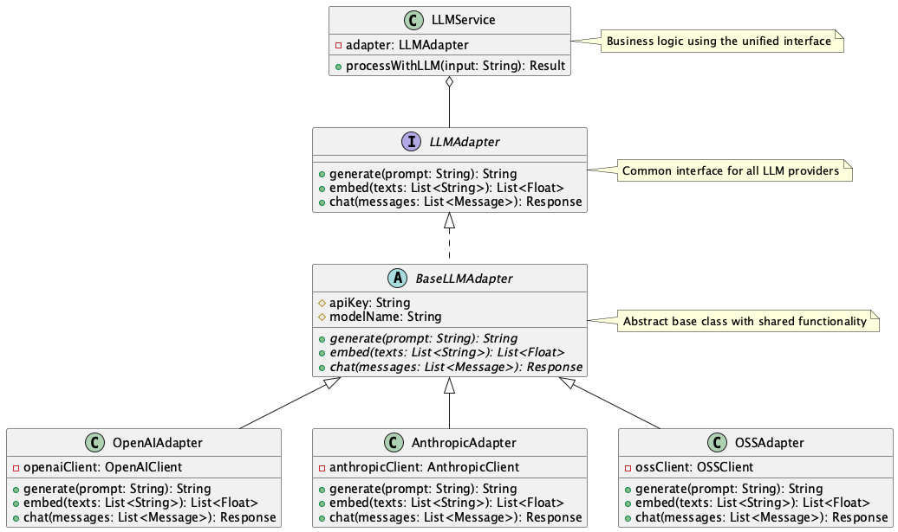

# Adapter for Unified API Interface Pattern

## 概要  

Adapter for Unified API Interface パターンは、異なる LLM プロバイダやベンダー（OpenAI、Anthropic、Google Gemini、またはDeepSeek等オンプレミスのオープンソースモデルなど）が提供する多様な API 仕様を、共通のインターフェースで抽象化する設計手法です。このパターンを適用することで、アプリケーションのビジネスロジックからはベンダー固有の実装を意識せず、統一された方法で LLM を利用することが可能になります。

## 解決したい課題  

各LLMプロバイダーにはそれぞれ得意不得意や強み弱みがあり、LLMを活用したシステムではそれぞれを組み合わせて補完し合った使い方をすることがあります。そうしたときに課題になるのが、LLM プロバイダはそれぞれ異なる API 仕様、リクエスト形式、エラーハンドリングの設計を採用しており、システムでその違いを吸収する必要があることです。具体的には以下のような課題が発生します。

1. **実装がベンダー依存になる**  
    - OpenAI の `chat/completions` エンドポイントと、Anthropic の `messages` エンドポイントでは構造が大きく異なるため、直接実装すると切り替えが困難になります。

2. **ロジックの重複が増える**  
    - 例：各 API に対するプロンプト構築やレスポンス整形のコードが分散し、保守性が著しく低下します。

3. **テストやデバッグが複雑になる**  
    - 複数の API クライアントが存在することで、各パターンに応じたテストやモックが必要になり、テストの負荷が高くなります。

## 解決策  

この課題に対して、共通の API インターフェースを定義し、各ベンダー固有の API 実装をアダプタとして実装することで解決します。アダプタは共通インターフェースを実装し、内部ではベンダー独自の仕様に変換して呼び出しを行います。これにより、アプリケーション側では単一のインターフェースのみを扱えば済むようになります。

1. OpenAIAdapter、AnthropicAdapter、OSSAdapter などの具体アダプタを用意します。
2. Adapter には `generate(prompt)`, `embed(texts)`, `chat(messages)` などの共通メソッドを定義します。
3. ロジック側は Adapter に依存することで、ベンダーの切り替えを透過的に行えます。

## 適応するシーン  

このパターンは以下のような場面で特に有効です。

- 異なる LLM ベンダーを横断的に利用する必要があるプロダクト  
- フェイルオーバーや性能比較のために複数のプロバイダを試したいケース  
- ベンダー依存から脱却し、将来的な移行や統合を見据えた設計が求められる場合  
- RAG やマルチエージェントアーキテクチャなどで、複数のモデルを使い分ける必要がある環境

## 利用するメリット  

このパターンを採用することで、以下のメリットが得られます。

- 各 LLM ベンダーの仕様差をアプリケーションから隠蔽できます。  
- ビジネスロジックを変更せずに、LLM ベンダーを容易に切り替えられます。  
- モックを使った単体テストや性能検証が簡単になります。  
- フロントエンド／バックエンド間で共通の仕様書を維持しやすくなります。  

## 注意点とトレードオフ  

このパターンを採用する際は、以下の点に注意が必要です。

- Adapter 実装が複雑化する可能性があります。特にベンダー固有の高度な機能（ツール呼び出し、ファイル操作など）を抽象化する際は、インターフェース設計に注意が必要です。  
- 単一の共通インターフェースでは表現しきれない機能は、拡張性を保つためにオプションやポリモーフィズムを用いた設計が求められます。  
- Adapter 層が増えることで処理フローが深くなり、デバッグが難しくなることがあります。  

## 導入のヒント  

このパターンを効果的に導入するためのポイントは以下の通りです。

- 最小限のコアインターフェース（`generate`, `embed`, `chat`）を定義し、段階的に機能拡張を行うとよいです。  
- LLM ごとに異なるプロンプト構造を抽象化する仕組み（プロンプトテンプレートマネージャ等）を併用するとさらに効果的です。  
- OpenAI や Claude、Gemini など主要ベンダーごとのユニットテストを先に用意することで、Adapter 実装の整合性を担保できます。  

## まとめ  

Adapter for Unified API Interface パターンは、LLM の多様な API を統一的に扱うことで、開発の効率化と運用の柔軟性を実現する設計手法です。ベンダー依存を排除し、将来的な技術選定の自由度を高めるためにも、初期段階からの導入が推奨されます。ただし、過剰な抽象化にならないよう注意しつつ、段階的に拡張していくアプローチが望ましいです。
