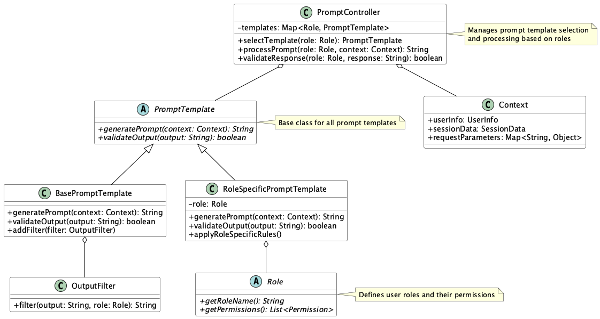

# Role-Based Prompt Control Pattern

## 概要

Role-Based Prompt Control Patternは、ユーザーやシステムの「役割（Role）」に応じて、LLMに渡すプロンプトの内容や制約を動的に制御する設計パターンです。このパターンにより、同じシステムでも利用者の立場や権限、状況に応じて、出力の適切性・安全性を確保することが可能になります。また、ユーザー体験のパーソナライズと、セキュリティポリシーの両立を実現することができます。

## 解決したい課題

LLMを活用したアプリケーションのユーザが常に同一のペルソナや立場であるとは限りません。一般的なSaaSやクラウドでも、ユーザには管理者、編集者、閲覧者等の役割（ロール）が用意されており、ユーザはそのロールに応じて利用可能な機能に違いがあります。

LLMベースのシステムにおいても、ユーザのロールに応じて利用可能な情報や機能は異なるでしょう。その差異がプロンプトの内容に表れる場合、ユーザのロールに応じて適用するプロンプトを変更する仕組みが必要になります。たとえば管理者用の情報を取得するプロンプトテンプレートが用意されているとします。このプロンプトテンプレートはもちろん管理者以外が利用することがは禁止されます。こうしたユーザロールに応じたプロンプト利用を管理するのがRole-Based Prompt Control Patternです。

- **情報漏洩リスク**
  - 一般ユーザーが利用するチャットUIから、管理者専用の社内情報に関するプロンプトを送信し、意図せず機密情報が出力される可能性があります。

- **権限不一致による出力不整合**
   - 操作権限のないユーザーが管理者用のプロンプトテンプレートを使って、データ削除や設定変更に関する応答を得ることができてしまうケース。
   
- **UI/UXの一貫性低下**
   - 業務支援AIにおいて、経理担当とエンジニアが同じプロンプト設計で応答を受けると、内容が不適切または不要な情報が混在してしまいます。
   
## 解決策

プロンプトの設計・制御において、ユーザーやコンテキストの「役割（Role）」に応じて出力内容やプロンプトの挙動を分岐させます。具体的には以下のようなアプローチを採用します。

- **ロールベースのプロンプトテンプレート管理**
   - 各ロール（管理者、一般ユーザー、ゲスト等）ごとに専用のプロンプトテンプレートを用意します。テンプレートは階層構造で管理し、共通部分とロール固有部分を分離します。

- **動的なプロンプト制御**
   - ユーザーの認証情報に基づいて、適切なプロンプトテンプレートを選択します。

- **出力フィルタリング**
   - ロールに応じて、出力内容の詳細度や専門性を調整します。機密情報や不適切な情報を自動的にフィルタリングします。

## 適応するシーン

このパターンは以下のような場面で特に有効です。

- 管理者と一般ユーザーで異なる応答制御が求められる業務AIシステム
- 複数の業務部門が共通のLLMを利用するが、それぞれ異なる表現や情報レベルを求めるシナリオ
- SaaSプロダクトにおいて、エンタープライズ顧客とフリーユーザーで出力内容を分けたい場合
- 子ども向け／大人向けのLLMアプリにおける出力トーン制御
- 多言語対応システムでの、言語や文化に応じた応答制御

## 利用するメリット

このパターンを採用することで、以下のメリットが得られます。

- ユーザーの役割や利用目的に合ったプロンプト制御が可能となり、誤情報や不要情報のリスクを低減できます。
- セキュリティポリシーやアクセス制御の一環として、プロンプトレベルで安全性を担保できます。
- UI/UXのパーソナライズが可能になり、ユーザー満足度や業務効率が向上します。
- プロンプトの一元管理により、品質の一貫性を保つことができます。

## 注意点とトレードオフ

このパターンを採用する際は、以下の点に注意が必要です。

- プロンプトテンプレートがロールごとに複雑化し、管理・保守が煩雑になる可能性があります。
- ロール判定や認可ロジックが不完全だと、誤ったプロンプトが使われ、出力誤りや情報漏洩につながるリスクがあります。
- ロール定義がアプリケーション外部（例：IdP）に依存している場合、同期ミスによる不整合に注意が必要です。
- 過度なロール分岐により、システムの複雑性が増加する可能性があります。

## 導入のヒント

このパターンを効果的に導入するためのポイントは以下の通りです。

1. まずは主要なロール（例：admin、user、guest）に限定してテンプレートを分け、小さく始めることを推奨します。
2. ロールごとに共通プロンプトを定義し、差分のみを上書き・追加する仕組み（継承・差分設計）を導入すると保守性が高まります。
3. ロール情報はセッション・認証情報と連携し、自動でプロンプト生成時に適用される仕組みを作ると効果的です。
4. テストフェーズでは、ロールごとの出力比較やA/Bテストも導入すると、品質と一貫性の評価がしやすくなります。

## まとめ

Role-Based Prompt Control Patternは、LLMアプリケーションにおける出力制御とユーザー体験の最適化を両立するための重要な設計パターンです。ユーザーの役割ごとにプロンプトや応答を制御することで、安全性とパーソナライズの両方を実現できます。適切なロール設計とテンプレート管理を行うことで、柔軟で堅牢なLLM活用が可能になります。ただし、システムの規模や要件に応じて、ロールの粒度や制御の複雑さを適切に調整することが重要です。
