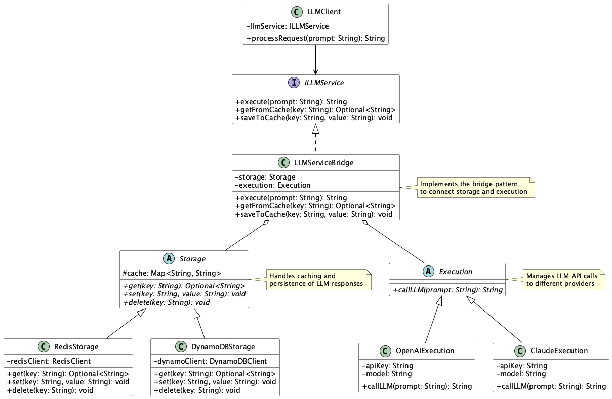

# Bridge for Storage & Execution Pattern

## 概要

Bridge for Storage & Execution Patternは、LLMを活用するシステムにおいて「ストレージ（Storage）」と「実行（Execution）」を明確に分離し、両者をつなぐ橋渡し役となるインターフェースを導入する設計手法です。このパターンにより、キャッシュ処理や永続化処理とLLM APIの呼び出し処理を疎結合にし、柔軟でテスト可能なシステムを実現できます。

## 解決したい課題

LLMの利用では過去のコミュニケーション履歴やユーザメタデータ等を利用してプロンプトの補助データとすることがあります。そのため、LLM APIを利用する多くのシステムでは、キャッシュ処理やデータベースとの連携処理がLLM呼び出しロジックと密結合になりがちです。これにより以下のような課題が発生します。

- **ロジックの混在による可読性・保守性の低下**
   - 1つのクラス内にキャッシュ取得、DB書き込み、LLM API呼び出しが混在し、変更時の影響範囲が広がります。

- **ストレージ基盤やLLMプロバイダのスワップが困難**
   - RedisからDynamoDBへ切り替えたい場合に、LLM呼び出し部分まで修正が必要になります。

- **テストが困難になる**
   - StorageとExecutionの両方を含むクラスは、単体テストでモックの粒度が大きくなり、再現性のあるテストが難しくなります。

- **パフォーマンス最適化の余地が狭まる**
   - キャッシュヒット／ミスのロジックが細分化できず、性能改善の自由度が低下します。

## 解決策

Bridge for Storage & Execution PatternではStorage（キャッシュや永続化）とExecution（LLM呼び出し）をそれぞれ独立した実装に分離し、それらを共通インターフェース（Bridge）経由で連携させます。

- **Abstraction（Bridge）の実装**
   - ILLMServiceのようなインターフェースを定義し、呼び出し側からは共通の形で利用します。

- **Storage実装の分離**
   - Redis、DynamoDB、PostgreSQLなどを用いてキャッシュの読み書きを実装します。

- **Execution実装の分離**
   - OpenAI APIやClaudeなどのLLMプロバイダへの呼び出しを担当します。

- **連携フローの実装**
   - まずStorageに問い合わせ、ヒットした場合はキャッシュを返却、ミスした場合はLLMを実行し結果をStorageに保存してから返却します。

## 適応するシーン

このパターンは以下のようなシステムに有効です。

- RAG（Retrieval-Augmented Generation）サービス：検索結果や生成結果をキャッシュし、コストとレイテンシを最適化したい場合
- チャットボット基盤：対話履歴やメモリを永続化しつつ、最新のコンテキストに応じた出力を生成する場合
- 埋め込みパイプライン：初回のみベクトル埋め込みを計算し、以降はキャッシュから取得したい場合
- リアルタイム分析システム：生成結果をキャッシュしてダッシュボードに反映したい場合

## 利用するメリット

このパターンを採用することで、以下のような利点が得られます。

- 疎結合な設計により、StorageとExecutionの独立開発・テストが可能になります。
- 拡張性が高く、ストレージやLLMプロバイダの入れ替えが容易になります。
- パフォーマンスの最適化が行いやすく、キャッシュヒット率の向上によってコスト削減やレイテンシ低減が期待できます。
- テスト性の向上により、MockやStubを活用したユニットテストが容易になります。

## 注意点とトレードオフ

このパターンを導入する際には、以下のような注意点があります。

- 設計・実装の複雑化：Bridge、Storage、Executionの3層構造を管理する必要があり、初学者には理解が難しくなる可能性があります。
- オーバーヘッドの増加：キャッシュ確認や保存処理によって、呼び出しのレイテンシが若干増加します。
- キャッシュ整合性の設計が必要：TTLの設定や手動無効化の仕組みがないと、古いデータを返してしまうリスクがあります。
- 運用コスト：ストレージ層に専用の監視やスケーリング戦略が必要になることがあります。

## 導入のヒント

効果的に導入するためのポイントは以下の通りです。

1. 最小構成から開始：まずはインメモリキャッシュ（例：dict）と単純なLLM呼び出しを接続する形で始めます。
2. DIやFactoryを活用：環境（開発、本番）ごとにStorage／Execution実装を差し替え可能にします。
3. メトリクス収集の仕組みを導入：キャッシュヒット率やLLM呼び出し回数を監視し、最適化の判断材料とします。
4. ポリシー設計：TTL、LFU／LRU、手動削除APIを含め、キャッシュ戦略を明確化します。
5. 段階的に拡張：初期はどちらか一方のみから始め、必要に応じてBridgeパターンへ拡張する形で無理なく導入できます。

## まとめ

Bridge for Storage & Execution Patternは、LLMの出力生成とそのキャッシュ・永続化を疎結合に管理できる実践的な設計手法です。責務を明確に分離することで、拡張性・可読性・テスト性を向上させつつ、実行効率の最適化も可能になります。初期導入の難易度はやや高いものの、中長期的には保守性の高いシステム構築に大きく貢献します。
