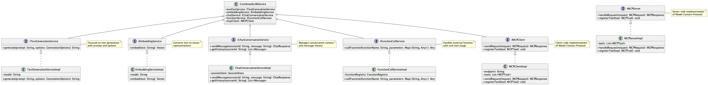

# LLM Service Interface Segregation Pattern

## 概要

LLM Service Interface Segregation Patternは、LLM関連の機能を提供するサービス層のインターフェースを、機能ごとに分割して設計するパターンです。Interface Segregation Principle（ISP）に基づき、利用者が必要とする最小限のメソッドだけに依存できるよう、細粒度のインターフェースを定義します。これにより、依存性の最小化、テストの簡素化、権限管理の柔軟性などが実現できます。

## 解決したい課題

LLMは多様な自然言語処理機能を提供します。テキスト生成だけを取っても、チャット、文章分類、タグ付け、プログラム生成等々を実践することが可能です。さらにはテキストベクトルを利用した類似検索やMCP（Model Context Protocol）による外部サービス呼び出しも可能です。

LLMが異なる多様な機能を提供する一方で、LLMとして単一の巨大なサービスインターフェースを採用した場合に以下のような課題が発生します。

- **インターフェースの肥大化**
   - テキスト生成、埋め込み、チャット、ツール呼び出しなど、すべてのLLM機能を一つのインターフェースに詰め込むと、利用しない機能にも依存することになり、クラス設計が複雑になります。

- **テストの煩雑化**
   - 単一のモックをすべてのユニットテストで使い回すことになり、不必要なメソッドまで実装・管理する必要が生じます。

- **変更影響の拡大**
   - 新しいLLM機能の追加や修正が既存のインターフェースに及ぶことで、広範囲のビルドやテストに影響を与えます。

- **権限管理やレート制限の柔軟性欠如**
   - API単位で細かい認可やレート制限を適用したい場合、単一インターフェースでは制御が困難です。

## 解決策

Interface Segregation Principle（ISP）に基づき、機能ごとに独立したインターフェースを定義し、それぞれの責務に応じたサービス構成を行います。例えば以下のような分割が有効です。

- **テキスト生成インターフェース**
   - `ITextGenerationService.generate(prompt, options)`
   - プロンプトに基づくテキスト生成に特化したインターフェースです。

- **埋め込みインターフェース**
   - `IEmbeddingService.embed(text)`
   - テキストのベクトル化に特化したインターフェースです。

- **チャットインターフェース**
   - `IChatConversationService.sendMessage(sessionId, message)`
   - 会話の文脈を保持するチャット機能に特化したインターフェースです。

- **関数呼び出しインターフェース**
   - Function calling / tool calling、またはMCPクライアントとMCPサーバに依拠。
   - ツールや関数の呼び出しに特化したインターフェースです。
   - **External Service Pattern**参照。

## 適応するシーン

このパターンは以下のような場面で有効です。

- 多機能なエンタープライズ向けチャットシステム（生成、要約、RAG、ツール呼び出し等）
- モジュール分割されたAIプラットフォームやマイクロサービスアーキテクチャ
- テナントごとに異なるLLM機能セットを提供するマルチテナント型SaaS
- テスト自動化やCI/CDの整備が進んでいる大規模開発プロジェクト

## 利用するメリット

このパターンを採用することで、以下のメリットが得られます。

- 明確な責務分離と疎結合な設計が実現でき、再利用性と保守性が向上します。
- ユニットテストやモック化が容易になり、開発生産性が向上します。
- 認可・レート制御が粒度の細かい単位で適用可能となり、セキュリティポリシーの実現が容易になります。
- 拡張性の高い構成を取りやすく、新機能を安全に追加できます。

## 注意点とトレードオフ

このパターンを採用する際は、以下の点に注意が必要です。

- インターフェースが増えることで、設計・管理のコストが上昇します。
- 依存注入（DI）設定が複雑化し、プロジェクト規模によってはセットアップに時間がかかります。
- 機能の粒度設計に失敗すると、後から統合・再分割が必要になる可能性があります。
- ドキュメント整備の負荷が高まり、開発者への学習コストが上がることがあります。

## 導入のヒント

このパターンを効果的に導入するためのポイントは以下の通りです。

1. 機能分類の洗い出しから始め、ユースケースごとにLLM機能を分類し、インターフェース単位に分割して設計します。
2. 既存のモノリシックなインターフェースを段階的に分割し、テストが壊れないように移行を進めます。
3. Spring、Guice、NestJSなどのDI機構を使い、インターフェース単位の依存注入を整備します。
4. 各機能インターフェースに対して認可・レート制限を一貫して適用できるよう、共通ミドルウェアを設計します。
5. 新たな開発者が理解しやすいよう、インターフェースごとの使用例をドキュメント化して共有します。

## まとめ

LLM Service Interface Segregation Patternは、LLMサービスをスケーラブルかつ保守性の高い構造で実装するための有効な手法です。機能単位にインターフェースを分割することで、テストや拡張、権限制御の効率を高めることができます。初期設計には慎重な粒度の見極めが必要ですが、うまく導入すれば大規模システムにおいて大きな効果を発揮します。
