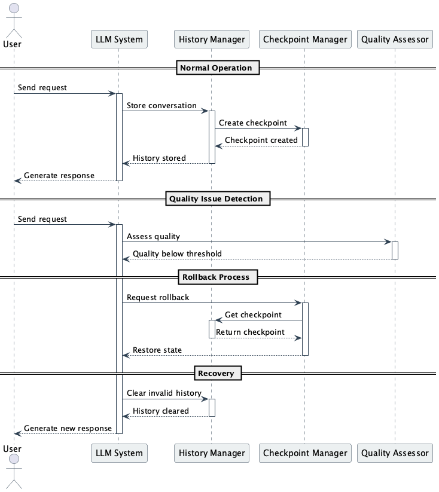

# Forget Past Pattern

## 概要

Forget Past Patternは、LLMとの対話において、過去の履歴やプロンプトの蓄積によって発生するコンテキストの誤りや生成品質の低下を防ぐための設計手法です。このパターンでは、適切なチェックポイントまで履歴を巻き戻し、プロンプトを再構成することで、LLMの出力品質を維持します。不要な情報の除去や誤った判断からのリカバリを通じて、システムの安定性と信頼性を向上させることができます。

## 解決したい課題

LLMを用いたシステムでは、長時間の対話や複雑なタスク処理において、過去の履歴が大量に蓄積されていきます。その履歴のすべてが正確で有用であるとは限らないでしょう。ユーザ側が間違ったリクエストをしたケースもあれば、LLMのHallucinationsによって誤った情報が生成されることもあります。こうした情報が履歴に残って、以降のLLMの処理でメモリとして利用される場合、不正確な情報をもとに推論が行われたり、誤ったコンテキストが生成されたりすることがあります。これにより、LLMの出力品質が低下し、システム全体のパフォーマンスにも悪影響を及ぼす可能性があります。

1. **コンテキスト汚染**
   - ユーザが誤って入力した内容が履歴に残り、以降の回答に影響を及ぼします。

2. **トークンコストの増加**
   - 不要な過去履歴を保持し続けることで、APIのトークン使用量とコストが膨れ上がります。また、処理の遅延も引き起こします。

3. **リカバリの困難さ**
   - 逸れた会話を手作業で調整して元に戻すのが手間で非効率です。誤った方向に進んだ会話を修正するために、たびたび最初からやり直す必要が生じます。

4. **テストのしにくさ**
   - 異常系を再現して検証する手段がなく、障害分析や再現性確認が難しいでしょう。特定の会話パターンでの問題を再現するためのテスト環境構築が複雑になります。

## 解決策

Forget Past Patternでは過去の不要な履歴を忘れるためのメカニズムを導入します。これにより、LLMの出力品質を向上させ、システム全体のパフォーマンスを最適化します。また、LLMのトークン制限により、長い履歴を保持することができないため、古い情報を削除する必要があります。これらの問題を解決するために、Forget Past Patternでは過去の履歴を適切に管理し、必要な情報だけを保持する方法を提供します。

具体的なアプローチは以下の通りです。

1. **チェックポイントのスナップショット化**
   - 重要なタイミングで履歴の状態を記録し、必要に応じてその時点に戻します。
   - 会話の開始時、重要な指示の送信後、タスクの完了時などにスナップショットを取得します。

2. **ロールバック機構の導入**
   - 誤った分岐や出力が発生した際に履歴を自動または手動で巻き戻し、再度適切なプロンプトを組み立てます。
   - 品質スコアが閾値を下回った場合に自動的にロールバックを実行します。

3. **動的リセット**
   - 品質スコアや逸脱率などの基準を用いて、ユーザの操作やシステム判定により自動的に過去履歴を除去します。
   - 会話の文脈が大きく変わったと検知した場合に、関連性の低い過去の履歴を削除します。

## 適応するシーン

このパターンは以下のような場面で特に有効です。

- カスタマーサポートチャットボットで、長時間の会話により話題が混線した場合
- 自律型エージェントが複数ツールを連携する処理中に誤動作が発生した場合
- 教育支援システムにおける誤った学習ステップからの再学習
- RAG＋LLMの構成で、検索や要約が失敗した際の再処理
- 複数回の対話が必要な複雑なタスクの実行時

## 利用するメリット

このパターンを活用することで、以下のような利点が得られます。

- 誤った履歴の除去による出力品質の向上
- トークン使用量の最適化によるコスト削減
- 会話やタスクの再実行が容易となり、ユーザとシステムの両方に柔軟性を提供
- エラーや異常系の再現性向上により、開発や運用効率が向上
- システムの安定性と信頼性の向上

## 注意点とトレードオフ

導入にあたっては、以下のような点に注意が必要です。

- 履歴を突然忘れることでユーザが混乱しやすくなるため、UX面での配慮が必要です
- どのタイミングで履歴をリセットするかの判断が難しく、実装や設計が複雑になります
- 履歴管理やチェックポイントの保持に追加コストが発生します
- 履歴を戻しても必ずしも正しいルートに復帰できるとは限らず、再発防止策が必要です
- システムの複雑性が増加し、デバッグが難しくなる可能性があります

## 導入のヒント

このパターンを効果的に導入するためのポイントは以下の通りです。

1. **チェックポイントの戦略設計**：会話開始時、重要な指示の送信後など、戻しやすいタイミングをあらかじめ決めておきます。例：タスクの開始時、重要な意思決定時、エラー発生時など。
2. **UX設計の工夫**：ユーザに対して「会話をリセットしました」など明示的に伝え、混乱を避ける設計にします。例：リセット時に「過去の履歴を忘れました」と通知する、履歴の可視化機能を提供するなど。
3. **自動ロールバックの導入**：出力のスコア評価などを用いて自動的に履歴を巻き戻す仕組みを組み込みます。例：応答の品質スコア、文脈の一貫性スコアの監視。
4. **部分的な忘却の導入**：全体を消すのではなく、誤った発言部分のみを削除するような制御を取り入れます。例：特定のトピックに関連する履歴のみを選択的に削除。
5. **テストケースの整備**：正常系／異常系の両方でロールバックが正しく機能するよう、ユニットテストやE2Eテストを整備します。例：各種エッジケースでの動作確認、パフォーマンステスト。

## まとめ

Forget Past Patternは、LLMとの対話において、過去の履歴やプロンプトを適切に管理・巻き戻すことで、システムの応答品質と安定性を向上させる設計手法です。長時間稼働する対話システムやエージェント型アプリケーションにおいて、品質維持やトークン最適化を実現するために有効な手段となります。導入時にはUXや履歴設計に十分注意を払いながら、段階的に実装することが重要です。適切な実装により、より信頼性の高いLLM活用システムを構築することが可能になります。
