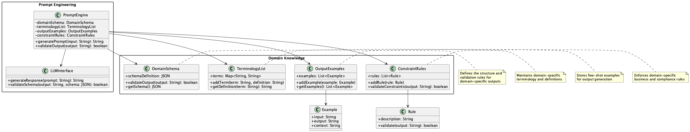

# Domain-Oriented Prompt Design Pattern

## 概要

Domain-Oriented Prompt Design Patternは、特定のドメイン（金融、医療、法務、製造など）に特化した知識、専門用語、データ構造をプロンプトに明示的に組み込む設計手法です。スキーマや用語集、出力例、制約ルールを活用することで、LLMの応答精度と一貫性を向上させることができます。このパターンにより、ドメイン特有の要件や規制を満たしつつ、高品質な出力を生成することが可能になります。

## 解決したい課題

LLMは汎用的に広い知識を持っていることから、多様なドメインの課題解決に活用されることが期待されます。異なるドメインでは異なるLLMの使い方が必要とされます。LLMモデル自体をドメイン専用に用意することもあるでしょう。もっと手軽に対処する場合は、既存のLLM APIを利用して、ドメイン特化型のプロンプト設計を行うことが考えられます。ドメイン特化型のプロンプト設計は、LLMの出力精度や一貫性を向上させるために重要です。

1. **一般文脈への偏り**
   - 医療領域で「BP」という用語が「ベストプラクティス」ではなく「血圧（Blood Pressure）」を意味しているにもかかわらず、一般的な解釈が優先されてしまいます。

2. **用語・フォーマットのブレ**
   - 同じ契約書内で「賃料」「月額費用」などの言い回しが混在し、文書の整合性が損なわれてしまいます。

3. **コンプライアンス違反リスク**
   - 医療レポートで法的に必要な項目が抜け落ちてしまい、違反リスクが発生してしまいます。

4. **再利用性不足**
   - ドメイン定義を各プロンプトに都度埋め込むことで、変更が発生した際に全体を修正する必要が生じてしまいます。

## 解決策

ドメインに特化した知識と構造をプロンプト設計に組み込むことで、上述の課題を解決します。

1. **ドメインスキーマの利用**
   - JSON SchemaやPydanticなどを用いてデータ構造を定義し、モデル出力の期待形式を明示します。

2. **専門用語リストの導入**
   - 業界特有の略語や専門用語の意味を明記し、システムプロンプトで定義して誤解を防ぎます。

3. **出力例（few-shot）の提示**
   - ドメインにおける代表的な出力例をfew-shotとして与えることで、スタイルや構造を誘導します。

4. **制約ルールの記述**
   - 法規制やビジネスルールに基づく出力要件をチェックリスト形式で明記し、違反リスクを低減します。

## 適応するシーン

このパターンは以下のようなドメイン特化型システムに適しています。

- エンタープライズSaaSでのレポート・ダッシュボード生成
- ヘルスケア領域における診療要約や検査レポート生成
- 法務文書や契約書のドラフト生成およびレビュー補助
- 製造業における製品仕様書やマニュアルの自動作成

## 利用するメリット

このパターンの活用により、以下のような利点が得られます。

- ドメイン特有の誤解を最小化し、高精度な出力が得られます。
- 出力形式や記述スタイルを一貫させることで、後処理やレビューの手間を削減できます。
- コンプライアンス遵守の観点で、法的・業務的要件を満たしやすくなります。
- スキーマや用語集を共有資産として再利用可能になり、メンテナンス性が向上します。

## 注意点とトレードオフ

導入にあたっては以下の点に注意が必要です。

- 初期設計の負荷が大きく、ドメインスキーマや用語集の整備に時間がかかります。
- プロンプトの長文化により、トークン消費量やコストが増加する場合があります。
- モデルがスキーマ遵守できる前提（JSONモードやfunction calling対応）である必要があります。
- ドメイン要件の変更時には、スキーマ、用語、出力例の一括見直しが必要となります。

## 導入のヒント

このパターンを効果的に導入するためのポイントは以下の通りです。

1. まずは主要フィールドのみ対応し、徐々に拡張していくことで導入負荷を抑えます。
2. 専門用語や略語をDBまたはCSVで管理し、プロンプト生成時に動的に参照できるようにします。
3. few-shotとテンプレートを組み合わせた構造で設計し、段階的に精度を高めていきます。
4. CI/CDパイプラインにスキーマ検証や出力例検証のユニットテストを組み込みます。

## まとめ

Domain-Oriented Prompt Design Patternは、特定領域の業務ニーズに最適化されたプロンプト設計を可能にする強力な手法です。LLMの出力の品質、信頼性、遵法性を高めるためには、ドメイン知識の構造化とプロンプトへの体系的な組み込みが不可欠です。適切に運用することで、高品質な業務自動化が実現できます。
