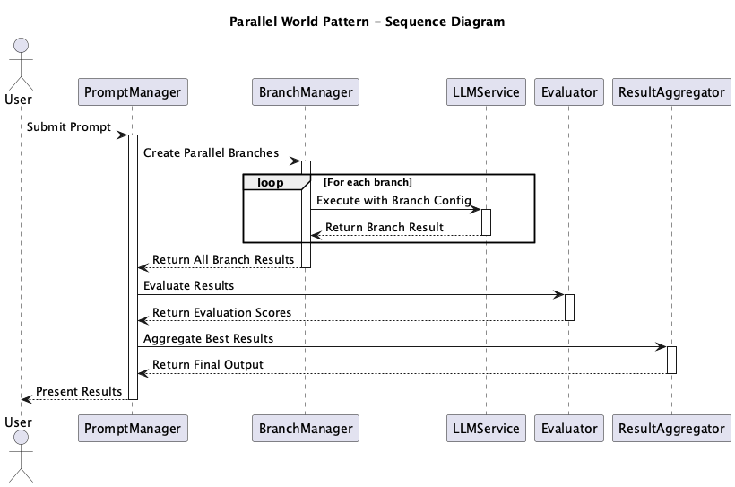

# Parallel World Pattern

## 概要

Parallel World Patternは、同一のプロンプトや会話履歴を複製し、異なるプロンプトバリエーションや設定を並列に実行・比較する設計パターンです。このパターンにより、複数の選択肢を同時に生成して比較・評価し、最適な出力を効率的に選定することができます。特に、プロンプトエンジニアリングやLLMの出力最適化において、迅速な改善サイクルを実現するために有効です。

## 解決したい課題

LLMと長いやり取りをして検討を深めている途中で、複数の対立するアイデアを検討する必要が出てくることは多々あります。同じ会話履歴を用いて検討を継続したいでしょうが、一般的にはLLMへのリクエストが1履歴1リクエストであるため、複数のアイデアを同時に検討することが難しいです。

LLMを活用したプロンプト設計において、以下のような課題が生じます。

1. **反復試行の非効率性**
   - 少しずつプロンプトを修正して実行・比較する工程は手間と時間、そしてトークンコストを大きく消費します。
   - 一つの変更が失敗した場合、元の状態に戻して別の変更を試す必要があります。

2. **比較の困難さ**
   - 履歴が複雑化すると、どのプロンプト変更が有効だったのかを正確に判断することが難しくなります。
   - 共通の履歴から複数のアイデアを深堀りすることができません。

3. **品質保証の難しさ**
   - 単一ブランチのみで失敗した場合、良かった状態に戻す手段がなく、リカバリが困難です。
   - 本番環境での予期せぬ失敗に対して、代替案をすぐに用意することができません。

## 解決策

Parallel World Patternでは、対話履歴やプロンプトをスナップショットとして複製し、以下のような手法で問題を解決します。

1. **並列ブランチ生成**
   - 複数のプロンプトバリエーション（温度変更、システムメッセージの違い、Few-shotの構成違いなど）を同時に実行します。
   - 各ブランチに一意の識別子を付与し、設定と結果を紐付けます。

2. **品質評価と比較**
   - 各ブランチの出力をユーザフィードバックなどで評価します。

3. **履歴追跡と可視化**
   - どのブランチがどのプロンプトや設定で実行されたかを記録し、再現性を確保します。
   - 結果の差分を視覚的に表示し、改善点を特定しやすくします。

## 適応するシーン

このパターンは以下のようなシステムやプロジェクトで有効です。

- チャットボットの応答改善に向けたプロンプトのチューニング
- コンテンツ自動生成ツールでの文章スタイルや構成の最適化
- LLMエージェントにおける複数の推論戦略（ReAct vs CoT）の並行比較
- コーディング補完における複数の補完候補の同時生成と評価
- マルチモーダル生成における異なる生成戦略の比較

## 利用するメリット

Parallel World Patternを活用することで、以下の利点が得られます。

- 迅速な比較と改善が可能になり、検証サイクルを短縮できます。
- リスク分散により、あるブランチで失敗しても他ブランチには影響がありません。
- 定量的な最適化により、科学的に最適なプロンプトを選定できます。
- ナレッジ蓄積により、再利用可能な知見を得ることができます。
- 複数の選択肢を同時に提示することで、より良い結果を選定できます。

## 注意点とトレードオフ

このパターンを活用する際には、以下の点に注意が必要です。

- 実行コストの増大：並列ブランチ数が多くなるほど、API利用量やレイテンシ、トークンコストが増加します。
- 履歴管理の煩雑さ：各ブランチのプロンプト・設定・出力を追跡・管理する仕組みが必要になります。
- ユーザの混乱：複数案を提示する場合、出力差の可視化や説明が不十分だと選択が困難になります。
- 最適化ロジックの難しさ：ブランチの評価指標設計が曖昧だと、自動で最良案を選ぶことが困難になります。

## 導入のヒント

以下の方法を参考に導入を進めると効果的です。

1. 少数のブランチから開始し、効果とコストを比較します。
2. 各ブランチに「変更内容」や「評価スコア」などのメタ情報をタグ付けします。
3. BLEUやROUGE、ルールベーススコアリングなどで自動評価できる仕組みを整備します。
4. 不要になった履歴やブランチは定期的に削除し、ストレージやAPI使用量を抑制します。
5. ダッシュボードやグラフで並列結果を視覚化し、ユーザが直感的に差分を理解できるようにします。

## まとめ

Parallel World Patternは、プロンプト設計やLLM出力の最適化において極めて効果的な戦略です。複数案を並列に実行・比較することで、品質向上のスピードと信頼性を高めることができます。ただし、導入には実行コストや管理の複雑さも伴うため、システム規模と目的に応じて段階的に適用することが望ましいです。
