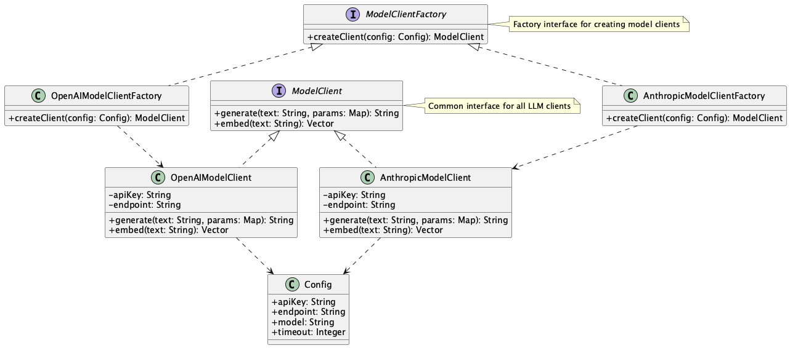

# Abstract Factory for Model Clients

## Overview

Abstract Factory for Model Clients is a design pattern that provides a common interface for multiple LLM providers (such as OpenAI, Anthropic, Google Gemini, or on-premises open-source models like DeepSeek). This practice allows the business logic layer to utilize LLM capabilities in a unified manner without being aware of the specific implementation details of each provider.

## Problems to Solve

In many cases, when developing systems that utilize LLMs, projects initially start with a single LLM provider (e.g., OpenAI API). The program is set up with only an OpenAI API client, which is used throughout the codebase. However, since LLMs are not perfect, situations may arise where the initially used LLM becomes problematic, necessitating the use of alternative LLMs to overcome these issues.

Additionally, when new LLM models are released, it becomes necessary to modify clients to support these new models.

While it's possible to create additional LLM clients (e.g., Anthropic API client) or new model clients alongside the initial LLM client (e.g., OpenAI API client), this approach leads to several challenges:

- **Vendor Lock-in Issues**
  - If the implementation directly calls OpenAI's API, switching to Anthropic for cost reduction would require modifications throughout the entire codebase.

- **Code Duplication**
  - Similar request construction and error handling code is duplicated for each provider, reducing maintainability.

- **Testing Difficulties**
  - Each provider's API needs to be mocked individually, complicating the test code.

## Solution

Apply the Abstract Factory for Model Clients pattern by providing a common interface and Factory class for all LLM providers. LLM clients are generated from a common LLM model client factory and can be used through a common interface. The business logic layer can use LLMs without being aware of interface differences between providers.

- **Common Interface Definition**
  - Define common interfaces (such as `generate`, `embed`, etc.) that all LLM clients must implement.

- **Factory Class Implementation**
  - Create Factory classes for each provider to generate clients with appropriate configurations.

- **Centralized Configuration Management**
  - Manage settings such as API keys and endpoints in one place, allowing dynamic switching at runtime.

## Applicable Scenarios

This practice is particularly effective in the following situations:

- Systems using multiple LLM providers
- When you want to dynamically switch providers based on cost or performance
- When failover or backup mechanisms are needed
- When conducting A/B testing between different models

## Benefits

Adopting this practice provides the following benefits:

- Decouples business logic from provider implementation
- Makes it easy to add new providers
- Facilitates testing by creating mock LLM clients from the interface
- Improves operational efficiency through centralized configuration management

## Considerations and Trade-offs

When adopting this practice, consider the following points:

- In small-scale systems, the overhead from abstraction may become significant
- Attempting to include all provider-specific features in the common interface can lead to interface bloat
- Maintenance costs arise from provider SDK version updates

## Implementation Tips

Key points for effectively implementing this practice:

1. Start with minimal common methods and expand as needed
2. Combine with a DI container to make the provider configurable at startup
3. Manage model types and API keys in configuration files (YAML/JSON/Env)

## Summary

Abstract Factory for Model Clients is a powerful design pattern for handling multiple LLM providers uniformly. When implemented appropriately, it can significantly improve system flexibility and maintainability. However, it's important to adjust the level of abstraction according to the system's scale and requirements.
