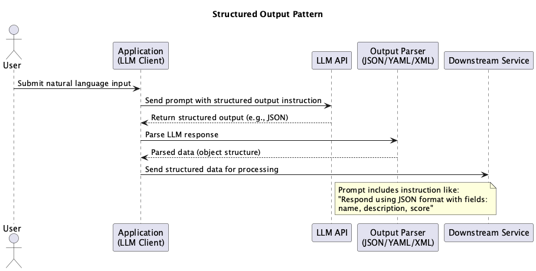

# Structured Output

## Overview

Structured Output is a design approach for receiving LLM outputs in predefined structures (JSON, dataclass, pydantic.BaseModel, etc.). This practice enables systems to process generated results safely and mechanically. By utilizing OpenAI's function calling / tool calling and JSON schema, it's possible to automatically validate and structure model outputs.

## Problems to Solve

Most programming languages are better at handling structured objects than natural language strings. On the other hand, LLMs are based on natural language processing, with natural language as their basic input and output. When making requests to LLMs from programs and receiving responses, the challenge of operating with only natural language (string type) is that programs need to parse and search for necessary information within strings. Since natural language can be freely written, there's always a possibility of gaps in parsing and search rules. This situation leads to the following problems:

1. **Frequent Parsing Errors**
   - Expected JSON format output may contain grammatically incorrect strings, resulting in errors.

2. **Low Safety**
   - Outputs may contain unexpected content, risking the execution of incorrect business logic.

3. **Difficulty in Debugging and Validation**
   - With free-form natural text, it's unclear how each field is interpreted, making testing complex.

## Solution

Many recent LLM APIs support Structured Output. With OpenAI API, you can instruct the model to respond in a structure specified by the program using function calling / tool calling or JSON schema. In Structured Output, we explicitly instruct the LLM to output according to a predefined structure and receive responses in a format that matches that structure.

1. **Defining Output Schema**
   - Design prompts to explicitly state JSON schema, encouraging output in formats like `{ "title": ..., "summary": ... }`.

2. **Type-Safe Conversion**
   - Map LLM responses to structures and convert them into type-safe formats (objects, dictionaries, structs, etc.).

3. **Detecting Hallucinations that Don't Follow Structure**
   - Detect hallucinations by validating when LLM responses don't follow the instructed structure.

## Applicable Scenarios

This practice is particularly effective in the following situations:

- Data extraction tasks (entity extraction, numerical information retrieval, etc.)
- When data needs to be passed to downstream systems via API responses
- Use cases requiring standardized outputs like JSON or CSV
- When user input needs to be structured for internal processing

## Benefits

Adopting this practice provides the following benefits:

- Output formats are standardized, making parsing and type conversion easier.
- Detection of anomalies and missing values becomes easier, improving reliability.
- System integration (API calls, etc.) becomes more straightforward.
- Input/output schema validation makes unit testing and automation easier.

## Considerations and Trade-offs

When adopting this practice, attention should be paid to the following points:

- LLMs may not completely follow structured output, requiring exception handling.
- Too many schema constraints may reduce flexibility.
- Token count increases, requiring attention to prompt size and cost.
- Output formatting accuracy may vary depending on the model version.

## Implementation Tips

Key points for effectively implementing this practice are as follows:

1. Explicitly define output schemas using dataclass or pydantic.BaseModel.
2. Prioritize using models that support JSON schema and Function Calling / Tool Calling.
3. Implement type validation using libraries like Pydantic.

## Summary

Structured Output is a practical approach for handling LLM-generated outputs in a structured manner. This enables reliable system integration and automated processing, greatly expanding the scope of business applications. However, since it depends on output accuracy, robust schema design and exception handling are crucial.
