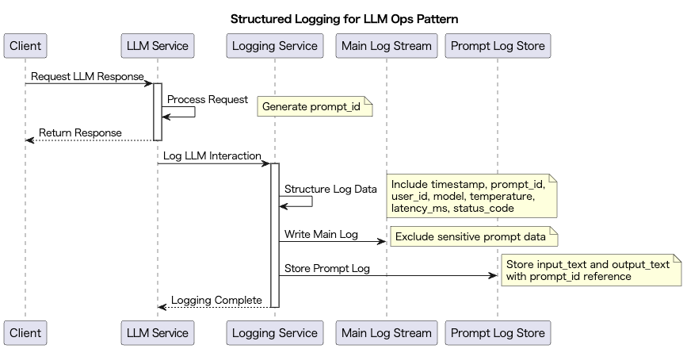

# Structured Logging for LLM Ops

## Overview

Structured Logging for LLM Ops is a design practice that records interactions such as prompts, responses, and metadata in a structured format (like JSON) for applications utilizing LLMs. This practice enables efficient operational monitoring, quality analysis, test automation, and troubleshooting of LLMs. By integrating structured logs with log aggregation platforms like Datadog, CloudWatch, Elasticsearch, and BigQuery, visualization, aggregation, and anomaly detection become possible.

Furthermore, we will introduce a method to maintain log readability by outputting prompts to a dedicated data store instead of logs.

## Problems to Solve

LLM inference consists of various elements:

- Input prompts
- Output prompts
- Models used
- Request parameters (Temperature, etc.)
- Request timestamps
- User information
- Others

Like other application systems, when an error occurs, it's impossible to know which information caused the error until it happens. Since unrecorded logs disappear, there's no question about the need to output sufficient information in logs. Additionally, to identify bottlenecks for quality improvement, even without errors, logs need to be analyzed.

On the other hand, the challenging aspect of managing LLM logs is that input/output prompts can be enormous and may contain confidential information. Needless to say, when logs are filled with large amounts of natural language, it becomes difficult to read other logs. If confidential information is included, proper log processing becomes even more challenging.

1. **Difficulty in Tracking Error Causes**
   - When users report "irrelevant answers," it's difficult to reproduce or investigate because the prompts and settings used are unknown.

2. **Inefficient Analysis for Quality Improvement**
   - While wanting to compare which prompt templates or parameter settings produced higher accuracy, extraction is impossible due to inconsistent and unstructured logs.

3. **Difficulty in Implementing Automated Testing and Alerts**
   - While wanting to monitor for anomalies in LLM outputs, analysis is impossible because logs are recorded in human-readable plain text.

4. **Log Readability Issues and Confidential Information**
   - Directly outputting prompts to the log system compromises log readability and security.

## Solution

Record prompts, responses, API call parameters, response times, model names, user IDs, and other information consistently as structured logs in JSON format. By defining structured logs with the following fields, log analysis and quality monitoring become easier:

- `timestamp`: Log recording time
- `prompt_id`: Unique identifier for the prompt
- `user_id`: User identifier
- `model`: LLM model name used
- `temperature`: Temperature parameter for generation
- `input_text`: Input prompt
- `output_text`: LLM output
- `latency_ms`: Response time
- `status_code`: API call status

Additionally, prompt logs are not directly output to the log stream but saved in a dedicated prompt log data store to maintain log readability and confidentiality. Logs in both the log stream and data store are managed with unique log IDs, allowing for operational viewing of both when necessary.

1. **Time-series Based Storage Structure**
   - Example: Save in formats like `s3://prompt-logs/2024/03/15/14/request-123.json` to facilitate time-series search.

2. **Asynchronous Storage Processing**
   - Perform prompt storage processing in the background to avoid affecting inference response speed.
   - Example: Use message queues like Kafka or RabbitMQ to store prompts asynchronously.

3. **Access Control Implementation**
   - Implement appropriate access control on the external storage side, ensuring only users with necessary permissions can access prompts.
   - Example: Use IAM roles or bucket policies to implement access control based on the principle of least privilege.

## Applicable Scenarios

This practice is particularly effective in the following situations:

- When operational monitoring and SLA compliance visualization are needed for commercial LLM services
- Applications that frequently generate and send prompts, such as RAG or chatbots
- Processes for testing prompt validation and LLM output quality evaluation
- Scenarios requiring traceability of user operations and system outputs for security and audit purposes

## Benefits

Adopting this practice provides the following benefits:

- Ensures traceability of prompts and responses, making incident response and user support easier
- Enables LLM accuracy evaluation and improvement through analysis and aggregation of structured logs
- Facilitates building automated alerts and error detection logic
- Can be utilized as a data foundation for future model comparison and A/B testing

## Considerations and Trade-offs

When adopting this practice, attention should be paid to the following points:

- Since structured logs contain prompts and outputs, care must be taken regarding the risk of personal and confidential information leakage
- When log volume becomes enormous, storage costs and log infrastructure scalability need to be designed in advance
- Standardization and testing of loggers are important to maintain log consistency
- Excessive log output may lead to performance degradation, so log level and sampling control should be considered

## Implementation Tips

Key points for effectively implementing this practice are as follows:

1. Clearly define log schemas and prepare common libraries to record in the same format for all LLM calls
2. Use JSON or structured log formats to enable integration with log infrastructure
3. Be conscious of log levels (info/debug/error) from the development stage and gradually deploy to production
4. Incorporate logic to mask and filter personal information in prompts and outputs
5. Perform prompt storage processing in the background to avoid affecting inference response performance. Split directories and indexes based on time to improve access and cost efficiency
6. Implement TTL settings to automatically manage retention periods according to domain or tenant requirements

## Summary

Structured Logging for LLM Ops is a fundamental and important design practice for enhancing reliability, traceability, and quality management when utilizing LLMs in business. By standardizing structured logs and integrating with analysis and visualization platforms, it provides significant benefits across all phases of development, operations, and improvement. However, sufficient consideration must be given to log security and cost management.
