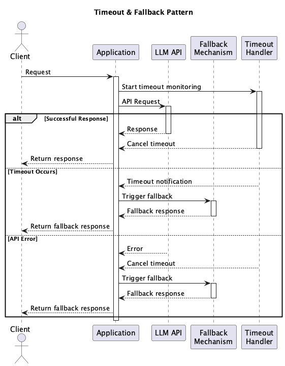

# Timeout & Fallback

## Overview

Timeout & Fallback is a design practice that ensures the overall reliability and responsiveness of a system by preparing alternative means (fallbacks) in case the LLM API response is not received within a certain time or when errors occur. This practice functions as a safety mechanism to prevent degradation of user experience and processing interruptions.

## Problems to Solve

In any application, it's better to minimize user wait times as much as possible. Most people dislike waiting and want responses as quickly as possible. This is also true when using LLM APIs, but LLMs are systems that involve massive resource usage and complex processing, making them relatively high-risk systems in terms of long response times and potential failures.

1. **Response Delays**
   - The OpenAI API may be temporarily congested, taking tens of seconds to respond. This can be fatal for chat applications requiring real-time interaction.

2. **Temporary Failures and Network Disruptions**
   - The API in specific regions may go down during certain time periods, causing processing failures.

3. **User Wait Time Stress**
   - Prolonged "loading" displays on screen increase the risk of user abandonment.

## Solution

Implement a mechanism that automatically uses fallback methods to continue processing if no response is received from the LLM API within a certain time. Examples of fallbacks include cached responses, simple template messages, rule-based processing, or using alternative LLM providers.

1. Make a request to the OpenAI API for 5 seconds, and if no response is received, return a "template message" or "cached response from similar past questions" as a fallback.

## Applicable Scenarios

This practice is particularly effective in the following situations:

- Applications requiring real-time interaction like chatbots and FAQs
- Business systems incorporating LLMs as part of their workflow
- Customer service scenarios requiring minimum responses even when LLM fails
- Configurations combining multiple LLM vendors for redundancy

## Benefits

Adopting this practice provides the following benefits:

- Improves system responsiveness and maintains user experience
- Reduces the risk of business interruption due to external API failures
- Can return better-than-nothing results even if response quality is somewhat reduced
- Enhances overall system availability and robustness

## Considerations and Trade-offs

When adopting this practice, the following points should be noted:

- Fallback quality may be lower than normal LLM responses
- Complex fallback processing can increase management and maintenance costs
- If fallbacks occur frequently in unintended cases, underlying quality issues may become harder to identify
- Continued "ambiguous responses" or "generic messages" may create distrust among users

## Implementation Tips

Key points for effectively implementing this practice are as follows:

1. Set appropriate timeout periods according to use cases (e.g., 3-5 seconds for chat, 10-30 seconds for batch processing)
2. Fallbacks can be configured in stages (e.g., cache → template → other provider)
3. Record fallback execution status as logs and visualize them through alerts and dashboards
4. Ensure transparency by displaying messages to users such as "Response has been simplified"

## Summary

Timeout & Fallback is an important design practice for maintaining user experience and system stability in preparation for LLM API uncertainties. It becomes an essential component especially in use cases where real-time interaction is crucial or in systems with significant business impact. By properly designing and implementing this practice, it's possible to build reliable LLM-integrated systems.
