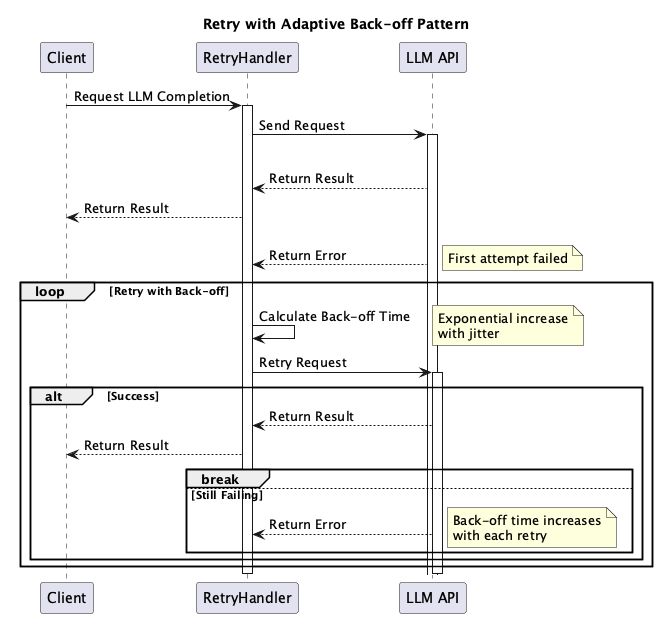

# Retry with Adaptive Back-off

## Overview

Retry with Adaptive Back-off is a design practice that implements a retry mechanism with intervals when requests to LLM APIs fail. By adopting an "adaptive backoff strategy" that dynamically increases wait times based on the number of failures rather than using fixed intervals, it suppresses load concentration and consecutive failures, thereby enhancing the overall stability of the system.

## Problems to Solve

Delays or failures in Web API responses are inevitable. Therefore, systems utilizing Web APIs require logic that accounts for delays and failures. While there are various causes for Web API delays and failures, it's better to avoid continuously sending requests when the system is experiencing issues. If an application is built to frequently execute timeouts and retries to avoid failures, it can become a load on the Web API. Alternatively, if the Web API has rate limiting, that application (or user) may become inaccessible due to rate limit errors. Since LLM APIs are also implemented as Web APIs, similar situations can occur.

1. **Temporary Rate Limit Errors (429)**
   - Some requests are rejected due to rate limiting when too many requests are sent simultaneously to the OpenAI API.

2. **Momentary Network Failures or Timeouts**
   - Network instability between the backend and LLM provider causes temporary connection loss.

3. **System Overload Due to Concentrated Retries**
   - All clients immediately retry after a failure, causing the API to become unresponsive.

## Solution

When requests fail, instead of simple retries, we implement "exponential backoff" or "jittered backoff" that exponentially increases delay times while retrying. This effectively handles temporary failures while preventing excessive retries from causing additional load.

1. The first retry is after 1 second, then 2 seconds, 4 seconds, 8 seconds, and so on, increasing the intervals.
2. Determine whether to retry based on the error. If retry is not possible, execute fallback processing. Record error logs to enable analysis of frequently occurring errors.

## Applicable Scenarios

This practice is particularly effective in the following situations:

- Services that frequently call LLM APIs (chatbots, batch processing, RAG pipelines, etc.)
- Applications that require essential communication with rate-limited external APIs
- Systems that want to recover without immediate service interruption during network failures
- Business applications requiring SLA compliance where failure rates need to be reduced

## Benefits

Adopting this practice provides the following benefits:

- Automatic recovery from temporary failures
- Suppression of overload on the LLM API side
- Flexible response to rate limits and error situations, improving success rates
- Reduction of manual resending and user intervention, maintaining quality user experience

## Considerations and Trade-offs

When adopting this practice, the following points require attention:

- Processing delays due to retries may affect scenarios requiring real-time performance
- Inappropriate backoff design can lead to infinite retries or prolonged recovery times
- Retries are meaningless and create unnecessary traffic when the failure is a "permanent error" (e.g., authentication error)

## Implementation Tips

Key points for effectively implementing this practice are as follows:

1. Clearly define error codes for retry targets in advance (e.g., HTTP 429, 503)
2. Set maximum retry counts and maximum backoff times to prevent excessive waiting or continued processing
3. Add "random jitter" to backoff to prevent simultaneous client retries
4. Monitor retry frequency and success rates through logs and metrics to tune the optimal strategy

## Summary

Retry with Adaptive Back-off is a fundamental and effective strategy for enhancing reliability and resilience in communication with external LLM APIs. Through adaptive retries, it can achieve both stable user experience and high success rates, even for rate limits and temporary failures that cannot be handled by simple retries. However, proper failure judgment and waiting strategy design are key to successful implementation.
