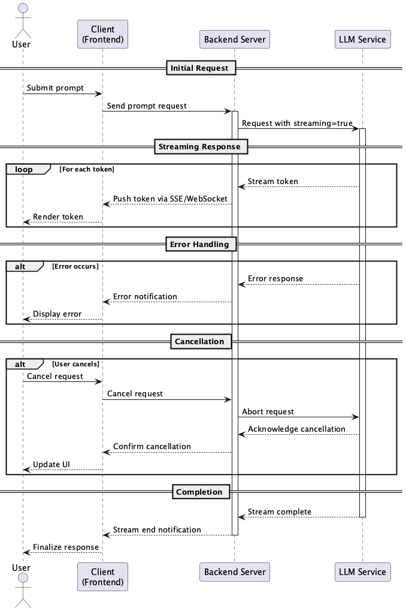

# Streaming Output

## Overview

Streaming Output is a design approach that processes and displays LLM responses sequentially without buffering. This practice provides immediate feedback to users and significantly reduces the perceived waiting time for responses. It can dramatically improve UX in interfaces that require real-time interaction.

## Problems to Solve

Chat UI is one of the most prominent use cases for LLMs. As exemplified by ChatGPT, using LLMs through chat is a widely accepted application. In LLM utilization, there is a challenge where users must wait until the LLM's response is complete.

- **Long waiting time for responses degrades user experience**
  - If response generation takes 10 seconds, users must stare at an unresponsive screen.

- **Unable to interrupt or cancel, processing continues even with incorrect requests**
  - Even if users notice input errors, they cannot stop the operation until the response is complete.

- **Reduced interactivity in UX**
  - In Chat UI, displaying response text as it flows in naturally creates a more natural conversation experience than showing it all at once.

## Solution

In Streaming Output, we receive output from the LLM in streaming mode and process/display it sequentially by tokens or sentences as they arrive. The following configuration is typical.

- **Utilization of Streaming APIs**
  - Use LLM APIs (e.g., OpenAI's `stream=true` option) to receive tokens sequentially.

- **Implementation of Real-time Communication**
  - Backend pushes tokens to clients as they are received (using SSE or WebSocket).

- **Implementation of Immediate Rendering**
  - Frontend renders received content immediately, showing response progress to users.

- **Addition of Control Features**
  - Implement cancellation and display pause features as needed.

## Applicable Scenarios

This practice is particularly effective in the following situations.

- Interactive UIs such as chatbots and virtual assistants
- Use cases with large output volumes like long text summarization, article generation, and translation results
- Scenarios using high-precision prompts or complex system instructions where long response times are expected
- Applications where users expect real-time responses

## Benefits

Adopting this practice provides the following benefits.

- Perceived waiting time for responses can be significantly reduced.
- Rich and natural user experience can be provided.
- Response progress is visible, enabling interruption and re-input decisions.
- Model latency can be absorbed in terms of UX, improving overall system impression.

## Considerations and Trade-offs

When adopting this practice, attention should be paid to the following points.

- Streaming processing requires implementation of asynchronous processing and real-time communication (WebSocket, SSE, etc.).
- Cannot be applied to LLM providers or modes that do not support streaming.
- Communication load between backend and frontend increases, and error handling becomes more complex.
- Display by token units may lead to misunderstandings at stages where context is not yet determined.

## Implementation Tips

Here are key points for effectively implementing this practice.

1. Initially limiting streaming display to chat UI only can help contain the scope of impact.
2. Backend design using asynchronous frameworks (e.g., FastAPI, Node.js) is effective.
3. Combining with a design where "cancellation is possible even before input completion" improves usability.
4. Adding formatting processing after detecting stream termination can maintain display quality.

## Summary

Streaming Output is a design approach that dramatically improves UX by displaying LLM responses in real-time. It can give users an impression of "immediate response" to the LLM's characteristic of requiring time for response generation, making it highly effective for conversational UIs and generative applications. While there is technical complexity, the value gained exceeds it.
