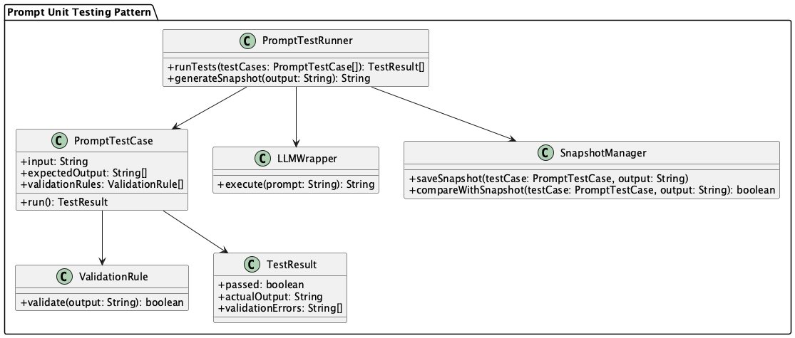

# Prompt Unit Testing

## Overview

Prompt Unit Testing is a design practice that verifies the behavior of prompts for LLMs at the unit test level. It enhances the reliability of LLM-powered systems by ensuring prompt quality and stability while making it easier to detect side effects from changes. This practice enables automatic verification of how prompt changes affect outputs and prevents quality degradation.

## Problems to Solve

In LLM applications, even minor changes to prompts can significantly impact output results. While prompt change management is important, it's equally crucial to ensure the quality of results from modified prompts. Like general programming, prompt changes should also be tested.

Additionally, there are many scenarios where prompts are manipulated programmatically, such as with **Structured Prompt Template** and **Role-Based Prompt Control**. In such cases, it's important to test that prompts are generated as expected and are only accessible to appropriate users.

The following challenges make prompt quality management difficult:

- **Prompt quality is person-dependent**
  - Prompt adjustment know-how accumulates as tacit knowledge and isn't shared across the team.

- **Difficulty in visualizing the impact of changes on behavior**
  - Changes in output are hard to verify in reviews, risking unexpected content being released to production. The relationship between prompt change history and output changes cannot be tracked.

- **No regression testing exists**
  - Cases that previously worked well might break after prompt modifications without notice. Output quality for important use cases may gradually degrade.

- **Misconception that testing is impossible due to output ambiguity**
  - LLM outputs are always probabilistic and variable, leading to the misconception that they can't be tested. Testing is often abandoned due to the belief that exact matching tests can't be written.

## Solution

Prompt Unit Testing automates unit testing of prompts and verifies expected output structures and important elements for representative inputs. By designing with the following approach, testing becomes possible while considering LLM ambiguity:

- **Implementation of flexible output verification**
  - Verification is done by keywords, structure, or schema rather than exact text matching.
  - Use **Structured Output** to organize information structurally, making testing easier.

- **Test utility preparation**
  - Prepare test utilities that wrap LLMs and introduce mechanisms to absorb environmental differences and variations.
  - Record output differences based on snapshots, making them reviewable.

- **Systematization of test cases**
  - Organize representative input cases by category and manage them as test cases. Build a comprehensive test suite including edge cases and error scenarios.

## Applicable Scenarios

This practice is particularly effective in the following situations:

- LLM applications requiring standardized outputs (e.g., FAQ, summarization, classification)
- Teams where multiple people maintain and improve prompts
- When CI/CD pipelines include LLM processing
- When introducing LLMs as part of business processes requiring high reliability
- When tracking prompt change history and maintaining quality

## Benefits

Adopting this practice provides the following benefits:

- Quick detection of impact from prompt changes prevents quality degradation.
- Improved reliability of LLM outputs reduces concerns from users and business stakeholders.
- Developers can confidently improve and experiment with prompts.
- Integration with CI/CD enables continuous quality verification.
- Prompt quality management becomes team-shared rather than person-dependent.

## Considerations and Trade-offs

When adopting this practice, consider the following points:

- Test design requires careful consideration, as assuming exact output matching makes tests fragile.
- Maintaining test coverage can be challenging for prompts with large output variations.
- Over-reliance on snapshot testing may make maintenance cumbersome due to sensitivity to minor output differences.
- Test execution time may increase, potentially affecting CI/CD pipeline efficiency.

## Implementation Tips

Key points for effective implementation of this practice:

1. Manage test prompts in structured files like YAML or JSON for easier version control.
2. Start by selecting 1-3 representative input cases and defining comparison criteria for tests and expected outputs.
3. Structure LLM output formats using **Structured Output** to enable schema validation and structured information retrieval.
4. Establish mechanisms to visualize and share test execution results within the team.

## Summary

Prompt Unit Testing is an essential design methodology for safely and continuously utilizing and improving LLMs. By detecting the impact of prompt changes through testing, it prevents quality degradation and reliability issues, enabling better LLM utilization cycles. By incorporating thoughtful test design and scalable mechanisms, it becomes possible to bring software development best practices into LLM development.
