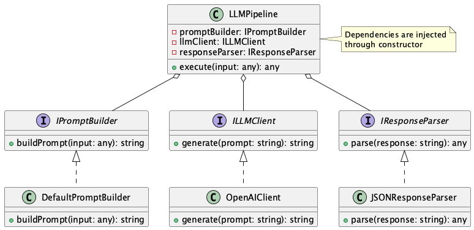

# Dependency Injection for LLM Pipelines

## Overview

Dependency Injection for LLM Pipelines is a design approach that modularizes a series of LLM pipeline processes such as prompt construction, model invocation, and response post-processing, making each component loosely coupled. This enables flexible replacement of processing steps and improves testability.

## Problems to Solve

When building applications using LLMs, it's common to connect LLM-related processes (request prompt generation, requests, response post-processing, etc.) to form a pipeline (see: LangChain).

LLM pipelines typically consist of multiple steps including prompt assembly, model inference, response parsing, and processing. Each step in the pipeline often requires different resources (persistent data, external interfaces, etc.) and functionalities (API requests, inference, normalization, etc.), which need to be implemented separately. It's better to avoid implementing these tightly coupled in a single function or class. While implementing everything in one place might seem clearer and easier initially, loose coupling is necessary for resource reuse and implementing complex pipelines. Problems that arise from tight coupling include:

- **Testing becomes difficult**
  - Functions containing model calls are hard to mock and difficult to unit test.

- **Low reusability**
  - Similar processes require creating separate components, leading to duplicate implementation of the same logic.

- **Large impact of changes**
  - Changing the prompt format requires reviewing the entire structure.

## Solution

Each processing step (e.g., prompt construction, model invocation, response processing) is interface-based and combined using DI (Dependency Injection). This allows each step to be developed, tested, and operated independently. By injecting these dependencies through constructors or DI containers, flexible configuration changes and testing become possible.

- **Prompt Builder**
  - Separates the responsibility of constructing prompt strings from input.

- **Model Client**
  - Extracts the LLM invocation part as an interface.

- **Response Parser**
  - Clearly separates the processing of converting LLM responses into desired data structures.
  - Reference: **Structured Output**

## Applicable Scenarios

This practice is particularly effective in the following situations:

- Projects requiring reuse of prompt construction, inference, and response processing across multiple pipelines
- LLM-powered products implementing Test-Driven Development (TDD) or CI/CD
- Systems requiring design that anticipates switching between external vendors or OSS models
- Cases where multiple engineers in a team implement different processing steps separately

## Benefits

Adopting this practice provides the following benefits:

- **Unit testing** of each component becomes easier.
- Model replacement or response processing changes can be made with **localized changes**, improving maintainability.
- High reusability at the step level enables realization of the **DRY (Don't Repeat Yourself) principle**.
- A/B testing or new feature additions can be implemented with **only the differences**.

## Considerations and Trade-offs

When adopting this practice, the following points should be noted:

- In small-scale projects, the structure might appear complex, with slightly higher learning costs for initial design.
- Making interface granularity too fine can lead to excessive abstraction, potentially reducing development speed.
- Frameworks and configuration management for utilizing DI might be necessary.

## Implementation Tips

Key points for effectively implementing this practice are as follows:

- Start by interface-based implementation of three basic steps: `PromptBuilder`, `LLMClient`, and `ResponseParser`.
- Utilizing DI libraries (e.g., Python's `dependency-injector` or `FastAPI`'s DI mechanism) makes implementation easier.
- Embedding logs and metrics for each step improves observability during operation.

## Summary

Dependency Injection for LLM Pipelines is a design approach that significantly improves flexibility, testability, and maintainability in systems utilizing LLMs. Particularly for products where frequent changes or replacements of processing steps are anticipated, early adoption can bring substantial benefits. Through structural organization and abstraction, stable continuous development and operation can be achieved.
