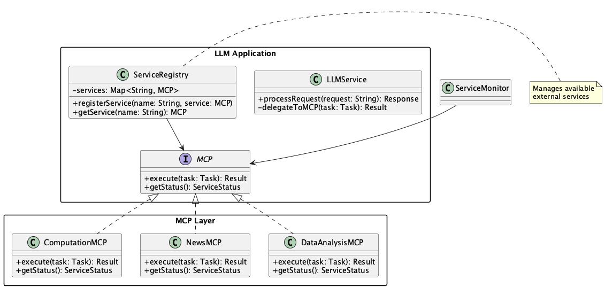

# External Service

## Overview

External Service is a design approach that improves the overall quality and efficiency of a system by delegating tasks that LLMs are not good at to external services. By focusing LLMs on natural language processing and delegating other tasks to appropriate specialized tools, we can build more reliable systems where each component focuses on its strengths.

## Problems to Solve

While LLMs are powerful natural language models, they cannot solve all challenges. Advanced mathematical optimization, data analysis, or machine learning model training are not practical with LLMs. Additionally, processing large amounts of data through LLM API requests can be inefficient in terms of cost and time. Tasks like table data aggregation are more efficiently handled through programming. Furthermore, LLMs cannot consider information they haven't been trained on (such as latest news). It's effective to request such processing and information from external services.

1. **Cases requiring advanced numerical computation**
   - Having LLMs perform financial model calculations or mathematical optimization can lead to errors.

2. **Cases requiring latest information**
   - When dealing with news or technical information that occurred after the LLM's knowledge cutoff, external APIs are essential.

3. **Cases handling large amounts of data**
   - Performing aggregation or analysis of entire CSV files directly with LLMs can be very costly in terms of time and token costs.

4. **Processing better suited for specialized tools**
   - Tasks like graph drawing, ML model classification, and image processing are more accurate and faster when using dedicated engines.

## Solution

We create a mechanism to delegate part of the LLM's processing by utilizing MCP (Model Context Protocol) or other external service connection methods. The LLM focuses on its role as a command center, while actual processing is distributed to external services. This is achieved through the following methods:

1. **Prepare MCP**
   - Prepare services for processing and their MCP servers, making them requestable from the LLM. The following processes should all go through MCP.

2. **Delegate computational processing**
   - Prepare NumPy or mathematical optimization engines as backend and delegate calculations to them.

3. **Efficient data aggregation**
   - LLM analyzes natural language requests and issues commands to BI tools or SQL engines.

4. **Obtain latest information**
   - Retrieve articles from external news APIs and have the LLM only perform summarization.

5. **Utilize image recognition**
   - Delegate image analysis to Vision APIs and have the LLM generate explanations or captions for the results.

## Applicable Scenarios

This practice is particularly effective in the following situations:

- When executing complex cash flow calculations in financial modeling systems
- When marketing analysis tools require natural language insight acquisition and BI tool integration
- When support chatbots delegate log analysis or diagnostics to external diagnostic engines
- When hybrid AI agents coordinate with multiple external services to perform processing according to user intent

## Benefits

Adopting this practice provides the following benefits:

- Improved overall reliability by accurately executing advanced processing
- Cost reduction by minimizing LLM processing
- Improved throughput through parallel execution and scalable service integration
- Compensation for LLM knowledge cutoff limitations by obtaining real-time information

## Considerations and Trade-offs

When adopting this practice, attention should be paid to the following points:

- System complexity increases with more external service integrations
- Authentication information and access control design/management become essential
- Need to maintain consistency between external service responses and LLM outputs
- Increased operational burden for handling external API version changes or failures

## Implementation Tips

Key points for effectively implementing this practice are as follows:

1. **Define abstract interfaces by use case**: Keep dependencies loosely coupled through interfaces like `INewsService`, `IComputationEngine`.

2. **Implement fallback processing**: Prepare logic to return simplified calculations or cached results when external services are unavailable.

3. **Design asynchronous integration**: Achieve stable integration while absorbing delays by utilizing batch processing and webhooks.

4. **Implement integration tests**: Prepare end-to-end tests including LLM integration using mocks/stubs of external services.

5. **Introduce monitoring and alerts**: Monitor metrics such as call success rate and latency to quickly detect anomalies.

## Summary

External Service is a practice for building more practical and high-performance systems by clearly separating LLM's strengths and weaknesses and combining them with external specialized tools and APIs. While system complexity increases, proper design can achieve an architecture that excels in extensibility, reliability, and efficiency.
