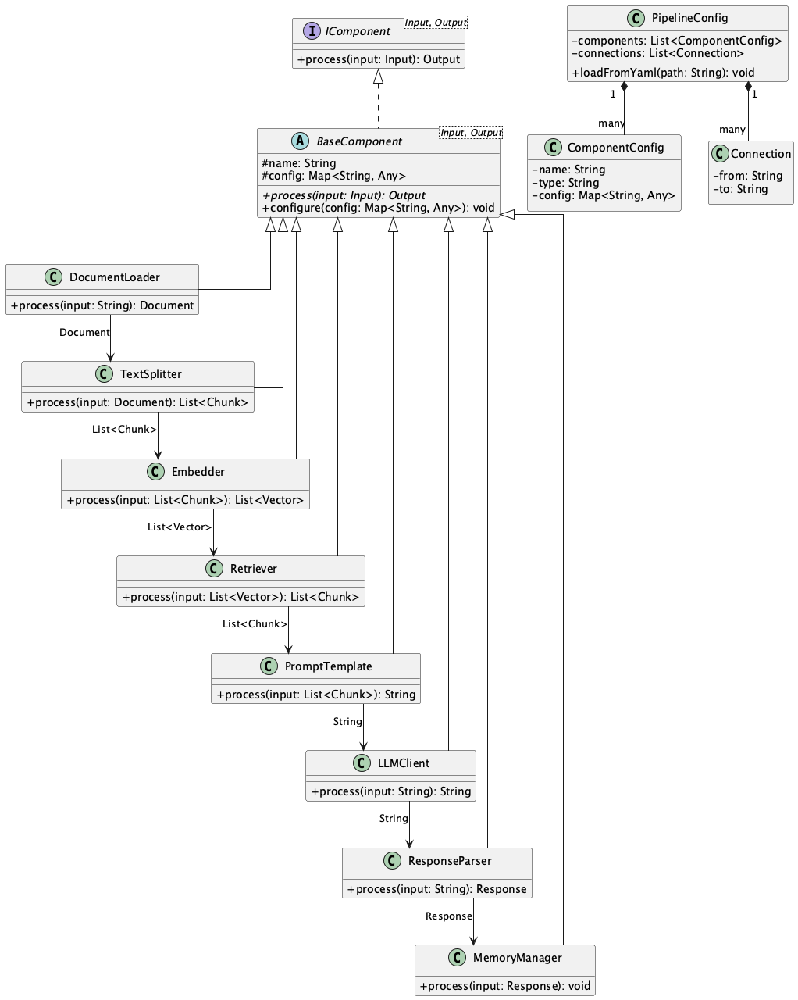

# Composable Component Framework

## Overview

The Composable Component Framework is a design approach for systems utilizing LLM APIs that breaks down processes into small functional units called components, which are then combined to build pipelines and workflows. Each component is independent, has clear responsibilities, and connects with others through standardized interfaces. This practice enables the construction of flexible and highly reusable systems.

## Problems to Solve

There are numerous use cases for providing diverse document processing and advanced chat services using LLMs. With the rise of RAG and AI Agents, this trend is accelerating. In such systems, LLM API requests are diverse, each with different purposes, output formats, SLAs, and target users. Developing these as a single component leads to the following challenges:

1. **Monolithic Implementation Bloat**
   - Consolidating all processes into a single class or function significantly reduces readability and maintainability.

2. **Difficulty in Feature Extension**
   - Adding new features or steps requires major changes to existing code, reducing development efficiency.

3. **Testing Challenges**
   - Large-scale processes are executed in bulk, making it difficult to test individual logic and leading to over-reliance on integration tests.

4. **Lack of Logic Reusability**
   - When similar processes are needed elsewhere, code must be copied and reused, resulting in redundant implementations.

## Solution

Break down processes into small components with clear responsibilities such as Loader, Splitter, Embedder, Retriever, PromptTemplate, LLMClient, ResponseParser, MemoryManager, and ToolInvoker. All components implement a common interface (e.g., `IComponent<Input, Output>`) and can be developed and tested independently. These are connected in a chain or DAG (Directed Acyclic Graph) structure and can be configured through declarative settings (YAML/JSON, etc.).

## Applicable Scenarios

This practice is suitable for systems such as:

- RAG Pipeline: Document Loading → Text Splitting → Embedding Generation → Search → Summarization
- Chat Agent: Input Processing → Context Addition → LLM Call → Response Parsing → Memory Update
- Data Preprocessing: Data Loader → Cleaning → Tokenization → LLM Feature Extraction
- Multimodal Processing: Image → OCR → Text Processing → Translation or Summarization

## Benefits

Introducing the Composable Component Framework provides the following advantages:

- Each component can be developed, tested, and maintained independently.
- Reusing highly versatile components improves development efficiency.
- Easy replacement of models and algorithms enables rapid experimentation and validation.
- Declarative configuration allows pipeline structure changes without code modifications.

## Considerations and Trade-offs

When implementing this practice, consider the following points and trade-offs:

- Initial cost is required for component granularity design and interface preparation.
- Interface calls between processes may increase latency.
- Dependency management and version compatibility maintenance between components is necessary.
- Team education is needed to understand and effectively utilize this practice.

## Implementation Tips

Key points for smooth implementation are as follows:

1. Start by componentizing only the main steps and verify operation.
2. Define a common interface (e.g., `IComponent<I, O>`) and standardize it across all components.
3. Manage pipeline configuration through settings files like YAML or JSON.
4. Prepare unit tests for each component and cover the whole system with integration tests.
5. Adopt semantic versioning to maintain version and dependency consistency.

## Summary

The Composable Component Framework is a design approach that significantly improves flexibility, extensibility, and reusability in LLM systems. While initial implementation requires design costs, it enables the realization of a robust architecture with high maintainability in the long term. Particularly in LLM applications with complex workflows, effective utilization can improve development and operational productivity.
