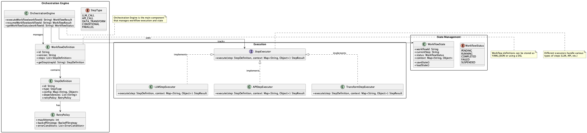

# Orchestration Engine

## Overview

The Orchestration Engine is a design practice that provides a foundation for defining, executing, monitoring, and resuming complex processing flows that combine LLM calls, external tool integration, database operations, conditional branching, and parallel execution, either declaratively or programmatically. This practice enables high reusability and operational flow control without bloating the code.

## Problems to Solve

Complex workflow processing and pipelines involve various components. For example, when building a data pipeline, components such as source data acquisition, transformation, validation, branching based on data quality, external data retrieval when needed, recording results in DWH, logging processes, and monitoring tools are incorporated. LLM-based pipelines are similar, often becoming mechanisms that combine various systems. As LLM and external API and tool integrations increase, processing flows become more complex, leading to the following challenges:

1. **Flow Bloat and Spaghetti Code**
   - Complex interweaving of if/else statements, retries, branching, and exception handling makes maintenance difficult.

2. **Difficulty in Implementing Resume and Recovery**
   - Re-execution processing and intermediate state management become complicated when some steps fail.

3. **Difficulty in Flow Visualization and Monitoring**
   - With just log output, it becomes difficult to understand the overall flow progress and bottlenecks.

4. **High Cost of Asynchronous Processing and Parallel Execution**
   - Implementing and testing multiple branches, timeouts, and cancellations increases the burden.

## Solution

In the Orchestration Engine, processing flows are described declaratively using YAML, JSON, or dedicated libraries, and the orchestration engine interprets and executes them. The following elements can be defined:

1. **Step Order and Dependencies**
   - Explicitly define the execution order and dependencies of each processing step.

2. **Conditional Branching, Loops, and Parallel Branches**
   - Complex flow control can be described declaratively.

3. **LLM Calls and External API Integration**
   - Manage various service integrations uniformly.

4. **Error Handling and Retries**
   - Define behavior in advance for error occurrences.

5. **State Management and Resume Processing**
   - Maintain processing state and enable resumption when needed.

## Applicable Scenarios

This practice is particularly effective in the following scenarios:

- Multi-step generation processes like FAQ generation → search → summarization → translation → formatting
- Tool invocation flow configuration by agents (LLM decision → API execution → verification → next action)
- Automation of ETL and data preprocessing/postprocessing incorporating LLMs
- Business process automation such as customer response and approval flows

## Benefits

Introducing this practice provides the following advantages:

- Complex processing flows can be managed as configuration files rather than code.
- Automatic recovery and fallback mechanisms can be built for error occurrences.
- Flow progress and success/failure of each step can be visualized in real-time.
- New flows can be added or modified without changing code.

## Considerations and Trade-offs

The following points should be noted when implementing:

- Initial construction cost: Time may be required for engine selection, design, and operational infrastructure setup.
- Performance overhead: Latency may increase compared to native implementation due to definition interpretation and state management.
- Learning cost: Learning of custom DSL or YAML definitions is required.
- Vendor lock-in risk: Dependence on specific orchestration tools may make future migration difficult.

## Implementation Tips

The following approaches are effective for smooth implementation:

1. Start with a PoC of a small workflow of about 3 steps for evaluation.
2. Keep each step stateless and delegate state management to the engine.
3. Incorporate error handling such as retry counts, fallbacks, and DLQ (Dead Letter Queue) into the design from the start.
4. Integrate metrics and logs with tools like Prometheus and Grafana to establish operational monitoring.
5. Version the flow definitions to manage change history and differential deployment.

## Summary

The Orchestration Engine is a design practice that provides a flexible mechanism for defining, executing, resuming, and monitoring complex processing flows including LLMs. Through declarative process description and improved operationality, it enables the realization of highly reliable LLM applications while reducing development and maintenance costs. However, initial construction and operational ingenuity are key to success.
