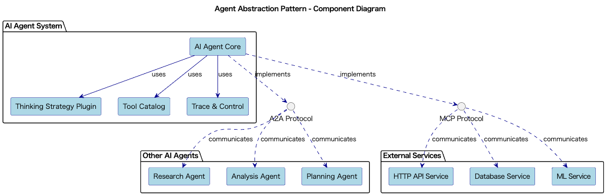

# Agent Abstraction

## Overview

Agent Abstraction is a design practice that abstracts autonomous AI Agents centered around LLMs as high-level interfaces. This practice enables the construction of agents that can consistently execute complex processes such as tool calls, searches, and thinking steps by simply providing goals and context. By making thinking strategies and tools flexibly interchangeable, it achieves a highly reusable and extensible agent system.

## Problems to Solve

There is a trend of solving complex problems using AI Agents wrapped around LLMs. AI Agents are systems that aim to solve both defined and undefined tasks using LLM's reasoning capabilities. AI Agents build systems by combining various external services and other AI Agents. When implementing autonomous processing that combines LLMs with tools, the following challenges arise:

1. **Scattered Action Logic**
   - LLM output processing and external tool integration become dispersed throughout the code, making maintenance difficult.

2. **Difficulty in Automating Complex Workflows**
   - Implementing processes including conditional branches, loops, and exception handling individually results in enormous effort.

3. **Fixed Thinking Strategies**
   - Hard-coding strategies like ReAct and Chain-of-Thought makes optimization and replacement difficult. Implementation dependent on specific thinking strategies makes it difficult to introduce new strategies or improve existing ones.

4. **Lack of Reusability**
   - Similar autonomous processes are implemented individually for each use case, preventing code reuse. Even for similar business automation tasks, individual implementations are required.

## Solution

Agent Abstraction solves these challenges by combining the following elements:

1. **Implementation of Unified Interface through A2A**
   - Provides a unified interface through the A2A protocol.

2. **Plugin-based Thinking Strategies**
   - Makes multiple strategies like ReAct, Chain-of-Thought, and Tree-of-Thought interchangeable as plugins. Each strategy is implemented as an independent module, allowing dynamic selection at runtime.

3. **Tool Catalog Definition**
   - Defines tools such as HTTP APIs, SQL queries, and external ML services as plugins. The Agent selects and calls appropriate tools as needed.

4. **Implementation of Tracing and Control**
   - Records and monitors each step, detecting abnormal termination and infinite loops for control. Provides visualization and control functions for execution state.

## Applicable Scenarios

This practice is particularly effective in the following systems and projects:

- Intelligent assistant platforms handling business report creation and workflow execution
- DevOps automation agents that automatically monitor, analyze, and repair infrastructure
- Research support tools assisting from literature search to experimental planning
- Business automation services that build business flows from natural language without coding

## Benefits

Introducing this practice provides the following advantages:

- Improved readability through consistent interfaces
- Flexibility in switching thinking strategies and tools
- Enhanced reusability across different businesses
- Easier monitoring and control of execution steps
- Improved code maintainability and extensibility

## Considerations and Trade-offs

When introducing this practice, attention should be paid to the following points:

- Design and implementation complexity: High technical understanding and effort are required for core agent design and tool integration.
- Cost management: Excessive API calls or infinite loops during autonomous processing can lead to significant costs.
- Security risks: Permission management is crucial due to risks of misuse of external tools and information leakage.
- Debugging difficulty: Visualization and tracing mechanisms are essential for identifying issues in dynamically constructed flows.

## Implementation Tips

Key points for implementation are as follows:

1. **Start with Small AI Agents**: Validate with simple QA agents using Chain-of-Thought.
2. **Begin with Safe Tool Sets**: Build with high-safety tools like read-only APIs and log retrieval.
3. **Incorporate Cost Control Functions**: Set limits on execution steps and call counts, implement loop detection.
4. **Prepare Detailed Logs and Tracing Mechanisms**: Record inputs, outputs, and time per step, visualize on dashboards.
5. **Conduct Regular Security Reviews**: Thoroughly manage tool execution permissions and API keys.

## Summary

Agent Abstraction is a powerful design approach for safely and flexibly implementing advanced autonomous processing using LLMs. The unified interface enables simplification of business code while supporting expansion of tools and strategies. However, implementation requires sufficient design and control mechanism construction, making an approach of starting small and expanding gradually effective.
