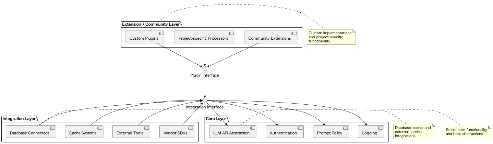

# Layered Modularity & Core Abstraction

## Overview

Layered Modularity & Core Abstraction is a design approach that clearly separates stable core functionality from flexible extension capabilities in systems utilizing LLMs. The core layer provides common and relatively unchanging foundational functionality, while the extension layer enables easy addition and modification of features through plugins and integration capabilities. This structure promotes both maintainability and extensibility while facilitating collaboration between teams and external parties.

## Problems to Solve

LLM is still a relatively new technology, and effective use cases and software architectures for its implementation are still evolving. Many applications incorporating LLM APIs are still in the process of determining their optimal usage patterns, often developing while validating external tools and modifying functionality. On the other hand, legitimate applications typically have core functionality that provides their value. Mixing core functionality with experimental extension features is not considered good practice.

In LLM-based system development, the following issues arise as projects grow:

1. **Widespread Impact of Breaking Changes**
   - Changes to common LLM invocation processes affect all lower-level modules.

2. **Difficulty in Adding New Features**
   - Core code modifications are required each time new external tool integration or vendor-specific processing is added.

3. **Fragmentation in Development and Operations Between Teams**
   - Different teams extending functionality independently leads to complex library dependencies.

4. **Difficulty in Providing External Plugins**
   - Even when published as open source, external developer contributions are hindered by the need for core modifications.

## Solution

LangChain, which has long supported LLM utilization, adopts a practice of abstracting core functionality and features under development into multiple layers. Following LangChain's approach, Layered Modularity & Core Abstraction solves these problems by separating functionality into three layers:

1. **Core Layer**
   - Defines stable APIs for LLM invocation, authentication, prompt policies, logging, etc.

2. **Integration Layer**
   - Handles integrations with databases, caches, external tools, vendor SDKs, and other extensible components.

3. **Extension / Community Layer**
   - Includes high-flexibility components such as project-specific preprocessing and plugins created by OSS developers.

This separation allows for maintaining stability while enabling flexible addition and removal of individual features.

## Applicable Scenarios

This practice is particularly effective in the following situations:

- Building OSS LLM libraries like LangChain or LlamaIndex
- Deploying LLM integration platforms as company-wide common SDKs across departments
- Multi-vendor configurations requiring switching between different LLM providers (OpenAI, Claude, etc.)
- Chatbot platforms or application development frameworks designed to support third-party plugins

## Benefits

Adopting this practice provides the following advantages:

- Enables addition of new features while maintaining core stability
- Facilitates acceptance of extension contributions from external developers and other departments
- Improves operational and maintenance efficiency through clear responsibility boundaries for each module
- Enables independent version management of core and extension modules, making quality assurance easier

## Considerations and Trade-offs

When adopting this practice, attention should be paid to the following points:

- Increased layers make dependency management more complex, requiring version consistency verification
- Time and cost are required for designing the boundaries between core and extensions
- Additional abstraction calls between layers result in some performance overhead
- Documentation and guidelines for plugin developers need to be prepared

## Implementation Tips

Key points for effectively implementing this practice are as follows:

1. Limit core functionality to "absolutely unchanging basic features" (e.g., authentication, LLM API abstraction)
2. Define extension interfaces simply and clearly to make implementation easy for developers
3. Use Dependency Injection or plugin loaders to enable dynamic extension at runtime
4. Manage core and plugins in separate repositories or CI/CD pipelines for easier operations
5. Automate regression testing for major plugin and core combinations to ensure compatibility

## Summary

Layered Modularity & Core Abstraction is a powerful design approach that balances stability and flexibility in LLM-centric systems. By fixing core functionality as stable APIs and delegating extensions to external parties, it enables the construction of foundations that can withstand large-scale and continuous system evolution. While initial design requires some effort, this practice provides significant value in the medium to long term.
