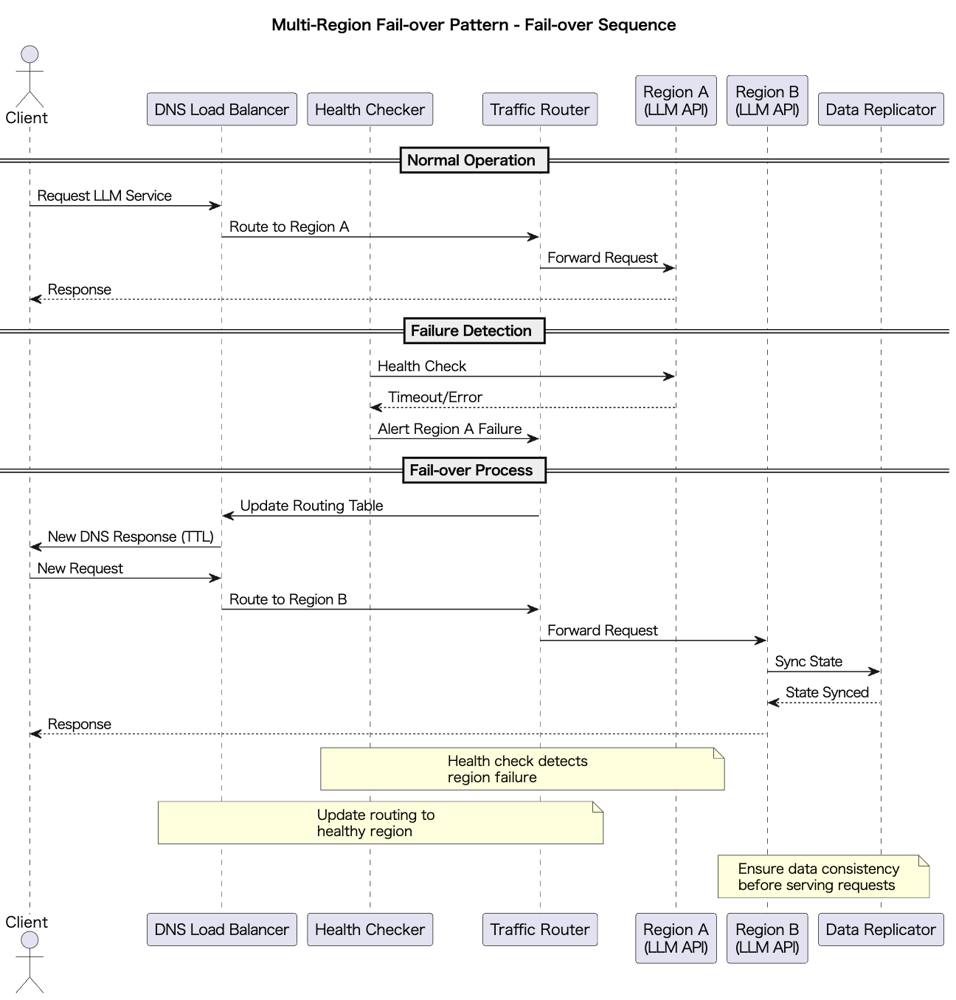

# Multi-Region Fail-over

## Overview

Multi-Region Fail-over is a design approach that distributes LLM API services across multiple geographical regions and automatically or manually switches traffic to other regions when failures or overloads occur in a particular region. This practice ensures high system availability, maintains user experience, and complies with regional regulations.

## Problems to Solve

LLM APIs are typically used as cloud services. Some LLM providers allow users to specify cloud regions for deploying and using LLM models (e.g., Azure OpenAI API).

While using a single-region LLM API might be sufficient for providing LLM functionality alone, this approach presents several challenges:

1. **Single Region Failure**
   - There is a risk of complete service disruption in a region due to regional infrastructure failures or natural disasters.

2. **Cross-Region Latency**
   - When users connect to remote servers, response times increase, degrading UX. For example, users in Japan connecting to US region servers experience 200-300ms latency.

3. **Regulations and Data Sovereignty**
   - Different regional regulations (such as EU's GDPR) may require data to be stored in specific regions. For instance, EU user data must be processed within EU regions.

4. **Load Concentration Imbalance**
   - When access is concentrated in certain regions, processing performance degrades due to scaling limits. For example, when promotional events are held in specific regions, load concentrates in those regions.

## Solution

Multi-Region Fail-over addresses these challenges through the following methods:

1. **DNS-based Routing**
   - Uses DNS round-robin or Geo-DNS to route users to the nearest region.

2. **Global Load Balancing**
   - Implements global load balancers to perform health checks on each region and automatically switch to other healthy regions during failures.

3. **Data Replication**
   - Synchronizes input prompts, conversation history, cache information, etc., across multiple regions.

4. **DNS TTL Optimization**
   - Implements DNS policies with short TTL settings to enable rapid failover.

## Applicable Scenarios

This practice is effective in the following situations:

- Globally deployed LLM chat services and SaaS platforms
- Enterprise solutions requiring high availability while complying with various national regulations
- Financial and healthcare sectors requiring disaster recovery and business continuity planning (BCP)
- Systems experiencing concentrated access from worldwide promotional events

## Benefits

Implementing this practice provides the following advantages:

- **Ensured High Availability**: Traffic can be switched without system downtime during regional failures.
- **Optimal User Experience**: Low-latency responses by always connecting users to geographically nearby regions.
- **Compliance**: Ensures global redundancy while complying with regional data sovereignty requirements.
- **Horizontal Scaling**: Enables scaling at the region level, promoting overall resource distribution.

## Considerations and Trade-offs

When implementing this practice, consider the following points:

- **Data Synchronization Costs and Delays**: Network transfer and delays occur during cross-region replication.
- **Implementation and Operational Complexity**: Requires management of multiple components including DNS settings, load balancer configurations, and monitoring/alert rules.
- **Consistency Issues**: State inconsistencies may occur between regions when immediate consistency is required.
- **Increased Infrastructure Costs**: Higher operational costs due to maintaining resources in each region.

## Implementation Tips

The following approaches are effective for implementation:

1. **Validation in Small Regions**: First build a canary region in a staging environment to verify switching behavior and data synchronization accuracy.
2. **Multi-layered Health Checks**: Design comprehensive health checks considering response times and error rates, not just simple availability monitoring.
3. **Separate Cache Strategies**: Balance response performance and consistency by using both region-local and globally synchronized caches.
4. **DNS TTL Optimization**: Enable immediate switching with short TTL while monitoring and adjusting for DNS query load.
5. **Infrastructure as Code**: Use Terraform or CloudFormation to prepare automated failover scripts and monitoring.

## Summary

Multi-Region Fail-over is a crucial design approach for achieving high availability, latency optimization, and regulatory compliance in systems using LLM APIs. While implementation requires certain design and operational costs, it is an extremely effective approach for building stable and sustainable global services.
