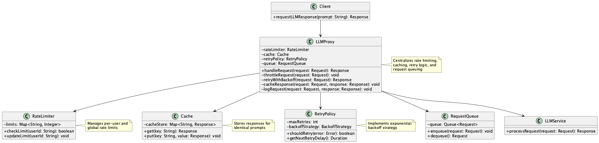

# Proxy for Rate-Limited Access

## Overview

Proxy for Rate-Limited Access is a design approach to address rate limit constraints when using LLM APIs. Instead of sending requests directly to the API, it routes them through a proxy server equipped with rate control, retry, and caching capabilities to ensure stable API usage and maximize throughput. This practice allows applications to use LLM APIs stably without being concerned about rate limit details.

## Problems to Solve

Many LLM APIs (e.g., OpenAI API) have restrictions on requests per second (QPS) or token counts. When providing applications that incorporate LLM APIs, you will likely use a common LLM API contract for the application or project. The quotas (usage limits) set by LLM providers are often determined per contract. If a specific user of the application uses the service heavily and hits the quota, the LLM API becomes unavailable for all users, including others.

- **Error Occurrence During High-Frequency Access**
  - When multiple users access simultaneously, `429 Too Many Requests` is returned, causing the process to fail.

- **Batch Processing Interruption**
  - When attempting to process thousands of data items in a nightly batch, the process stops midway due to reaching the limit.

- **Implementation Duplication and Inconsistency**
  - Different retry logic and throttling implementations exist for each service, reducing maintainability. As each team implements their own error handling, consistent behavior cannot be maintained.

## Solution

Implement a design where a proxy server is placed between the application and the LLM API, routing all requests through it. This proxy handles the following functions:

- **Request Throttling Control**
  - Controls the number of requests per second per user or user group to ensure the overall contract doesn't exceed the LLM API quota.
  - Uses sliding window or token bucket methods to limit request numbers.
    - Example: Sliding window method: Allows up to 10 requests per second, adding excess requests to a queue for sequential processing.
    - Example: Token bucket method: Replenishes 10 tokens per second, consuming 1 token per request.

- **Retry and Backoff Processing**
  - Retries according to policies like exponential backoff when temporary errors occur. When a 429 error occurs, retries with gradually increasing wait times of 2, 4, 8 seconds. If LLM API 429 errors persist, temporarily stops retrying and restricts application usage while waiting for recovery.

- **Cache Utilization**
  - Caches results for identical prompts for a short time to reduce API call frequency.

- **Circuit Breaker Implementation**
  - Controls requests per second per user or user group to ensure the overall contract doesn't exceed the LLM API quota.
  1. **Closed State (Normal Operation)**
     - Allows all requests and increases counter on error occurrence.
     - Example: Processes requests normally until error rate exceeds threshold (e.g., 50%).

  2. **Open State (Blocked)**
     - Blocks requests when errors exceed threshold and returns fallback responses.
     - Example: Returns cached responses or simple alternative responses after 3 consecutive errors.

  3. **Half-Open State (Recovery Check)**
     - Allows limited requests after a certain time to assess recovery status.
     - Example: Allows 1 request after 5 minutes, returns to Closed state if successful.

- **Load Balancing and Queue Management**
  - Uses queues to process requests sequentially even when many requests arrive simultaneously.

## Applicable Scenarios

This practice is particularly effective in the following situations:

- Web services with many users and frequent simultaneous requests
- Backend processes that frequently call LLM APIs, such as batch processing or data pipelines
- Internal infrastructure where multiple services share LLM usage
- Mission-critical systems that need to avoid unstable operation due to rate limit exceedance

## Benefits

Adopting this practice provides the following benefits:

- Reduces the frequency of rate limit errors and achieves stable operation.
- Centralizes retry logic, preventing implementation duplication and consistency issues.
- Enables simultaneous implementation of caching strategies and log collection in the proxy, improving operational efficiency.
- Enables centralized visualization and analysis of usage patterns, aiding future scaling decisions.

## Considerations and Trade-offs

When adopting this practice, attention should be paid to the following points:

- The proxy implementation itself becomes a new source of complexity and latency.
- Without proper retry control and queue design, risks of delay and request loss increase.
- Incorrect caching strategies can lead to loss of information freshness or incorrect responses.
- Proxy availability directly affects overall system reliability, making redundancy and monitoring essential.

## Implementation Tips

Key points for effectively implementing this practice are as follows:

1. Start with a lightweight proxy with simple queue + throttling control, gradually expanding functionality.
2. Utilizing open-source API Gateways or reverse proxies (like Envoy) makes construction easier.
3. Record metadata for each request (user ID, prompt content, retry count, etc.) for future analysis.
4. Design appropriate buffers and queues according to rate limit units (seconds, minutes, hours).

## Summary

Proxy for Rate-Limited Access is an important design approach for absorbing instability associated with LLM API rate limits and achieving stable service provision. By centralizing responsibilities such as retry, caching, throttling, and log management, it enhances overall system reliability and maintainability. Early implementation is recommended for systems where high-load, high-frequency LLM usage is expected.
