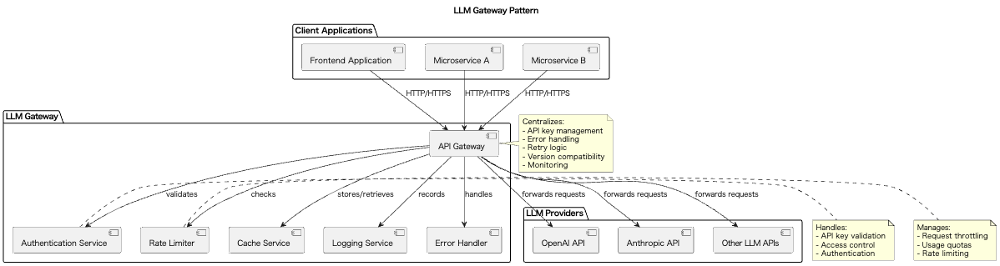

# LLM Gateway

## Overview

LLM Gateway is a design approach where instead of directly calling LLM APIs from applications, requests are relayed and managed through a dedicated gateway service. This practice enables centralized API key management, aggregation of common functionality, security enhancement, and version compatibility assurance. It is particularly suitable for safely utilizing LLM APIs in microservice architectures and enterprise environments.

## Problems to Solve

In services adopting microservice architecture or enterprise systems combining multiple different systems, there are many scenarios where LLM APIs are used from different software. While the purposes and methods of using LLM APIs may vary, there are common rules for LLM API usage. Examples include API key management, security, model version management, and usage management. Managing these individually in each system is inefficient. To maintain the same rules and security, it is desirable to manage them in a common system.

1. **Distributed API Key Management and Leakage Risk**
   - Keeping API keys directly in each service or client increases the risk of leakage.

2. **Duplicate Error Handling and Retry Implementation**
   - Implementing similar processes in each client is inefficient and reduces maintainability. Retry logic implementation varies across different places, making it difficult to maintain consistency.

3. **Lack of Observability**
   - API call logs and metrics are scattered across different places, making it difficult to understand the overall situation. Problem identification becomes challenging, and SLA monitoring becomes insufficient.

4. **Wide-ranging Impact from Provider API Changes**
   - Every time there are changes to endpoints or SDKs, all systems need to be modified.

## Solution

Introduce an LLM Gateway and route all LLM calls through the gateway service. This gateway serves the following roles:

1. **API Key Concealment and Centralized Management**
   - Keys are not passed to clients but securely stored within the gateway. If possible, access control and authentication are centrally managed.

2. **Aggregation of Common Functionality**
   - Centralize error handling, retries, caching, logging, and policy application. Provide a common error response format.

3. **API Version Absorption**
   - Absorb LLM provider-side API changes within the gateway, protecting systems from these concerns.

## Applicable Scenarios

This practice is particularly effective in the following situations:

- When sharing LLM usage between microservices
- When using LLM APIs from the frontend but wanting to conceal API keys
- Enterprise environments wanting to strengthen operational monitoring and governance
- Hybrid configurations combining on-premises and cloud
- When wanting to uniformly manage multiple LLM providers

## Benefits

Adopting an LLM Gateway provides the following benefits:

- Enhanced Security: Enables API key concealment and access control
- Improved Development Efficiency: Simplifies client-side implementation and makes it more resilient to changes
- Integrated Monitoring and Control: Enables centralized management of call metrics and logs
- High Scalability and Maintainability: New features and policies can be added solely within the gateway
- Cost Optimization: Makes usage monitoring and control easier

## Considerations and Trade-offs

When implementing this practice, attention should be paid to the following points:

- Single Point of Failure Risk: If the gateway goes down, all LLM calls stop, requiring redundant configuration
- Increased Latency: Requests go through relay, causing slight response delays
- Gateway Operation Costs: Requires monitoring, scaling, and security patch management
- Behavior Changes Due to Caching and Policies: Risk of returning unintended responses due to inappropriate cache settings or restriction policies

## Implementation Tips

When implementing an LLM Gateway, the following phased approach is effective:

1. Initial Phase: Implement only API key management and authentication logging to build a secure foundation
2. Middle Phase: Add common processing such as error handling, retries, and timeout control
3. Later Phase: Introduce caching, rate limiting, and usage policies to optimize the whole system
4. Tool Utilization: Consider using existing gateways like AWS API Gateway, Azure API Management, Kong, or Envoy
5. CI/CD Integration: Codify configurations and achieve automated deployment through GitOps or CI pipelines

## Summary

LLM Gateway is a design approach that centrally solves challenges related to security, operability, and scalability in LLM API utilization. By aggregating common processing and management functions in the gateway, development efficiency and operational stability can be achieved. However, careful consideration is needed in design and operation during implementation, such as avoiding single points of failure and addressing increased latency. With appropriate implementation and operation, the quality and reliability of systems utilizing LLM can be significantly improved.
