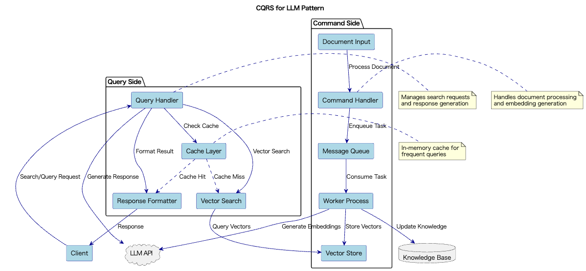

# CQRS for LLM

## Overview

CQRS for LLM is a technique that separates "state changes (Command)" and "result retrieval (Query)" processes in systems utilizing LLMs, applying optimized designs for each. By focusing on asynchronous processing and throughput for Commands, and immediacy and latency for Queries, it enables both performance and scalability in LLM systems.

## Problems to Solve

Systems utilizing LLMs may have a mix of synchronous, immediate processing mechanisms and asynchronous, throughput-focused processing mechanisms. When making requests to LLM APIs, there are cases where immediate responses to users are required, like in chat applications, as well as cases where throughput is prioritized, like in batch document processing. The former is better implemented with synchronous processing, while the latter with asynchronous processing.

As a result, systems have a mix of information writing (embedding generation or data addition) and reading (generation, search, summarization, etc.), leading to the following challenges:

1. **Performance Conflicts Between Read and Write Operations**
   - When processing embedding generation and search simultaneously within the same process, cache conflicts and lock waits occur frequently, degrading overall performance.

2. **Scalability Limitations**
   - Processing large numbers of search requests and batch update operations through the same path causes resource contention, reducing overall throughput.

3. **Trade-off Between Consistency and Response Speed**
   - When searching immediately after adding new documents, reads are delayed to maintain consistency, compromising user experience.

4. **Operational Complexity**
   - Mixed monitoring and log collection make troubleshooting and performance analysis difficult.

## Solution

CQRS for LLM clearly separates Commands and Queries, designing specialized processing paths for each.

1. **Command (State Change) Path Implementation**
   - Handle embedding generation, knowledge addition, fine-tuning execution, etc., through asynchronous queues or batch processing. Document additions are queued in message queues like Celery or RabbitMQ and processed asynchronously by worker processes. Alternatively, individual data pipelines can be built to schedule batches.

2. **Query (Read) Path Implementation**
   - Process summarization, chat responses, search, etc., immediately using in-memory caches or high-speed vector search layers. Search requests are processed quickly using Redis caches or dedicated vector DBs like FAISS.

3. **System Configuration Separation**
   - Apply different services, infrastructure, and log monitoring to Command and Query paths, enabling independent scaling and maintenance. Separate infrastructure for Command processing and Query processing, allocating optimal resources to each.

## Applicable Scenarios

This practice is particularly effective in medium to large-scale systems utilizing LLMs, such as:

- RAG-type search and summarization services handling large volumes of documents
- Dialogue systems requiring simultaneous management of chat interfaces and user settings
- Knowledge graphs or tag-based recommendation systems that are continuously updated
- Analysis systems integrated with dashboards and visualization UIs

## Benefits

Adopting this practice provides the following benefits:

- Commands and Queries can be scaled independently, separating bottlenecks and improving overall throughput.
- When failures occur, they can be immediately identified as Command or Query issues, improving operational efficiency.
- Cache, batch processing, and parallelism optimizations can be applied individually, enabling flexible performance tuning.
- Logs, metrics, and error tracking can be aggregated separately, making troubleshooting analysis more efficient.

## Considerations and Trade-offs

When adopting this practice, the following points should be considered:

- When reading immediately after writing, there's a possibility the changes haven't been reflected, requiring eventual consistency design.
- Additional components like queues, stream processing, and cache management need to be operated, increasing system complexity.
- Test design needs to account for asynchronous processing and eventual consistency, increasing testing difficulty.
- The entire team needs to understand CQRS and asynchronous architecture, incurring learning costs.

## Implementation Tips

Key points for effectively implementing this practice are as follows:

1. Start by extracting only some write operations (e.g., document registration) as Commands.
2. When Query response speed is critical, consider introducing in-memory caches or dedicated vector search layers.
3. Command/Query-specific metrics monitoring using Prometheus and Grafana is very effective.
4. Including TTL (Time to Live) or version information in caches can mitigate consistency issues.

## Summary

CQRS for LLM is a design practice that significantly improves performance, scalability, and observability by separating the responsibilities of "writing" and "reading" in LLM systems and applying optimal architectures for each. It is particularly effective in large-scale RAG systems and knowledge-base type dialogue agents built on LLMs. However, it's important to consider the appropriate level of separation based on system scale and requirements.
