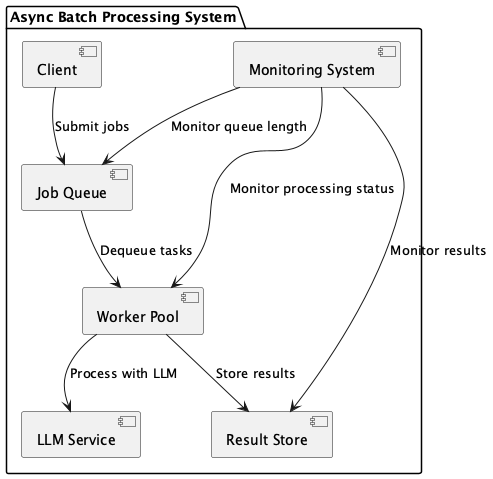

# Async Batch Processing

## Overview

Async Batch Processing is a design approach that processes large volumes of LLM requests through batch processing or asynchronous queues rather than real-time synchronization. Tasks are registered in a job queue, processed in parallel by workers, and results are ultimately aggregated. This practice enables efficient and fault-tolerant processing of large-scale LLM tasks.

## Problems to Solve

LLMs demonstrate their capabilities beyond synchronous, immediate-response use cases like chat. For example, they can process large volumes of natural language documents in bulk or write programs through AI coding. In these cases, synchronous, immediate responses are not mandatory. What's required is that requests are processed correctly, even with some delay. Additionally, the ability to load large amounts of data (natural language, programming language) is a requirement. When utilizing LLMs in systems, the following challenges arise:

1. **Scalability Limitations of Synchronous Calls**
   - Real-time API calls have limits on the number of requests that can be processed at once, making them unsuitable for bulk processing.

2. **Cost Optimization**
   - Synchronous processing tends to increase idle time, leading to inefficient resource consumption.

3. **Ensuring Fault Tolerance**
   - We want to avoid the entire process stopping due to failures in some requests.

4. **Peak Load Leveling**
   - Real-time processing requires resource design to handle concentrated requests during peak times.

## Solution

In this practice, tasks are queued and processed asynchronously by multiple workers (containers, serverless functions, etc.). Completed results are stored or notified through data stores or messaging systems. Specific examples include:

1. **Sentiment Analysis of Social Media Posts**
   - Execute sentiment analysis in bulk and save results asynchronously.

2. **Personalized Marketing**
   - Generate personalized marketing emails asynchronously for each customer segment.

3. **GitHub Repository Analysis**
   - Analyze development repositories or PRs to find bugs and inefficient processes, creating issues accordingly.

## Applicable Scenarios

This practice is suitable for the following situations:

- When you want to summarize or classify thousands to tens of thousands of documents in bulk
- Data pipelines that perform sentiment analysis or natural language processing in bulk
- Business operations like marketing where you want to generate large volumes of output during off-peak hours
- Use cases where LLMs are utilized as part of ETL from data transformation to generation and storage
- AI coding and development assistance

## Benefits

By utilizing this practice, you can gain the following advantages:

- Complete large volumes of processing in a short time through horizontal scaling
- Optimize cost efficiency with on-demand scalable resources
- Enhance overall system robustness by retrying only failed tasks
- Concentrate processing during nighttime or off-peak hours to avoid peak loads

## Considerations and Trade-offs

The following considerations and trade-offs exist when implementing this practice:

- Not suitable for use cases requiring real-time responses due to asynchronous processing
- Increases system complexity due to the need to build and operate queue management and worker pools
- Risk of duplicate processing if task idempotency is not ensured
- Monitoring design is crucial, requiring essential monitoring of queue length, delays, and failure rates

## Implementation Tips

When implementing this practice, consider the following points:

1. **Verify Batch Granularity**: Evaluate appropriate task sizes (chunk or document units) through PoC.

2. **Utilize Managed Services**: Construction becomes easier by using services like AWS SQS + Lambda, GCP Pub/Sub + Cloud Functions.

3. **Design Idempotency**: Design unique task IDs to prevent reprocessing of identical tasks.

4. **Configure DLQ and Retry Strategy**: Design retry counts for failed tasks and DLQ routing.

5. **Set Up Metrics and Alerts**: Visualize queue length, processing delays, failure rates, and set alert thresholds.

## Summary

Async Batch Processing is a powerful architecture that simultaneously achieves scalability, cost efficiency, and fault tolerance in large-scale asynchronous processing utilizing LLMs. However, it's not suitable for scenarios requiring real-time responses, so it's important to use it appropriately according to the use case and requirements.
