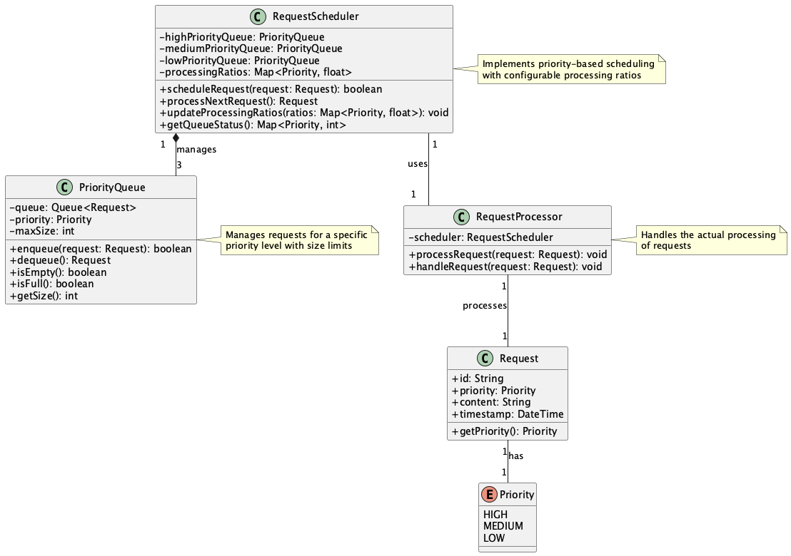
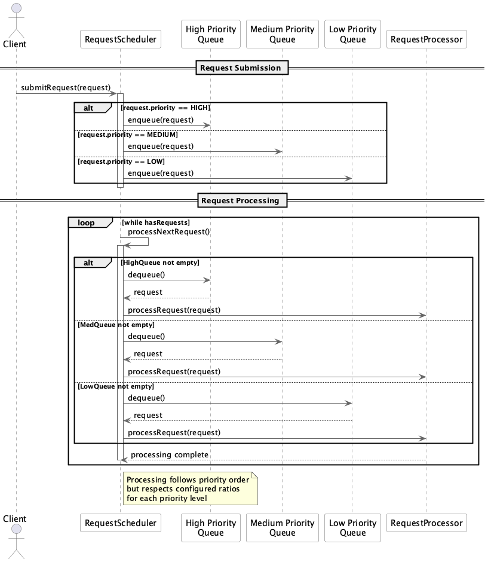

# Priority-Based Throttling

## Overview

Priority-Based Throttling is a design approach that controls throughput based on request priority when processing requests to LLM APIs and external services. It prioritizes high-priority requests while ensuring that medium and low-priority requests are also processed appropriately. This maintains service quality for important users and processes while ensuring overall fairness and efficiency.

## Problems to Solve

Not all services and systems using LLM APIs have the same level of importance. For example, in a freemium service strategy, there is a clear difference in importance between paid and free user requests. Similarly, there are use cases that require synchronous, immediate processing and others that require reliable processing even if it takes time - the former needs to be prioritized. Without considering these cases and treating all LLM requests with equal importance, the following issues can arise:

1. **Resource Contention Leading to Starvation**
   - In a single request queue, high-frequency high-priority requests can continuously block low-priority ones, preventing low-priority processing from being executed.

2. **Latency Delays for Critical Requests**
   - Processing all requests uniformly may fail to meet response time requirements specified in enterprise contracts or SLAs.

3. **Inconsistent Service Quality**
   - In systems where real-time and batch processing coexist, significant performance differences may occur between users.

4. **Increased Operational Load During Peak Traffic**
   - Uniform processing can lead to sudden system load increases, resulting in excessive resource usage or failures.

## Solution

Requests are classified into priorities such as "high, medium, low" and managed in dedicated queues. Worker processes poll requests in high→medium→low order for execution. Additionally, a mechanism is established to set processing ratios for each priority (e.g., high 70%, medium 20%, low 10%) and allow dynamic tuning to ensure all requests get execution opportunities.

For example, in a multi-tenant SaaS, paid user requests can be treated as high priority and free users as low priority, creating differences in processing order and latency.

## Applicable Scenarios

This practice is effective in the following use cases:

- Differentiating requests between paid and free users in multi-tenant API platforms
- Prioritizing urgent inquiries in chatbot and conversational AI systems
- System infrastructure where batch and real-time processing coexist
- Prioritizing premium support responses in customer support infrastructure

## Benefits

Utilizing this practice provides the following advantages:

- SLA Compliance: Guarantees response times for high-priority requests
- Fairness Assurance: Provides processing opportunities for low-priority requests, avoiding starvation
- Operational Optimization: Balances overall cost and scalability through priority-based resource allocation
- Visualization and Control: Improves operational visibility through queue depth and processing rate visualization

## Considerations and Trade-offs

When adopting this practice, the following points require attention:

- Design and Implementation Complexity: Requires design of multiple priority queues and implementation of dynamic scheduling, increasing development costs
- Impact on UX: Under high load, latency for medium and low-priority requests may increase, potentially affecting user experience
- Increased Monitoring Load: Requires queue monitoring and alert settings for each priority level, tending to increase operational burden
- Tuning Difficulty: Incorrect processing ratio settings can lead to issues such as excessive bias toward high priority or over-execution of low priority

## Implementation Tips

Key points for effective implementation of this practice are as follows:

1. Clarify Priority Policies: Define "high, medium, low" criteria based on business requirements
2. Gradual Implementation: Start with only high-priority queues, then add medium and low-priority queues for validation to ensure safe deployment
3. Metric Visualization: Use tools like Grafana, Prometheus, or DataDog to visualize processing status of each queue in real-time
4. Simplify Initial Settings: Start with fixed ratios (e.g., 70:20:10) and adjust based on actual traffic conditions
5. Design Fail-safes: Clearly define handling for when low-priority queues become saturated (dropping or moving to delay queues)

## Summary

Priority-Based Throttling is an effective design approach that enables priority-based request control, ensuring reliable execution of important processes while maintaining overall system fairness and stability. Its effectiveness is particularly notable in multi-tenant environments and systems with diverse request requirements. While implementation requires certain design costs and operational structure, proper utilization enables high-quality service delivery.
