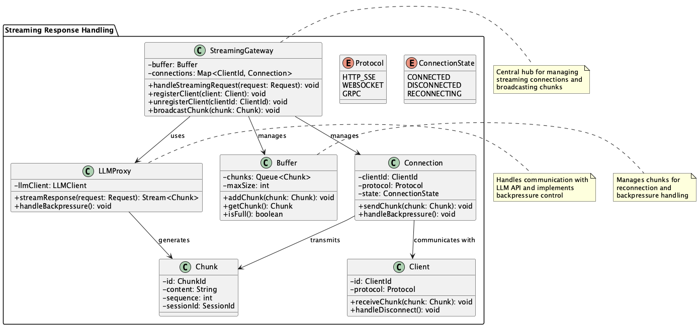
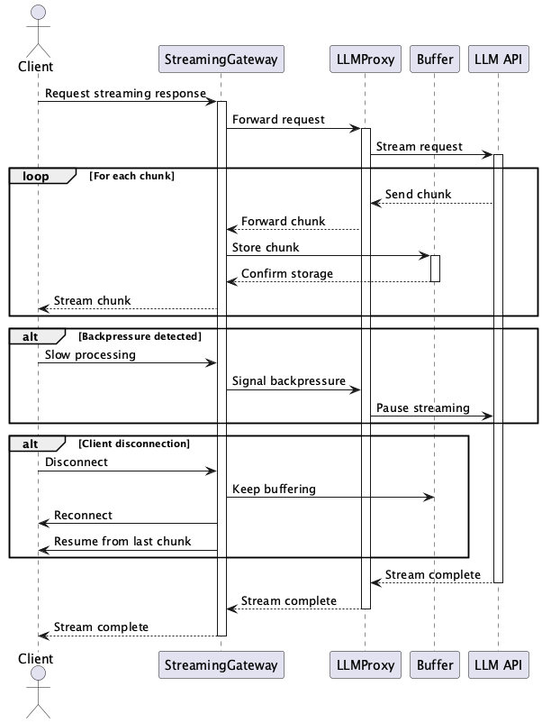

# Streaming Response Handling

## Overview

Streaming Response Handling is a design approach for efficiently and reliably receiving and relaying streaming responses from LLMs to multiple clients. It relays partial generation tokens (chunks) through proxies or hubs, implementing backpressure control and supporting various protocols. By centralizing client connection management on the server side, it achieves both system stability and scalability.

## Problems to Solve

As mentioned in **Streaming Output**, there are many use cases that require streaming output of LLM API responses. In services requiring streaming processing, directly connecting clients to LLM APIs is not a good practice. In configurations where LLM streaming responses are directly delivered to each client, the following challenges arise:

1. **Connection and Authentication Complexity**
   - Direct connections between each client and the LLM complicate authentication management and connection control.

2. **Difficulty in Stream Interruption and Reconnection**
   - When network disconnections occur, mechanisms to resume from the previous point need to be implemented individually.

3. **Challenges in Handling Various Protocols**
   - Support is needed for different streaming methods such as HTTP/1.1 SSE, HTTP/2 gRPC, and WebSocket.

4. **Insufficient Backpressure Handling**
   - When client-side processing is slow, the entire server can be affected, leading to processing delays and disconnections.

## Solution

Implement a proxy or relay hub on the server side to centrally receive and redistribute streaming output from LLMs. Incorporate the following mechanisms:

1. **Multi-protocol Distribution Gateway**
   - Delivers data through appropriate channels for each client.

2. **Buffering and Caching in Relay Server**
   - Ensures state restoration during reconnection and delivery stability.

3. **Backpressure Control Mechanism**
   - Achieves delivery based on client processing capabilities.

4. **Multicast Functionality**
   - Simultaneously delivers the same stream to multiple clients.

## Applicable Scenarios

This practice is suitable for the following systems and projects:

- Real-time chat systems: When partially generated responses need to be immediately presented to users
- Collaborative editing applications: Situations where multiple users receive the same output stream
- API gateway-type SaaS: When external clients need secure relay of the same stream
- Hybrid internal/external configurations: Configurations where internal processing results are streamed to external parties

## Benefits

Implementing this practice provides the following benefits:

- Simplified operations and security through centralized connection and authentication management
- Improved reliability: Centralized management of relay and retry processing on the server side, maintaining state during client reconnection
- Flexible delivery support: Ability to simultaneously deliver the same stream in different formats like WebSocket, SSE, and gRPC
- Easy operational visibility: Monitoring of latency and connection status through metrics collection at the relay layer

## Considerations and Trade-offs

When adopting this practice, consider the following points and trade-offs:

- Additional implementation and operational costs: Development of proxies and relay layers, connection management, buffer control, etc.
- Increased latency: Slight communication delay may occur due to relay processing
- Increased scalability requirements: Horizontal scaling and load balancing design of gateways becomes essential for high concurrent connections
- Increased state management complexity: Design considering chunk resending and session continuation

## Implementation Tips

When implementing this practice, consider the following steps:

1. Utilize existing streaming-compatible middleware. Examples: Envoy, NGINX, gRPC proxy
2. Add features incrementally. Example: First single client support → delivery to multiple clients → backpressure handling
3. Add identification information to chunks. Example: Enable position restoration during reconnection using sequence numbers or session IDs
4. Implement monitoring. Example: Visualization and alert settings for disconnection rates, reconnection counts, throughput, etc.
5. Provide client SDKs. Example: Distribution of client libraries with automatic reconnection and error handling features

## Summary

Streaming Response Handling is an effective design approach for stably and efficiently delivering LLM streaming output to multiple clients. By utilizing gateways and relay servers, it achieves centralized connection management and improved stream reliability. While implementation and operational costs increase, the benefits in terms of scalability and user experience are expected to outweigh these costs.
