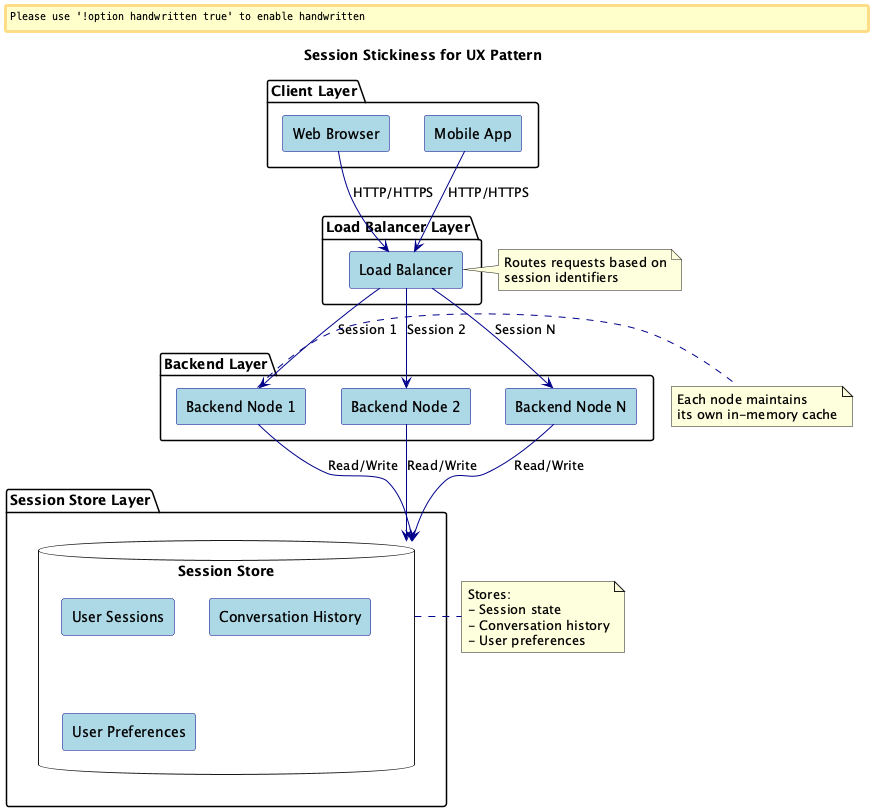

# Session Stickiness for UX

## Overview

Session Stickiness for UX is a design approach that provides a consistent conversational experience by routing requests to the same model context or backend node for each user session (conversation ID, user ID, browser session, etc.). This practice enables conversation context preservation, enhanced personalization, and reduced latency.

## Problems to Solve

While computers have various data storage areas, both temporary and permanent, the most easily accessible and low-latency area for programs is in-memory. When utilizing LLMs, keeping temporary data in memory is an effective way to avoid delays.

Therefore, in LLM-based systems (such as multi-turn conversational systems), when user requests are routed to different nodes during a session, the following problems can occur:

1. **Context Loss**
   - Conversation history dependent on in-memory cache is not shared between nodes, causing context to be lost.

2. **Response Inconsistency**
   - When cache and model settings differ between nodes, the same question may receive different responses.

3. **Loss of Personalization**
   - Individual adjustments based on user preferences and history are not maintained during the session.

4. **UX Disruption**
   - Connection switches during typing or session reconnections can cause duplicate prompt displays and delays.

## Solution

Implement a "sticky session" approach that uses session identifiers (cookies, JWT, custom headers, etc.) to direct requests from the same session to the same backend node.

1. **Session Affinity Settings**
   - Configure routing rules based on session identifiers in load balancers or API gateways.

2. **State Management**
   - Utilize in-memory cache or session stores (e.g., Redis) to maintain conversation history and user settings.

3. **Node Failure Recovery**
   - Implement recovery mechanisms to restore state from session stores.

## Applicable Scenarios

This practice is suitable for the following systems:

- Multi-turn chatbots requiring conversation consistency
- Personalized assistants that respond based on user history and preferences
- Customer support BOTs where session continuity is important
- Professional conversational applications in education or healthcare that need to maintain user profiles continuously

## Benefits

Adopting this practice provides the following benefits:

- Maintains conversation context, enabling natural and continuous interaction
- Enables fast responses, significantly improving UX
- Enables high-quality personalization through reuse of user-specific tuning results and history information
- Simplifies distributed environment design and operation by eliminating the need for state synchronization

## Considerations and Trade-offs

When adopting this practice, the following points should be considered:

- Load balancing efficiency may decrease, potentially concentrating requests on specific nodes
- Risk increases during single node failures, potentially resetting sessions
- Dynamic node addition/removal requires session re-affinity design
- Session store operational overhead (capacity, consistency, TTL, etc.) occurs

## Implementation Tips

Key points for effective implementation of this practice:

1. Use secure tokens (such as JWT) for session identifier design to ensure security and consistency
2. Use in-memory cache for small-scale systems, and distributed caches like Redis or GCP Memorystore for large-scale systems
3. Implement failover design to allow session state reconstruction from stores
4. Utilize load balancer sticky session features (e.g., IP hash, cookie affinity)
5. Monitor metrics such as sticky session rate, session concentration per node, and error reconnection rate

## Summary

Session Stickiness for UX is an important design approach for providing consistent conversational experiences per user. While it improves UX quality through context preservation, fast responses, and personalization, attention must be paid to ensuring scalability and fault tolerance. By properly designing sessions and cache strategies, stable and comfortable LLM-based conversational systems can be achieved.
