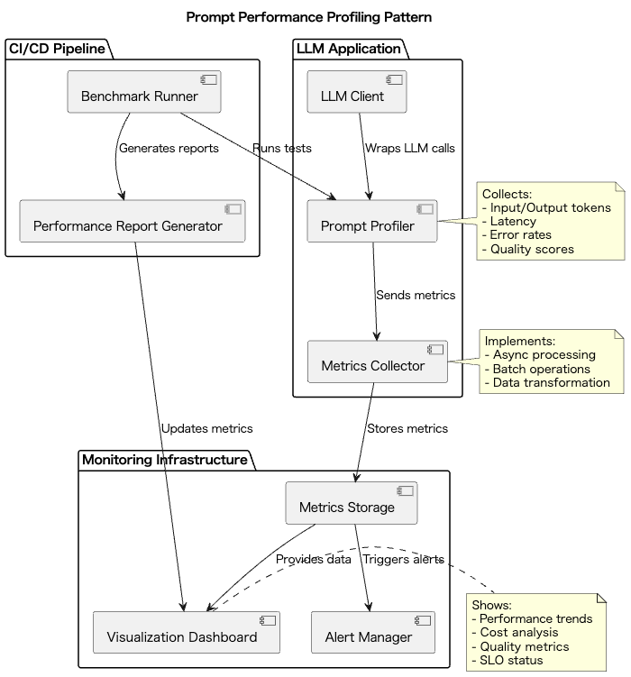

# Prompt Performance Profiling

## Overview

Prompt Performance Profiling is a design practice that quantitatively measures and visualizes the performance of prompts for LLMs, supporting continuous optimization. Through metrics collection, profiler integration, and dashboard visualization, it enables the discovery of bottlenecks and selection of optimal prompt configurations. This practice enables "visualization" and "continuous improvement" in prompt design.

## Problems to Solve

Not all prompts written for LLM utilization guarantee above-standard quality results. Some prompts may be crude and yield low-quality results, while others may be overly elaborate and lengthy, causing response delays and hallucinations. Token consumption also varies with prompt content. Writing appropriate prompts is challenging enough to make prompt engineering a distinct field in LLM utilization.

1. **Black Box Operation**
   - It's possible to miss when latency or token usage deteriorates after prompt changes.
   - Example: A case where response time doubled after introducing a new prompt, but it wasn't noticed until user complaints a week later.

2. **Non-systematic Optimization**
   - Prompt adjustments relying on experience and intuition have low reproducibility and make continuous improvement difficult.
   - Example: A case where developers make changes based on "this prompt seems better" intuition, and can't revert when results worsen.

3. **Lack of Cost Management**
   - Unable to identify which prompts are causing increased token usage, leading to unnecessary costs.
   - Example: A case where monthly API costs exceeded budget but couldn't identify which prompts were responsible.

4. **Missing Performance Degradation**
   - Unable to detect quality or performance degradation due to model version changes or parameter adjustments.
   - Example: A case where quality decreased in specific use cases when migrating from GPT-4 to GPT-4-turbo, but couldn't notice due to lack of quantitative comparison.

## Solution

By applying Prompt Performance Profiling, we build a profiling infrastructure that automatically collects and visualizes metrics for prompt calls.

1. **Metrics Collection**
   - Log input/output token counts, latency, error rates, quality scores, etc., for each call.
   - Example: Using OpenTelemetry to collect detailed metrics for each prompt call.

2. **Profiler Design**
   - Introduce components that wrap API calls to collect and transfer data asynchronously or in batches.
   - Example: Implementing a decorator that wraps the LLM client to collect metrics asynchronously.

3. **Visualization and Reporting**
   - Utilize Grafana or BI tools to display trend analysis, quality vs. cost scatter plots, alerts, etc.
   - Example: Visualizing average latency and token usage trends per prompt in a Grafana dashboard.

4. **CI Integration**
   - Generate automatic profile comparison reports for prompt changes and quantitatively evaluate differences.
   - Example: Running automatic benchmarks and generating reports when prompts change in GitHub Actions.

## Applicable Scenarios

This practice is suitable for the following situations:

- Large-scale LLM-utilizing SaaS services with millions of monthly calls.
- Batch processing infrastructure using LLMs for document classification or summarization.
- Enterprise API infrastructure sharing prompts across teams.
- Prompt improvement and production deployment decisions during PoC or experimental phases.

## Benefits

Introducing this practice provides the following benefits:

- Quantitative visualization of prompt change impacts enables scientific decision-making.
- Integration with CI/CD automatically detects and prevents prompt quality degradation.
- Understanding main factors of cost and latency enables efficient improvements.
- Confirming SLO achievement through metrics enables reliable operation.

## Considerations and Trade-offs

The following points require attention when implementing this practice:

- **Performance Impact**
  - Profiler introduction may slightly increase call latency.
  - Example: Metrics collection may increase latency by 5-10ms per call.

- **Data Storage Costs**
  - Long-term metric storage increases storage and query costs.
  - Example: For 1 million daily calls, storing metrics for one year may cost several thousand dollars monthly.

- **Quality Score Definition**
  - Metrics like BLEU or ROUGE may not be optimal for all evaluation content, requiring appropriate score design.
  - Example: ROUGE scores are effective for summarization tasks but require different evaluation metrics for code generation tasks.

- **Operational Load**
  - Dashboard creation/management and alert settings require expertise and resources.
  - Example: Designing and maintaining Grafana dashboards may require several hours of work monthly.

## Implementation Tips

When implementing this practice, we recommend following these steps:

1. Start with basic metrics like token count and latency.
2. Minimize performance impact through asynchronous transmission and batch processing.
3. Quickly establish visualization infrastructure using templates like Grafana.
4. Integrate with CI to output difference reports and detect quality degradation when prompts change.
5. Regularly review visualization content and alert conditions for continuous improvement.

## Summary

Prompt Performance Profiling is an important design methodology that enables "visualization" and "continuous improvement" in LLM prompt design and operation. Managing multiple aspects simultaneously - quality, cost, and latency - enables building more reliable LLM systems. However, it's important to appropriately select measurement items and visualization methods according to system scale and requirements.
