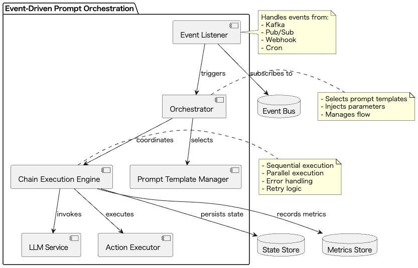

# Event-Driven Prompt Orchestration

## Overview

Event-Driven Prompt Orchestration is a design practice that automatically chains the execution of prompt generation, LLM calls, and subsequent processing triggered by events occurring within an application. This practice enables reactive and flexible LLM integration processing. By consistently managing everything from event occurrence to process completion, it aims to automate and improve the efficiency of the entire system.

## Problems to Solve

One of the breakthroughs in LLMs is the enhancement of reasoning capabilities, which has strengthened logical thinking. This has enabled LLMs to not only handle simple Q&A or summarization but also automate complex business logic and data processing. However, to achieve this, an event-driven architecture is necessary. When attempting to automate processing with LLMs triggered by events, the following problems arise:

1. **Increased Manual Integration Effort**
   - Individual scripts or cron jobs need to be created for each event, reducing maintainability.
   - Example: Each time a customer support inquiry comes in, prompts need to be manually generated and queried to the LLM.

2. **Complexity in State Management**
   - Manually implementing data transfer between events and recovery processing for failures increases the risk of errors and bugs.
   - Example: When chaining multiple LLM calls, results from each step need to be manually managed.

3. **Response Delay**
   - In synchronous processing configurations, response time from event occurrence becomes longer, compromising real-time performance.
   - Example: Responses are delayed because prompts need to be manually created before querying the LLM for user questions.

4. **Lack of Observability**
   - Without a unified mechanism to collect logs and metrics for each processing step, troubleshooting becomes difficult.
   - Example: When LLM responses are not as expected, it's difficult to identify at which stage the problem occurred.

## Solution

This practice automates event-based LLM processing using the following three main components:

1. **Event Listener**
   - Detects events through Kafka, Pub/Sub, Webhook, Cron, etc.
   - Example: Receives Slack message events via Webhook and generates automatic responses.

2. **Orchestrator**
   - Selects prompt templates based on event content and dynamically injects parameters.
   - Example: Selects the optimal prompt template based on the type of inquiry.

3. **Chain Execution Engine**
   - Uses LLM response results to execute subsequent actions (notifications, update processing, further LLM calls, etc.) sequentially or in parallel.
   - Example: Automatically sends email notifications or updates databases based on LLM responses.

## Applicable Scenarios

This practice is effective in the following situations:

- Automated responses and support assistance in customer service
- Automatic generation of code or documentation update notifications
- Automation of periodic batch processing report generation and dashboard updates
- Log summarization and failure analysis report creation in DevOps or CI/CD pipelines

## Benefits

By utilizing this practice, the following benefits can be obtained:

- Processing occurs automatically immediately after event occurrence, enabling a reactive experience.
- Each processing step becomes loosely coupled, improving maintainability.
- Due to the characteristics of event-driven architecture, it becomes scalable and robust against high traffic.
- The entire process becomes traceable, making log analysis and failure handling easier.

## Considerations and Trade-offs

The following points need attention when adopting this practice:

- **Trade-off between Real-time Performance and Cost**
  - Prioritizing immediate response increases processing costs.
  - Batch processing reduces costs but introduces delays.

- **Event Order Guarantee**
  - Risk of order reversal due to parallel processing requires design for Idempotency and Ordering.

- **Complexity of Error Handling**
  - As processing steps become multi-stage, design for failure handling (retry, fallback, DLQ, etc.) at each stage becomes essential.

- **Increased Operational Load**
  - Need to establish operational and monitoring systems for event buses, monitoring, and orchestration layers.

## Implementation Tips

When implementing this practice, it's recommended to start with a PoC following these steps:

1. First try with a minimal configuration: single event → single prompt → single action.
2. Incorporate Idempotency keys into the design to prevent duplicate event processing.
3. Enable collection and visualization of metrics (processing time, success rate) for each processing step.
4. Move failed events to a Dead Letter Queue (DLQ) and establish a system where operators can respond through notifications.
5. Write flow definitions in YAML or JSON format, considering no-code/low-code maintenance.

## Summary

Event-Driven Prompt Orchestration is a design approach that enables the automation of business processes incorporating LLMs through event-driven architecture, making it possible to build reactive and scalable systems. To balance maintainability and operability, careful design of order control, error handling, and ensuring observability is crucial. With proper implementation, it can achieve automation and efficiency improvement of the entire system.
