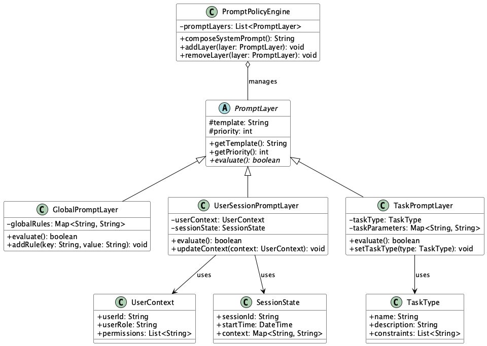

# System Prompt Control

## Overview

System Prompt Control is a design approach that dynamically manages and switches the "system" message (system instructions) sent to LLMs, allowing flexible control over the model's initial state, response style, and constraints. It manages prompts across multiple layers (global, user attributes, function-specific, etc.) and dynamically synthesizes them through a policy engine.

## Problems to Solve

One of the effective prompt techniques for utilizing LLMs is to appropriately set the roles of prompt messages. The system message plays a crucial role in instructing the LLM about "what you should do." This significantly changes the model's behavior and response style.

In software utilizing LLMs, when system messages are defined statically, the following problems can occur:

1. **Decentralized Prompt Management**
   - System prompts are individually written for each endpoint or function, leading to omissions and inconsistencies during changes.
   - Example: When different system prompts are defined for chat and summarization features, modifications to one may not be reflected in the other.

2. **Lack of Consistency**
   - System messages are not unified even within the same session, causing unstable model behavior.
   - Example: During a conversation with a user, different system prompts are applied, causing sudden changes in response tone.

3. **Complex Policy Application**
   - When different responses are needed based on user permissions or subscription plans, logic becomes complex and maintenance becomes difficult.
   - Example: When setting different response restrictions for premium and regular users, conditional branches increase.

4. **Inefficient Experiment Switching**
   - Code redeployment is required every time prompts are changed for A/B testing.
   - Example: The application needs to be redeployed each time to verify the effectiveness of new prompts.

## Solution

System Prompt Control dynamically synthesizes and applies system messages through the following mechanisms:

1. **Layered Structure**
   - System prompts are managed in three layers:
     - Global instructions (common to all)
     - User/session instructions (varying by attributes/context)
     - Function/task-specific instructions (by purpose such as translation or summarization)

2. **Prompt Policy Engine**
   - Synthesizes templates from the above layers based on conditions to build the final system message.
   - Example: Combines appropriate instructions based on user permission level and current function.

3. **Dynamic Switching Mechanism**
   - Dynamically switches system messages based on user permissions and experiment flags.
   - Example: Applies different prompt versions based on A/B test flags.

## Applicable Scenarios

This practice is effective in the following situations:

- Enterprise chat systems requiring control based on confidential information and internal rules
- Customer support bots where response styles and restrictions need to be changed based on support plans
- Multi-tenant API platforms where tenant-specific guidelines need to be applied
- Experimental environments where comparing the effects of different system messages is desired

## Benefits

Introducing this practice provides the following benefits:

- Centralized prompt management enables easy changes and rollbacks
- Flexible customization allows controlling LLM behavior appropriate for each user
- Enables rapid A/B testing and experimentation, improving development speed
- Improves output observability, making it possible to compare response quality per system message

## Considerations and Trade-offs

This practice has the following considerations:

- Abstraction Overhead
  - Layer synthesis and rule application increase processing costs and system complexity
- Rule Conflict Risk
  - When instructions conflict between different layers, unexpected responses may be generated
- Increased Operational Load
  - Version management and testing practices for system messages become diverse, increasing maintenance effort
- Creativity Suppression
  - Too many constraints may impair the LLM's free response generation capability

## Implementation Tips

Key points when implementing System Prompt Control are as follows:

1. Clearly separate layer design and document each responsibility scope
2. Define system prompt templates in YAML or JSON for declarative management
3. Prepare test cases for synthesized system messages for major scenarios
4. Log system message IDs and versions to enable correlation analysis with outputs
5. Design basic constraints (prohibited words, maximum token length) that are always applied to ensure safety

## Summary

System Prompt Control is a powerful design approach that balances LLM output quality and controllability. By layering and dynamically controlling prompt management, it can significantly improve system-wide flexibility and operational efficiency. However, careful attention is needed in design and operation, and it's important to implement while considering layer consistency and abstraction costs.
