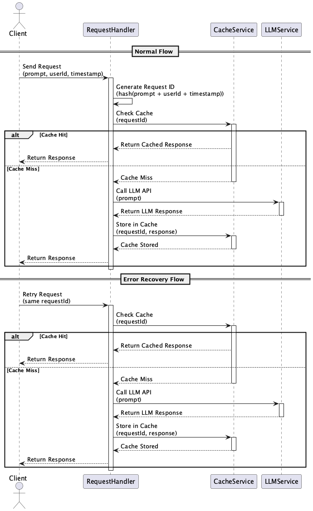

# Idempotent Inference Request

## Overview

Idempotent Inference Request is a technique designed to ensure that multiple identical prompt requests to an LLM do not cause side effects on the system state or responses. Its purpose is to provide safe and consistent responses to duplicate requests caused by network retries or UI misoperations.

## Problems to Solve

One challenge that arises when providing interactive applications is the possibility of sending the same request multiple times. Of course, since these are identical requests, there's no need to process and respond to all of them, and it's better to avoid doing so. Similarly, with LLM API requests, there may be cases where the same request is sent multiple times due to the UI/UX or logic of applications using the LLM API. For example, when a response is slow in a chat UI, users might press the resend button. In these cases, the same prompt is sent multiple times, leading to the following issues:

1. **Uncertain Retry Costs**
   - Due to network failures or UI resends, tokens are consumed again for identical requests, resulting in unnecessary costs.
   - Example: Cases where automatic resends occur during connection drops in mobile apps, leading to multiple charges for the same prompt

2. **Lack of Consistency**
   - Even with the same prompt, if the LLM produces non-deterministic output, different results may be returned each time, compromising the consistency of upstream systems.
   - Example: Cases where batch processing generates different results for the same document, causing inconsistencies in subsequent processing

3. **Side Effects from Duplicate Processing**
   - Duplicate log entries or multiple external API calls can lead to data inconsistencies and redundant processing.
   - Example: Cases where chat bot conversation history is recorded multiple times, compromising database integrity

4. **Operational Issues**
   - During job re-execution after system failures, processing the same data multiple times can lead to unnecessary resource consumption and inconsistencies.
   - Example: Cases where the same document is processed multiple times during batch processing re-execution, extending processing time

## Solution

In Idempotent Inference Request, the following design is implemented to ensure request idempotency:

1. **Request Identifier Generation**
   - Generate a unique key by combining prompt strings, user IDs, timestamps, etc.
   - Example: Generate a unique key in the format `hash(prompt + userId + timestamp)`

2. **Introduction of Cache/Deduplication Layer**
   - Cache the initial response result based on the unique key and reuse it for identical requests.
   - Example: Use Redis to temporarily store responses and return cached responses for requests with the same key

3. **Elimination of Side Effects**
   - Design the system so that log recording and external API calls are only executed on cache misses.
   - Example: Skip log recording on cache hits and only record for new requests

4. **Safe Retries**
   - Even during recovery retries, return cached responses for the same requests to balance cost and consistency.
   - Example: Return cached responses during network errors to ensure consistency during retries

## Applicable Scenarios

This practice is effective in the following situations:

- Self-service chatbots that reconnect after communication disconnections
- Document-level RAG pipelines in batch processing
- Event-driven microservices that may be resent
- Resend countermeasures during connection retries in mobile apps

## Benefits

Introducing Idempotent Inference Request provides the following advantages:

- Suppresses the impact of duplicate calls caused by network or UI operation errors
- Reduces unnecessary token consumption and request costs
- Maintains LLM output consistency and improves upstream processing stability
- Suppresses side effects and maintains data integrity

## Considerations and Trade-offs

When adopting this practice, the following points should be noted:

- **Cache Management Costs**
  - Storage load increases due to response cache storage and expiration management
  - Example: When processing large numbers of requests, cache storage capacity design is important

- **Compatibility with Non-deterministic Models**
  - Cache may not work depending on model temperature and random seed settings
  - Example: With temperature=1.0 setting, different results may be generated even for the same prompt

- **TTL (Time To Live) Adjustment**
  - Balance is required as long TTL settings may return old responses, while short settings may not allow retries
  - Example: With a 1-hour TTL setting, identical requests within that period are responded from cache

- **System Design Complexity**
  - Architecture including key generation logic and cache control becomes necessary, making design and implementation more complex
  - Example: System architecture becomes more complex due to the introduction of a cache layer

## Implementation Tips

Key points for smooth implementation of this practice are as follows:

1. Generate unique keys using hash values of prompt strings + user IDs or timestamps
2. Use fast caches like Redis or Memcached with TTL and capacity limits
3. Fix model temperature and seed values to increase output consistency
4. Make new calls only on cache misses and return conservative fallback responses during failures
5. Monitor cache hit rates and duplicate request counts to immediately detect operational anomalies

## Summary

Idempotent Inference Request is a design practice that ensures consistency and safety for LLM retries and duplicate processing. By incorporating caching and side effect control, it can improve cost efficiency and user experience. However, as it involves cache management and increased system design complexity, adjustments based on requirements and constraints are necessary during implementation.
