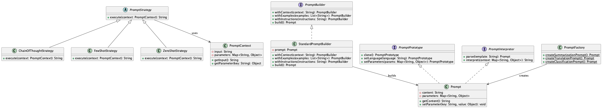

# Interpreter / Builder / Factory / Prototype / Strategy

## Overview

Interpreter / Builder / Factory / Prototype / Strategy is a composite practice for building prompt design and execution strategies in a flexible and reusable way when utilizing LLMs. By combining these five practices, it modularizes complex prompt construction and execution method switching, improving development, maintenance, and extensibility. It comprehensively supports everything from prompt DSL definition to template generation, strategy switching, and mass production of variations.

## Problems to Solve

In system development utilizing LLMs, prompt design is a crucial element. Since prompts determine what information to provide to the LLM, proper design is essential. However, prompts are in natural language, making them difficult to handle in programs and prone to reduced readability and maintainability. Specifically, the following issues arise:

1. **Growth of Hard-coded Prompts**
   - Conditional branches and string concatenation scattered throughout the application significantly reduce readability and maintainability. When modifying part of a prompt, changes are needed in multiple locations.

2. **Lack of Reusability**
   - Similar prompts are manually copied in multiple places, making it easy for changes to be missed or inconsistencies to occur.

3. **Complexity in Strategy Switching**
   - Strategy changes like Few-shot, Zero-shot, and Chain-of-Thought are implemented in a complex way in the codebase. Adding new strategies requires significant modifications to existing code.

4. **Difficulty in Rapid Prototyping**
   - When trying variations, prompts need to be rebuilt from scratch, reducing experimental efficiency.

## Solution

We combine and utilize the following five practices:

1. **Interpreter**
   - Defines a DSL (Domain-Specific Language) specialized for prompts and dynamically interprets and converts according to rules.
   - Defines prompt structure in JSON or YAML and dynamically assembles it at runtime.
   - Example: `prompt = PromptInterpreter.parse("summarize {text} in {language}")` defines prompts using DSL.

2. **Builder**
   - Provides a Fluent API or chain calls that can progressively build highly variable prompts.
   - Achieves a fluent interface like `promptBuilder.withContext().withExamples().withInstructions()`.

3. **Factory**
   - Centrally generates and manages prompt templates for each purpose (summarization, classification, translation, etc.).
   - Generates prompts according to purpose like `PromptFactory.createSummarizationPrompt()`.

4. **Prototype**
   - Can quickly generate multiple variations by copying base prompts and changing parameters.
   - Generates new prompts based on prototypes like `promptPrototype.clone().setLanguage("en")`.

5. **Strategy**
   - Provides an interface to dynamically switch prompt strategies like Few-shot, Chain-of-Thought, and Zero-shot.
   - Switches strategies at runtime like `promptStrategy.setStrategy(new ChainOfThoughtStrategy())`.

## Applicable Scenarios

This practice is effective in the following scenarios:

- When complex Chain-of-Thought prompts or multi-stage processing like RAG is needed
- When handling multiple generation tasks (summarization, translation, classification, etc.)
- When frequently conducting A/B testing of prompts or strategy comparison experiments
- When flexibly customizing prompt structures in multi-tenant environments
- When allowing non-engineers to define and customize prompt logic

## Benefits

Adopting this practice provides the following benefits:

- Each practice clearly divides responsibilities, improving modularization and maintainability.
- Template reuse and variation generation become faster using Builder and Prototype.
- Strategy enables flexible runtime control of prompt strategy switching.
- Through Interpreter, business-side logic editing becomes possible, reducing development effort.
- Test automation becomes easier, improving quality management efficiency.

## Considerations and Trade-offs

The following considerations and trade-offs exist when introducing this practice:

- Initial cost is required for design and implementation. A framework-like structure may be necessary.
- Abstraction through Strategy and Interpreter may slightly increase latency or complexity.
- Overly complex combination of modules may reduce overall readability.
- Testing of individual practices and their combinations increases, leading to more testing effort.
- Excessive use of practices may complicate simple implementations.

## Implementation Tips

The following points are effective when implementing:

1. Start with a PoC using only Factory and Builder to prove value on a small scale.
2. Keep the DSL scope minimal to control Interpreter introduction complexity.
3. Design each prompt strategy as an independent module, allowing switching through configuration files or UI.
4. Introduce version control for Prototype-based templates to achieve reproducibility and history management.
5. Incorporate unit tests and integration tests into CI to ensure combination quality.

## Summary

Interpreter / Builder / Factory / Prototype / Strategy is a comprehensive design approach that greatly improves the flexibility and extensibility of prompt design when utilizing LLMs. By appropriately combining each practice, rapid development and high maintainability can be achieved. The effectiveness of this practice is maximized particularly in complex generation tasks. However, it's important to appropriately adjust the scope of practice application according to system scale and requirements.
