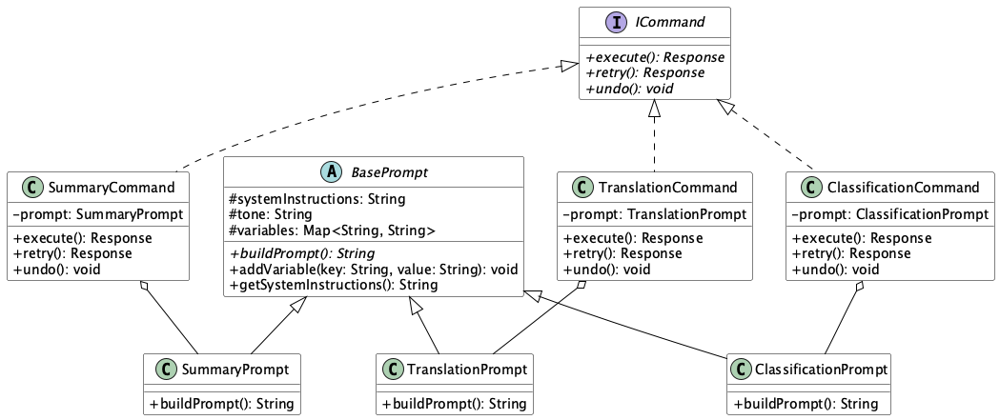

# Prompt Inheritance Command

## Overview

Prompt Inheritance Command is a design approach that separates prompt construction and execution control in LLM-based systems. By inheriting and extending common base prompts while implementing prompt operations (summarization, translation, classification, etc.) as command objects, it achieves a consistent instruction system and flexible execution control.

## Problems to Solve

Prompt management is complex. In LLM-based applications, prompt design and execution control are closely intertwined. Prompts are naturally handled as string types (String type) in natural language, but they actually contain many elements (tone, instructions, variables, etc.). Many prompts used in an application will naturally share common writing styles and formats. Managing these common elements as different strings is not efficient.

1. **Duplicated Prompt Definitions**
   - Copying and pasting the same system instructions and preprocessing code in each use case leads to missed updates when changes are needed.

2. **Scattered Execution Logic**
   - Processes such as prompt sending, retries, and logging are scattered across different locations, requiring updates in multiple places for each change.

3. **Testing Difficulties**
   - Unit testing becomes difficult because prompt generation and execution control are coupled.

4. **High Maintenance Cost for Configuration Changes**
   - When modifying common instructions or policies, there is a maintenance cost of having to individually update all templates.

## Solution

In Prompt Inheritance Command, the prompt generation structure is organized based on inheritance, and execution processing is separated as commands.

Just as we create abstract classes to structure object-oriented programming, prompts need to be structured in the same way.

Additionally, in object-oriented programming, we define executable functions through interfaces to switch between different classes at runtime or perform dependency injection (DI). Similarly, in prompt management, we standardize processing by defining the commands that use these prompts as interfaces.

1. **Base Prompt Definition**
   - Common processes such as tone, instructions, and variable insertion are consolidated in the BasePrompt class.

2. **Purpose-Specific Inheritance Classes**
   - Use cases like summarization, translation, classification, and Q&A are implemented as subclasses inheriting from BasePrompt.

3. **Introduction of Command Objects**
   - Various prompt execution processes are implemented based on the `ICommand` interface, unifying controls such as sending, retrying, and logging.

## Applicable Scenarios

This practice is effective in the following situations:

- When you want to centrally manage common instructions like compliance and terminology in a multifunctional chatbot
- When you want to manage multiple text generation modes like summarization, translation, and Q&A within the same framework
- When you want to manage each operation as a command chain in workflows involving RAG or multiple generation steps
- When developing external SDKs or plugins where you want to easily add new prompt logic

## Benefits

Utilizing this practice provides the following advantages:

- Improved Reusability: Changes to BasePrompt are immediately reflected in all inherited classes.
- Enhanced Maintainability through Separation of Concerns: Separation of prompt construction and execution control allows independent management and extension.
- Improved Testability: Each prompt class and command process can be individually mocked, making unit testing easier to implement.
- Easy Addition of New Features: Adding new prompt types only requires inheriting from BasePrompt and implementing ICommand.

## Considerations and Trade-offs

The following points should be noted when implementing:

- Inheritance Hierarchy Bloat: As the number of prompt types increases, the number of classes grows and design becomes more complex.
- Overhead: The addition of abstraction layers may cause slight performance degradation.
- Prerequisite Knowledge: Operation may become difficult for developers who don't understand inheritance and commands.
- Impact of Common Settings: Changes to BasePrompt have wide-ranging effects, requiring thorough testing before changes.

## Implementation Tips

To smoothly implement this practice, please note the following points:

1. Start BasePrompt with minimal requirements, including only essential items (tone and common instructions), and design it to be extensible later.
2. Standardize the ICommand interface (`execute()`, `retry()`, `undo()`, etc.) to prevent confusion among implementers.
3. Use a DI container to create a design that allows flexible switching between Prompt and Command.
4. Cover the inheritance structure and command processing in the CI pipeline to reduce risks during changes.
5. Document the inheritance structure diagram and command flow, and share it with the development team.

## Summary

Prompt Inheritance Command is an effective design approach for improving maintainability, extensibility, and reusability by separating prompt construction and execution control in LLM-based application development. While it makes it easier to centrally manage complex instruction systems and diverse use cases, careful attention is needed in the design of inheritance and abstraction. Understanding the practice correctly and implementing it gradually from a simple structure is the key to success.
