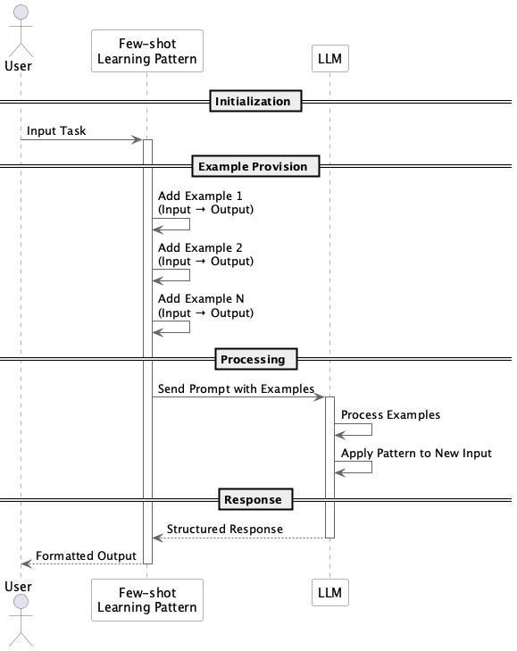

# Few-shot Learning

## Overview

Few-shot Learning is a design practice that improves the output accuracy and consistency of LLMs by including a small number of specific examples within the prompt. By providing examples of "how to do it" in addition to explicit instructions, it assists the model's understanding and adaptation. Since it doesn't involve learning, it's suitable for PoC and rapid development.

## Problems to Solve

Just as humans understand better when given specific examples along with instructions, LLMs also become more likely to produce intended outputs when given concrete examples. This is particularly effective for the following challenges:

1. **Difficulty in Prompt Design**
   - Instructions alone may not ensure compliance with requirements like "return output in JSON format" or "summarize in polite language."

2. **Low Reproducibility**
   - Even with the same instructions, responses may vary in format and level each time, making the system unstable.

3. **Adaptation Without Fine-tuning**
   - Since custom model training is costly, we want to guide domain-specific responses through examples.

4. **Domain-Specific Adaptation**
   - When LLMs don't understand specialized terminology or standard phrases used in financial operations, we supplement with example presentations.

## Solution

In Few-shot Learning, we present several "input example → output example" pairs at the beginning of the prompt, followed by the actual input. The examples are designed with the following considerations:

1. **Format Consistency**
   - Maintain consistent input and output formats across all examples.

2. **Order and Structure**
   - Present examples in order from typical cases to edge cases.

3. **Similarity to Production Input**
   - Use examples close to the actual task to promote model understanding.

## Applicable Scenarios

Few-shot Learning is particularly effective in the following situations:

- When improving response accuracy for chatbots and FAQs
- When formatting search results from RAG is necessary
- When extracting structured data (CSV/JSON format) from natural language is required
- When natural language style operations like text style conversion, polite language conversion, or summarization instructions are needed

## Benefits

Implementing this practice provides the following advantages:

- Quality becomes more stable by communicating expected outputs to the model through concrete examples.
- Rapid adaptation to new business requirements without fine-tuning.
- Complex tasks become manageable with just a few examples, reducing development and operational costs.
- Adjustments can be made by simply replacing examples when specifications change.

## Considerations and Trade-offs

Few-shot Learning has several limitations:

- **Context Length Limitations**
  - Too many examples may exceed the LLM's token limit, risking truncation of the actual input.

- **Example Selection Bias**
  - Including inappropriate examples may lead to model mislearning and induce errors.

- **Increased Request Cost**
  - Token billing occurs for the example section, increasing the cost per request.

- **Example Maintenance Required**
  - Examples need to be reviewed when task specifications or formats change.

## Implementation Tips

To smoothly implement this practice, consider the following points:

1. Carefully select representative examples. Include not only typical inputs but also easily misunderstood cases and exceptional inputs.
2. Start with 1-shot/2-shot. A few well-crafted examples are more effective than too many examples.
3. Clearly unify the structure of examples. Different writing styles per example can confuse the model.
4. Implement automated testing. Include Few-shot prompts in CI processes to verify behavior in production environments.

## Summary

Few-shot Learning is a powerful technique that improves output accuracy and stability by presenting a small number of examples to LLMs. It's particularly effective when you want to quickly adapt to business requirements without fine-tuning. The key to success is carefully designing representative examples while considering token limitations and maintenance challenges.
