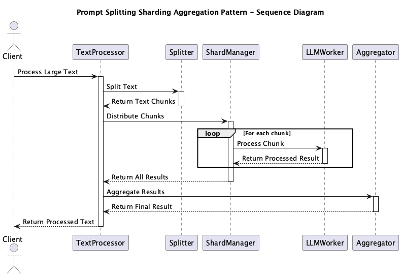

# Prompt Splitting Sharding Aggregation

## Overview

Prompt Splitting Sharding Aggregation is a design technique for efficiently processing large-scale text and long-form data. By splitting the input, processing it in parallel through distributed processing (sharding), and finally aggregating the results, it can overcome token limitations and processing speed constraints of LLMs while maintaining both quality and efficiency.

## Problems to Solve

LLM APIs have token limitations, making it difficult to process long texts or large amounts of text at once. However, some processes require handling large amounts of documents. For example, corporate knowledge bases, academic papers, and user manuals can span tens of thousands of tokens. When these long texts are sent directly to an LLM, the following problems occur:

1. **Context Length Limitations**
   - Technical documents or reports may exceed 10,000 tokens, making it impossible to process the entire content at once due to model length limitations.

2. **Insufficient Processing Throughput**
   - Heavy requests per item increase latency in multi-user concurrent processing or large document processing.

3. **Decreased Accuracy**
   - When very long texts are input together, the model may fail to grasp key points, resulting in ambiguous responses.

4. **Processing Cost Optimization**
   - There is a need to reduce costs by focusing on important parts rather than processing large inputs as-is.

## Solution

Prompt Splitting Sharding Aggregation combines three steps - Splitting, Sharding, and Aggregation - to efficiently process long texts and large amounts of text. This approach overcomes LLM token limitations and processing speed constraints while maintaining both quality and efficiency.

1. **Splitting**
   - Split input text at natural boundaries such as sections, paragraphs, or semantic units.

2. **Sharding (Distributed Processing)**
   - Send divided chunks to multiple LLM workers (or different models) in parallel for individual processing.

3. **Aggregation**
   - Collect and integrate responses from each chunk, perform deduplication and order adjustment, and provide a polished final output to users.

## Applicable Scenarios

This practice is effective in the following scenarios:

- Summarization and QA of large-scale documents like corporate knowledge bases or academic papers
- Information extraction from long texts such as user manuals and FAQs
- Pipelines for batch classification and analysis of large volumes of short texts like reviews and social media posts
- Multi-worker configurations for scaling LLM processing in Kubernetes or serverless environments

## Benefits

Utilizing this practice provides the following advantages:

- **Horizontal scaling** through sharding enables high-throughput processing.
- **Improved response quality** through split processing, resulting in responses focused on important information.
- **Reduced overall processing latency** through parallelization, improving real-time performance.
- Flexibility in aggregation allows selection of optimal integration methods (re-summarization, weighted voting, etc.) based on use cases.

## Considerations and Trade-offs

The following points should be considered when implementing:

- **Aggregation logic design** can become complex. Control of consistency, context connections, and deduplication is necessary.
- **State management costs** arise. Metadata such as context and position information for each chunk needs to be maintained.
- **Increased API requests** may lead to communication overhead and cost inflation.
- **Error tolerance design** is required. Policies for retries and alternative processing need to be established for failures and timeouts during parallel processing.

## Implementation Tips

The following points are effective for smooth implementation:

1. Introduce section detection and sentence boundary extraction algorithms for **semantic unit splitting**.
2. **Tune the number of shards** to determine parallel processing count while balancing environmental resources and costs.
3. Utilize **two-stage summarization or re-summarization** to generate high-accuracy final outputs.
4. Assign **metadata such as IDs and position information** to each chunk to aid context understanding during aggregation.
5. Prepare **fallback processing** (re-summarization or simple combination in case of failure) to improve reliability.

## Summary

Prompt Splitting Sharding Aggregation is an important design practice for overcoming LLM constraints while maintaining both processing efficiency and quality in long text and large-scale text processing. It particularly demonstrates its value in enterprise knowledge processing and large-scale document search. When implementing, careful planning of splitting/aggregation strategies and parallel execution infrastructure design is key to success.
