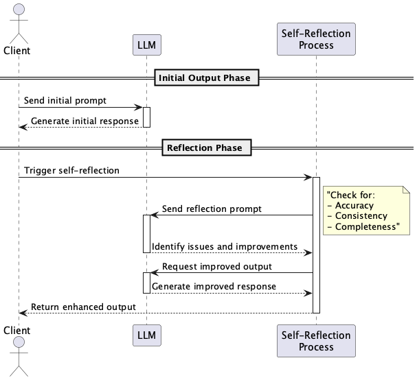

# Self-Reflection Prompt

## Overview

Self-Reflection Prompt is a design technique that improves the quality and reliability of LLM outputs by having the LLM evaluate and verify its own output. By using a self-evaluation prompt after the initial output, it aims to correct errors and fill gaps to obtain higher quality re-output. By encouraging multi-stage self-verification and metacognitive thinking, it becomes possible to enhance the accuracy and consistency of the output.

## Problems to Solve

LLMs have issues such as hallucinations and generating misinformation. While there are many studies on avoiding hallucinations and LLM providers implement various countermeasures, a complete solution has not yet been achieved. While it's impossible to perfectly avoid hallucinations in modern LLMs, it's high-risk to use LLM APIs without any countermeasures.

If hallucinations are left unaddressed, the following problems can occur in LLM outputs:

1. **Output Accuracy Variation**
   - Initial outputs of medical reports or contracts may contain factual errors or contradictions.

2. **Lack of Reliability**
   - Generated FAQs may convey incorrect information to users, leading to misunderstandings and potential complaints.

3. **Manual Review Overhead**
   - Time and cost are incurred in manually checking and correcting each document after output.

## Solution

In Self-Reflection Prompt, we use a "Self-Reflection Prompt" that makes the LLM evaluate itself after output. Specifically, we incorporate the following steps into the design:

1. **Initial Output**
   - Obtain output using a normal prompt.

2. **Apply Reflection Prompt**
   - "Are there any errors or omissions in this answer? Please list improvements and output the corrected answer."

3. **Step Separation (Chain of Reflection)**
   - By clearly distinguishing between error detection, improvement suggestions, and improved output steps, we structure the LLM's thought process.

4. **Explicit Evaluation Criteria**
   - Explicitly indicate perspectives such as "accuracy," "consistency," and "comprehensiveness" in the prompt.

## Applicable Scenarios

This is particularly effective in situations requiring high reliability and accuracy, such as:

- Text generation in domains where errors can be fatal, such as finance and healthcare
- Automation of initial drafts and review processes for contracts and terms of service
- Code generation by LLMs and automatic code review or static analysis
- Content verification processes for research papers and academic summaries

## Benefits

Introducing Self-Reflection Prompt provides the following advantages:

- Improves output accuracy and reliability
- Reduces manual review costs and time
- Makes answer quality more consistent
- Promotes learning effects of prompts through iterative self-verification

## Considerations and Trade-offs

When implementing this practice, the following points should be noted:

- API calls increase, leading to higher costs
- Tendency for longer latency until output completion
- LLM self-evaluation may include overconfidence and bias, so it cannot be completely trusted
- Requires some trial and error and tuning in reflection prompt design

## Implementation Tips

To effectively implement this practice, consider the following points:

1. Start with a small PoC and quantitatively measure the improvement in accuracy
2. Template and document evaluation perspectives during reflection
3. Reduce load by partially applying to only important sections rather than entire documents
4. Collect metrics such as pre/post output quality, error rates, and user evaluations for continuous improvement
5. Start with one reflection step and expand to two or more reflection stages as needed

## Summary

Self-Reflection Prompt is an effective design technique that improves output quality and reliability by having the LLM perform self-evaluation and correction. It is particularly effective in fields requiring high accuracy such as healthcare, finance, and legal, and enables continuous improvement of output accuracy while reducing human review processes. We recommend implementing it gradually while understanding the trade-offs.
