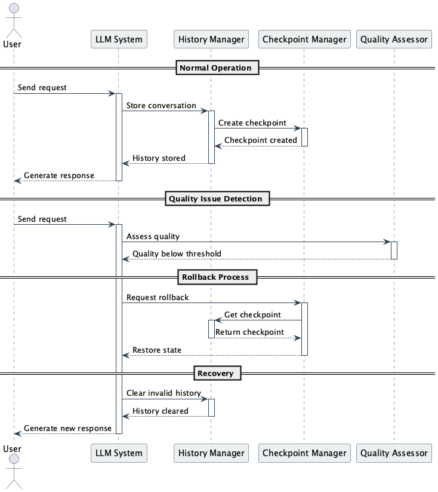

# Forget Past

## Overview

Forget Past is a design technique that prevents context errors and degradation in generation quality caused by the accumulation of past history and prompts in conversations with LLMs. This practice maintains LLM output quality by rolling back history to appropriate checkpoints and reconstructing prompts. It improves system stability and reliability by removing unnecessary information and recovering from incorrect judgments.

## Problems to Solve

In systems using LLMs, during long conversations or complex task processing, a large amount of history accumulates. Not all of this history is necessarily accurate or useful. There may be cases where users make incorrect requests, or LLM hallucinations generate incorrect information. When such information remains in history and is used as memory in subsequent LLM processing, reasoning may be performed based on inaccurate information, or incorrect contexts may be generated. This can lead to degraded LLM output quality and potentially negative impacts on overall system performance.

1. **Context Contamination**
   - Content incorrectly entered by users remains in history and affects subsequent responses.

2. **Increased Token Cost**
   - Continuously maintaining unnecessary past history leads to increased API token usage and costs. It also causes processing delays.

3. **Difficulty in Recovery**
   - Manually adjusting and returning to the original conversation is cumbersome and inefficient. Conversations that have gone off track often need to be restarted from the beginning.

4. **Testing Difficulties**
   - There are no means to reproduce and verify abnormal cases, making failure analysis and reproducibility confirmation difficult. Building test environments to reproduce problems in specific conversation practices becomes complex.

## Solution

Forget Past introduces mechanisms to forget unnecessary past history. This improves LLM output quality and optimizes overall system performance. Additionally, due to LLM token limitations, it's not possible to maintain long histories, necessitating the deletion of old information. To solve these problems, Forget Past provides methods to appropriately manage past history and maintain only necessary information.

The specific approaches are as follows:

1. **Checkpoint Snapshotting**
   - Record history state at important moments and return to that point when necessary.
   - Take snapshots at conversation start, after sending important instructions, task completion, etc.

2. **Rollback Mechanism Introduction**
   - Automatically or manually roll back history when incorrect branches or outputs occur, rebuilding appropriate prompts.
   - Automatically execute rollback when quality scores fall below threshold.

3. **Dynamic Reset**
   - Automatically remove past history based on criteria such as quality scores and deviation rates, through user operations or system judgment.
   - Delete past history with low relevance when detecting significant changes in conversation context.

## Applicable Scenarios

This practice is particularly effective in the following situations:

- Customer support chatbots when topics become confused during long conversations
- When autonomous agents malfunction during processing involving multiple tool integrations
- Relearning from incorrect learning steps in educational support systems
- Reprocessing when search or summarization fails in RAG+LLM configurations
- During execution of complex tasks requiring multiple conversations

## Benefits

Utilizing this practice provides the following advantages:

- Improved output quality through removal of incorrect history
- Cost reduction through token usage optimization
- Easy conversation and task re-execution, providing flexibility for both users and systems
- Improved development and operational efficiency through better error and abnormal case reproducibility
- Enhanced system stability and reliability

## Considerations and Trade-offs

The following points require attention when implementing:

- Users may become confused when history is suddenly forgotten, requiring UX considerations
- Determining when to reset history is difficult, making implementation and design complex
- Additional costs occur for history management and checkpoint maintenance
- Returning to history doesn't guarantee returning to the correct path, requiring prevention measures
- System complexity increases, potentially making debugging more difficult

## Implementation Tips

Key points for effectively implementing this practice are as follows:

1. **Checkpoint Strategy Design**: Pre-determine easy-to-return-to timings such as conversation start, after sending important instructions, etc. Examples: task start, important decision points, error occurrence, etc.
2. **UX Design Considerations**: Design to avoid confusion by explicitly informing users, such as "Conversation has been reset." Examples: Notifying "Forgot past history" during reset, providing history visualization features, etc.
3. **Automatic Rollback Implementation**: Incorporate mechanisms to automatically roll back history using output score evaluation. Examples: Monitoring response quality scores, context consistency scores.
4. **Partial Forgetting Implementation**: Incorporate controls to delete only incorrect statement parts rather than everything. Examples: Selectively deleting history related to specific topics.
5. **Test Case Preparation**: Prepare unit tests and E2E tests to ensure rollback functions correctly in both normal and abnormal cases. Examples: Verifying behavior in various edge cases, performance testing.

## Summary

Forget Past is a design technique that improves system response quality and stability by appropriately managing and rolling back past history and prompts in conversations with LLMs. It becomes an effective means to maintain quality and optimize tokens in long-running conversation systems and agent-type applications. When implementing, it's important to pay sufficient attention to UX and history design while implementing gradually. With appropriate implementation, it becomes possible to build more reliable LLM utilization systems.
