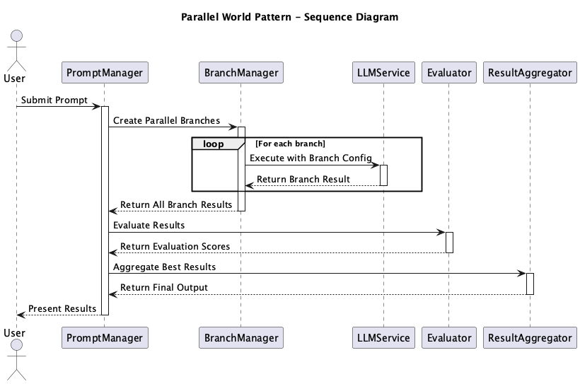

# Parallel World

## Overview

Parallel World is a design practice that duplicates the same prompts or conversation history and executes different prompt variations or settings in parallel for comparison. This practice enables efficient generation, comparison, and evaluation of multiple options to select the optimal output. It is particularly effective in prompt engineering and LLM output optimization for achieving rapid improvement cycles.

## Problems to Solve

When engaging in extended interactions with LLMs to deepen discussions, there are often situations where multiple conflicting ideas need to be explored. While you may want to continue the discussion using the same conversation history, it is generally difficult to explore multiple ideas simultaneously since LLM requests are typically one request per history.

The following challenges arise in prompt design utilizing LLMs:

1. **Inefficiency of Iterative Trials**
   - The process of making small prompt modifications, executing, and comparing them consumes significant time, effort, and token costs.
   - If one change fails, you need to revert to the original state and try a different change.

2. **Difficulty in Comparison**
   - As history becomes complex, it becomes difficult to accurately determine which prompt changes were effective.
   - It becomes impossible to explore multiple ideas in depth from a common history.

3. **Difficulty in Quality Assurance**
   - If a single branch fails, there is no way to revert to a good state, making recovery difficult.
   - It becomes challenging to quickly prepare alternatives for unexpected failures in production environments.

## Solution

Parallel World solves these problems by duplicating conversation history or prompts as snapshots using the following approaches:

1. **Parallel Branch Generation**
   - Execute multiple prompt variations (temperature changes, different system messages, different Few-shot configurations, etc.) simultaneously.
   - Assign unique identifiers to each branch and link settings with results.

2. **Quality Evaluation and Comparison**
   - Evaluate outputs from each branch using user feedback and other methods.

3. **History Tracking and Visualization**
   - Record which branch was executed with which prompts and settings to ensure reproducibility.
   - Visually display result differences to make it easier to identify improvement points.

## Applicable Scenarios

This practice is effective in the following systems and projects:

- Prompt tuning for improving chatbot responses
- Optimization of writing styles and structures in automated content generation tools
- Parallel comparison of multiple reasoning strategies (ReAct vs CoT) in LLM agents
- Simultaneous generation and evaluation of multiple completion candidates in code completion
- Comparison of different generation strategies in multimodal generation

## Benefits

Utilizing Parallel World provides the following advantages:

- Enables rapid comparison and improvement, shortening verification cycles.
- Risk distribution ensures that failures in one branch don't affect others.
- Quantitative optimization allows for scientific selection of optimal prompts.
- Knowledge accumulation enables acquisition of reusable insights.
- Simultaneous presentation of multiple options allows for better result selection.

## Considerations and Trade-offs

When utilizing this practice, attention should be paid to the following points:

- Increased execution costs: As the number of parallel branches increases, API usage, latency, and token costs increase.
- Complexity of history management: Mechanisms are needed to track and manage prompts, settings, and outputs for each branch.
- User confusion: When presenting multiple options, poor visualization or explanation of output differences can make selection difficult.
- Difficulty in optimization logic: If branch evaluation metrics are ambiguous, automatic selection of the best option becomes challenging.

## Implementation Tips

The following methods can be effective for implementation:

1. Start with a small number of branches and compare effects and costs.
2. Tag each branch with metadata such as "change content" or "evaluation score."
3. Establish mechanisms for automatic evaluation using BLEU, ROUGE, rule-based scoring, etc.
4. Regularly delete unnecessary history and branches to control storage and API usage.
5. Visualize parallel results using dashboards and graphs to help users intuitively understand differences.

## Summary

Parallel World is an extremely effective strategy in prompt design and LLM output optimization. By executing and comparing multiple options in parallel, it can enhance the speed and reliability of quality improvement. However, implementation involves execution costs and management complexity, so it is desirable to apply it gradually according to system scale and objectives.
